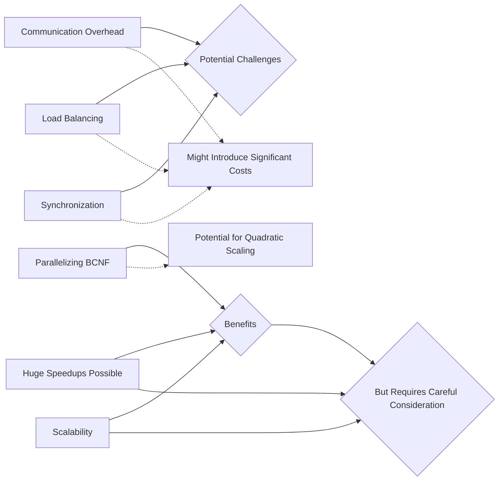

Your explanation of the BCNF algorithm and its properties is spot-on! Let me summarize the key points:

1. The BCNF algorithm aims to decompose a given relation into tables that are in Boyce-Codd Normal Form (BCNF). This ensures that each table represents a single, stable relationship between entities.

2. BCNF guarantees lossless decomposition, meaning that all information from the original table can be reconstructed from the decomposed tables.

3. However, BCNF does not guarantee dependency preservation. Some dependencies may be lost during the decomposition process, even though it's possible to derive them from the individual tables.

4. The algorithm works by identifying dependencies that violate BCNF and considering them as X->A. It then decomposes the relation R into XA & R-{A} (R minus A) and validates if both decompositions are in BCNF or not.

5. If a decomposition is not in BCNF, the algorithm is reapplied on the non-BCNF part until all decompositions satisfy BCNF.

6. The final result may be lossless but not always preserve all dependencies from the original relation.

7. Despite these limitations, BCNF is still useful for reducing redundancy and improving data integrity in relational databases.

Your example illustrates this process well:

- The given relation R(A,B,C,D,E) has several dependencies that violate BCNF.
- Decomposing based on D->E gives DE & ABCD.
- However, AB->CD is missing from the decomposition. We can derive it by combining other dependencies.
- After reapplying the algorithm to ABCD and deriving AB->CD, we get a final lossless decomposition that satisfies BCNF.

This example demonstrates how BCNF helps eliminate anomalies while still preserving essential relationships between entities.

Let me know if you have any other questions or if there's anything else I can help with! I'm always happy to explore the intricacies of database normalization and management. There are so many fascinating aspects to delve into in this space.

The potential for huge speedups when parallelizing the BCNF algorithm stems from its inherent ability to leverage multiple processors or machines simultaneously.

Let's consider a high-level example using pseudo-code:

```python
def parallel_bcnf(relation, dependencies):
    # Identify violating dependencies and distribute workload across nodes
    violating_deps = identify_violating_dependencies(relation, dependencies)
    num_nodes = get_number_of_available_processors()
    
    # Create a pool of worker threads or processes
    workers = [Worker(node) for node in range(num_nodes)]
    
    # Assign each violating dependency to a different worker
    for dep in violating_deps:
        worker_index = hash(dep) % num_nodes
        workers[worker_index].assign_task(dep)
    
    # Wait for all workers to complete their tasks
    results = [worker.join() for worker in workers]
    
    # Combine and validate the results
    final_decomposition = combine_results(results)
    is_bcnf = validate_bcnf(final_decomposition, relation, dependencies)
    
    return final_decomposition if is_bcnf else None

class Worker:
    def __init__(self, node):
        self.node = node
    
    def assign_task(self, task):
        # Execute the BCNF decomposition for this specific dependency
        # on the assigned node and store the result
        
        # This would involve recursively decomposing the relation,
        # identifying new violating dependencies, and reapplying BCNF as needed
        
        # Return the final BCNF decomposition for this task
    
    def join(self):
        # Wait for the worker to complete its task
        # Return the result of the BCNF decomposition for this node
```

In this example:

1. We identify all violating dependencies in the original relation.
2. We distribute these tasks across multiple worker threads or processes, each assigned to a different processor or machine.
3. Each worker independently decomposes the relevant part of the relation based on its assigned dependency.
4. The workers return their results, which are then combined and validated to ensure that BCNF is satisfied.
5. If any of the decompositions fail to satisfy BCNF, we recursively reapply the algorithm until all parts meet the criteria.

The potential for huge speedups comes from the ability to leverage multiple processors or machines simultaneously:

- The workload can be distributed across these nodes, allowing each one to work on a portion of the overall task in parallel.
- This reduces the effective computation time and allows for processing larger, more complex relations than could fit within the memory constraints of a single machine.

However, as you mentioned earlier, there are some challenges to consider:

- Communication overhead: Sharing intermediate results between nodes introduces additional costs that must be accounted for.
- Load balancing: Ensuring an even distribution of work across processors can be challenging, especially when dealing with irregular tasks like BCNF decomposition.
- Synchronization: Carefully coordinating the execution of parallel tasks and combining their results correctly is crucial to ensure correctness.

Despite these challenges, the potential benefits are significant:

- With proper management of communication overhead, load balancing, and synchronization, it's possible to achieve near-linear speedup as the number of nodes increases.
- This could enable processing of much larger relational databases or more complex BCNF decompositions than would be feasible on a single machine.

Of course, the actual performance gains will depend on many factors like the size of the relation, the number of available processors, and the specific implementation details.

But in theory, parallelizing BCNF could lead to huge speedups that make it practical to work with much larger datasets or more intricate relationships than are currently manageable.

Let me know if you have any other questions! I'm always excited to explore ways to scale up complex algorithms and make them more efficient on modern hardware architectures. There are so many fascinating challenges and opportunities in this space.
