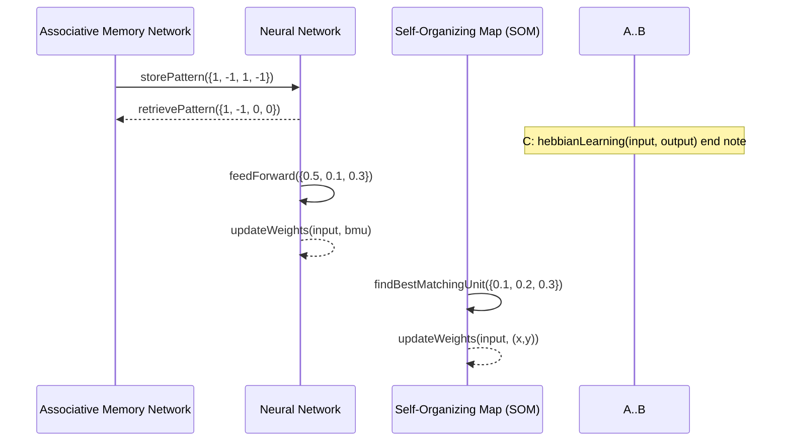

```mermaid
sequenceDiagram
    participant A as Associative Memory Network
    participant B as Neural Network
    participant C as Self-Organizing Map (SOM)
    
    A->>B: storePattern({1, -1, 1, -1})
    B-->>A: retrievePattern({1, -1, 0, 0}) 
    note over A..B:C: hebbianLearning(input, output) end note
    
    B->>B: feedForward({0.5, 0.1, 0.3})
    B-->>B: updateWeights(input, bmu)
    
    C->>C: findBestMatchingUnit({0.1, 0.2, 0.3})
    C-->>C: updateWeights(input, (x,y))
```