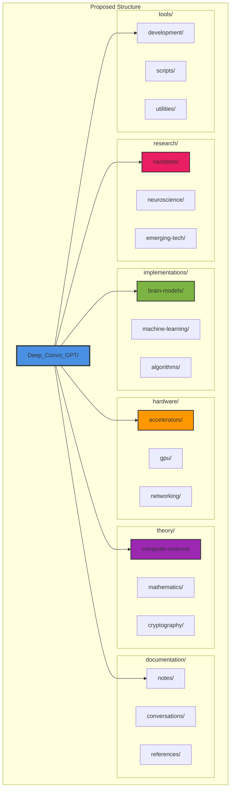
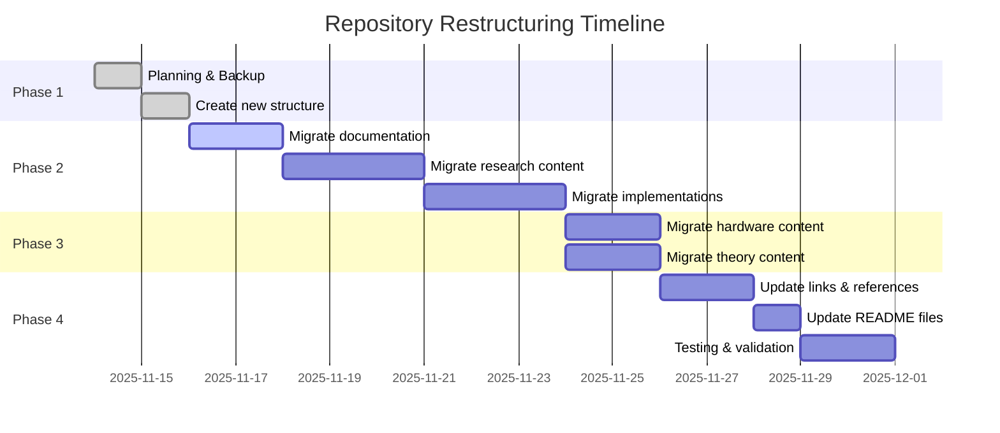
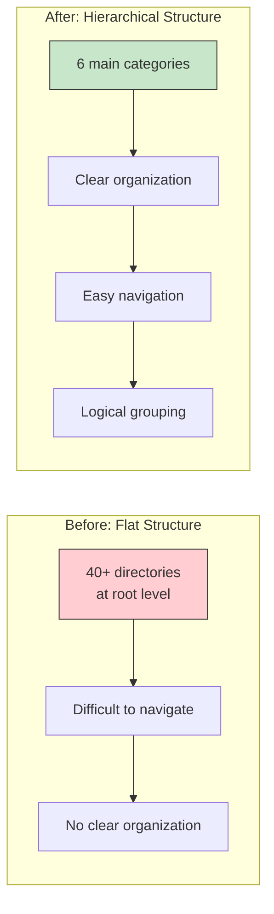

# Repository Structure Improvement Suggestions

## Current State Analysis

The Deep_Convo_GPT repository is a rich polymath knowledge base with extensive content across multiple domains. However, the current flat structure with 40+ directories at the root level can make navigation challenging.

## Proposed Hierarchical Structure

### 1. Top-Level Organization

```
Deep_Convo_GPT/
├── research/           # Research domains
├── implementations/    # Code implementations
├── hardware/          # Hardware-related content
├── theory/            # Theoretical foundations
├── documentation/     # General docs and notes
├── tools/             # Software tools and utilities
└── archive/           # Historical or deprecated content
```

### Detailed Reorganization Plan



## Specific Reorganization Mappings

### Research Domain (`research/`)

```bash
research/
├── neuroscience/
│   ├── human_brain/          # From root
│   ├── Robert Hecht-Nielsen/ # From root
│   └── spike-trains/         # New organization
├── nanobots/                 # From root (extensive content)
│   ├── core-theory/
│   ├── implementations/
│   ├── biocompatibility/
│   └── applications/
├── emerging-technologies/
│   ├── quantum/
│   ├── swarm-computing/
│   └── distributed-systems/
└── interdisciplinary/
    ├── early_homonids/       # From root
    ├── Buddhism/             # From root
    ├── egregore/             # From root
    └── frege/                # From root
```

### Implementations Domain (`implementations/`)

```bash
implementations/
├── brain-models/
│   ├── polyglot/            # All language implementations
│   │   ├── functional/      # Haskell, F#, Lisp, Erlang, Scala
│   │   ├── systems/         # C++, Rust, Verilog, VHDL
│   │   ├── scientific/      # R, Fortran, Julia, Python
│   │   ├── specialized/     # APL, Chapel, SQL, Janus
│   │   └── classic/         # BASIC, COBOL, Pascal, Perl
│   └── parallel/            # OpenMP variants
├── machine-learning/
│   ├── neural-networks/
│   │   ├── DeepBrainModel.py
│   │   ├── VAE.py
│   │   └── pytorch_autoencoder.py
│   ├── attention/           # From root
│   │   ├── GQA/
│   │   ├── KDGQA/
│   │   └── DGQA/
│   ├── architectures/
│   │   ├── GRU/             # From root
│   │   ├── RELU/            # From root
│   │   └── VAE/             # From root
│   └── transformers/
│       └── vision/
└── algorithms/
    ├── graph/
    │   ├── C_PP/            # From root
    │   ├── MRNG/
    │   └── ann-search/
    ├── cellular-automata/   # From root
    │   ├── indexing/
    │   ├── compression/
    │   └── cryptographic/
    └── optimization/
```

### Hardware Domain (`hardware/`)

```bash
hardware/
├── accelerators/
│   ├── tenstorrent/         # From root
│   │   ├── pybuda/
│   │   ├── kernels/
│   │   └── optimization/
│   └── colossus/            # From root
├── gpu/
│   ├── GPU_new_uses/        # From root
│   ├── raid-configs/
│   └── optimization/
└── networking/
    ├── x540-T2_NIC/         # From root
    └── infrastructure/
```

### Theory Domain (`theory/`)

```bash
theory/
├── computer-science/
│   ├── algorithms/
│   ├── complexity/
│   └── information-theory/
├── mathematics/
│   ├── graph-theory/
│   │   └── graphs/          # From root
│   ├── markov_chains/       # From root
│   └── probability/
├── cryptography/
│   ├── polybius/            # From root
│   ├── zero-knowledge/
│   └── random-oracles/
└── foundations/
    ├── godel/               # From root
    └── logic/
```

### Documentation Domain (`documentation/`)

```bash
documentation/
├── notes/
│   ├── surprising_facts.txt # From root
│   └── research-logs/
├── conversations/
│   ├── gpt4/
│   ├── chatgpt/
│   ├── deepseek/
│   └── gemini/
├── references/
│   └── papers/
├── diagrams/
│   └── graphs/              # Mermaid diagrams
│       ├── git-workflow/
│       ├── network-outages/
│       └── r-zero/
└── personal/
    ├── cv.md                # From root
    └── skills-tracking/
```

### Tools Domain (`tools/`)

```bash
tools/
├── development/
│   ├── software_dev/        # From root
│   └── software_ideas/      # From root
├── routing/
│   └── Pilot_LLM_router/    # From root
└── utilities/
    └── scripts/
```

## Migration Strategy

### Phase 1: Planning & Preparation
1. Create new directory structure
2. Document current file locations
3. Identify dependencies and links

### Phase 2: Incremental Migration


### Phase 3: Link Updates
1. Update all internal references
2. Update README files in subdirectories
3. Create symlinks for backward compatibility if needed

### Phase 4: Validation
1. Verify all files migrated
2. Test code dependencies
3. Update documentation

## Benefits of Reorganization

### Improved Navigation


### Better Discoverability

| Current | Proposed | Improvement |
|---------|----------|-------------|
| All 40+ dirs visible | 6 main categories | 85% reduction in cognitive load |
| Mixed content types | Clear separation | Faster content location |
| No clear hierarchy | 3-level hierarchy | Logical navigation path |
| Difficult for newcomers | Self-documenting structure | Better onboarding |

### Enhanced Maintainability

1. **Easier Updates**: Related content grouped together
2. **Clear Ownership**: Each domain has defined scope
3. **Better Scaling**: Can add new content without cluttering root
4. **Improved Search**: Domain-specific searches more effective

## Additional Improvements

### 1. Add Index Files

Create `INDEX.md` in each major directory:

```markdown
# Research Domain Index

Quick navigation to research content:

- [Neuroscience](neuroscience/) - Brain research and neural modeling
- [Nanobots](nanobots/) - Theoretical framework and implementations
- [Emerging Tech](emerging-technologies/) - Quantum, swarm computing, etc.
```

### 2. Standardize README Format

All subdirectory READMEs should follow a template:

```markdown
# [Directory Name]

## Overview
Brief description of content

## Contents
- File/directory listings with descriptions

## Related Sections
- Links to related content in other domains

## Quick Start
- Getting started guide
```

### 3. Add Cross-Reference Links

Create `CROSS_REFERENCES.md`:

```markdown
# Cross-Domain References

## Brain Modeling → Machine Learning
- Brain models inspire neural network architectures
- See: `implementations/brain-models/` and `implementations/machine-learning/`

## Hardware → Software
- Tenstorrent kernels used in ML implementations
- See: `hardware/accelerators/tenstorrent/` and `implementations/machine-learning/`
```

### 4. Create Navigation Aids

Add `.github/` directory with:
- `CODEOWNERS` - Define ownership for different domains
- Issue templates for different content types
- Project board templates for research tracking

### 5. Implement Tagging System

Create `TAGS.md`:

```markdown
# Content Tags

## By Domain
- #neuroscience
- #machine-learning
- #hardware
- #cryptography

## By Type
- #implementation
- #theory
- #documentation
- #research

## By Language
- #python
- #cpp
- #rust
- #haskell
```

## Implementation Script

```bash
#!/bin/bash
# migrate-structure.sh

# Create new directory structure
mkdir -p research/{neuroscience,nanobots,emerging-technologies,interdisciplinary}
mkdir -p implementations/{brain-models/polyglot,machine-learning,algorithms}
mkdir -p hardware/{accelerators,gpu,networking}
mkdir -p theory/{computer-science,mathematics,cryptography,foundations}
mkdir -p documentation/{notes,conversations,references,diagrams,personal}
mkdir -p tools/{development,routing,utilities}

# Migration would happen here (carefully, with git mv to preserve history)
# Example:
# git mv human_brain research/neuroscience/
# git mv tenstorrent hardware/accelerators/

echo "Structure created. Review before executing migrations."
```

## Rollback Plan

1. Keep original structure tagged before migration
2. Use git branches for migration process
3. Create rollback script
4. Test thoroughly before merging

## Conclusion

This reorganization will transform Deep_Convo_GPT from a flat collection of directories into a well-structured knowledge repository with:

- **Clear organization** by domain and purpose
- **Easy navigation** for both maintainers and visitors
- **Better scalability** for future content
- **Improved discoverability** of related content
- **Professional presentation** while maintaining research flexibility

The migration should be done incrementally, with careful testing at each phase, and with full git history preservation using `git mv` commands.
