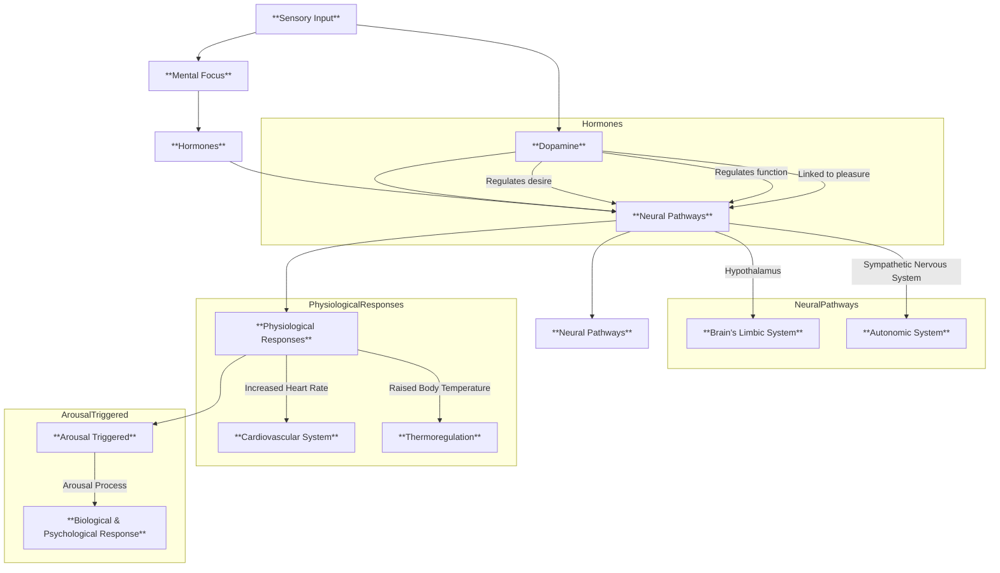

### **Key Elements in the Diagram**:
1. **Sensory Input** (e.g., touch, sight, sound)  
2. **Mental Focus** (e.g., attention, emotional connection)  
3. **Hormones**:  
   - **Testosterone** (regulates desire)  
   - **Estrogen** (regulates function)  
   - **Dopamine** (linked to pleasure)  
4. **Neural Pathways**:  
   - **Hypothalamus** (brain region)  
   - **Sympathetic Nervous System** (autonomic system)  
5. **Physiological Responses**:  
   - **Heart rate**  
   - **Body temperature**  
6. **Arousal Triggered**:  
   - Final integration of biological and psychological responses

---

### **Notes**:
- This is a **conceptual flowchart** and not a literal code or scientific formula.
- The diagram highlights the **interplay of biological, psychological, and physiological components** in human sexual arousal.
- Use this as a visual aid for understanding the process, not as a programming or scientific model.
