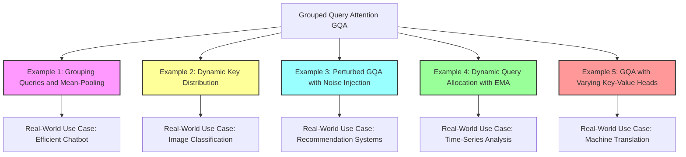

Below are five self-contained C examples simulating aspects of Grouped Query Attention (GQA) and their real-world applications. Each example demonstrates the concept of GQA and includes a real-world use case.

---

### **Example 1: Grouped Query Attention Simulation**
Simulates GQA by grouping queries and applying mean-pooling on keys.

**Real-world Use Case:** Efficient chatbot attention for input processing.

```c
#include <stdio.h>

#define NUM_QUERIES 6
#define NUM_GROUPS 2
#define DIM 3

void mean_pooling(float keys[NUM_QUERIES][DIM], float pooled_keys[NUM_GROUPS][DIM]) {
    for (int g = 0; g < NUM_GROUPS; g++) {
        for (int d = 0; d < DIM; d++) {
            pooled_keys[g][d] = 0;
            for (int q = g * (NUM_QUERIES / NUM_GROUPS); q < (g + 1) * (NUM_QUERIES / NUM_GROUPS); q++) {
                pooled_keys[g][d] += keys[q][d];
            }
            pooled_keys[g][d] /= (NUM_QUERIES / NUM_GROUPS);
        }
    }
}

int main() {
    float queries[NUM_QUERIES][DIM] = {{1, 2, 3}, {4, 5, 6}, {7, 8, 9}, {2, 4, 6}, {8, 10, 12}, {3, 6, 9}};
    float keys[NUM_QUERIES][DIM] = {{1, 0, 1}, {0, 1, 0}, {1, 1, 1}, {0, 0, 1}, {1, 0, 0}, {0, 1, 1}};
    float pooled_keys[NUM_GROUPS][DIM];

    mean_pooling(keys, pooled_keys);

    printf("Pooled Keys:\n");
    for (int g = 0; g < NUM_GROUPS; g++) {
        for (int d = 0; d < DIM; d++) {
            printf("%.2f ", pooled_keys[g][d]);
        }
        printf("\n");
    }
    return 0;
}
```

---

### **Example 2: Dynamic Key Distribution in GQA**
Adjusts query group sizes based on the norm of keys.

**Real-world Use Case:** Image classification with attention to important features.

```c
#include <stdio.h>
#include <math.h>

#define NUM_KEYS 4
#define DIM 3

float calculate_norm(float key[DIM]) {
    float norm = 0;
    for (int i = 0; i < DIM; i++) {
        norm += key[i] * key[i];
    }
    return sqrt(norm);
}

void distribute_queries(float keys[NUM_KEYS][DIM], int query_distribution[NUM_KEYS], int total_queries) {
    float norms[NUM_KEYS], norm_sum = 0;

    for (int i = 0; i < NUM_KEYS; i++) {
        norms[i] = calculate_norm(keys[i]);
        norm_sum += norms[i];
    }

    for (int i = 0; i < NUM_KEYS; i++) {
        query_distribution[i] = (int)(total_queries * (norms[i] / norm_sum));
    }
}

int main() {
    float keys[NUM_KEYS][DIM] = {{1, 2, 3}, {4, 5, 6}, {1, 1, 1}, {3, 3, 3}};
    int query_distribution[NUM_KEYS];
    int total_queries = 10;

    distribute_queries(keys, query_distribution, total_queries);

    printf("Query Distribution:\n");
    for (int i = 0; i < NUM_KEYS; i++) {
        printf("Key %d: %d queries\n", i, query_distribution[i]);
    }

    return 0;
}
```

---

### **Example 3: Perturbed GQA with Noise Injection**
Introduces Gaussian noise to attention maps.

**Real-world Use Case:** Reducing bias in recommendation systems.

```c
#include <stdio.h>
#include <stdlib.h>
#include <time.h>

#define NUM_GROUPS 2
#define DIM 3

void add_noise(float attention_map[NUM_GROUPS][DIM], float noise_level) {
    srand(time(0));
    for (int g = 0; g < NUM_GROUPS; g++) {
        for (int d = 0; d < DIM; d++) {
            float noise = ((float)rand() / RAND_MAX) * noise_level - (noise_level / 2);
            attention_map[g][d] += noise;
        }
    }
}

int main() {
    float attention_map[NUM_GROUPS][DIM] = {{0.8, 0.1, 0.1}, {0.4, 0.3, 0.3}};
    float noise_level = 0.05;

    printf("Original Attention Map:\n");
    for (int g = 0; g < NUM_GROUPS; g++) {
        for (int d = 0; d < DIM; d++) {
            printf("%.2f ", attention_map[g][d]);
        }
        printf("\n");
    }

    add_noise(attention_map, noise_level);

    printf("\nAttention Map with Noise:\n");
    for (int g = 0; g < NUM_GROUPS; g++) {
        for (int d = 0; d < DIM; d++) {
            printf("%.2f ", attention_map[g][d]);
        }
        printf("\n");
    }

    return 0;
}
```

---

### **Example 4: Dynamic Query Allocation with EMA**
Implements dynamic query grouping using an Exponential Moving Average.

**Real-world Use Case:** Time-series analysis with evolving feature importance.

```c
#include <stdio.h>

#define NUM_KEYS 4
#define ALPHA 0.8

void update_ema(float current_norms[NUM_KEYS], float ema[NUM_KEYS]) {
    for (int i = 0; i < NUM_KEYS; i++) {
        ema[i] = ALPHA * current_norms[i] + (1 - ALPHA) * ema[i];
    }
}

int main() {
    float current_norms[NUM_KEYS] = {1.2, 0.8, 1.5, 0.7};
    float ema[NUM_KEYS] = {1.0, 1.0, 1.0, 1.0};

    update_ema(current_norms, ema);

    printf("Updated EMA Norms:\n");
    for (int i = 0; i < NUM_KEYS; i++) {
        printf("Key %d: %.2f\n", i, ema[i]);
    }

    return 0;
}
```

---

### **Example 5: GQA with Varying Number of Key-Value Heads**
Explores the impact of different key-value head counts.

**Real-world Use Case:** Optimizing machine translation attention configurations.

```c
#include <stdio.h>

#define MAX_HEADS 8
#define DIM 3

void scale_attention(float attention[MAX_HEADS][DIM], int num_heads) {
    for (int h = 0; h < num_heads; h++) {
        for (int d = 0; d < DIM; d++) {
            attention[h][d] /= num_heads;
        }
    }
}

int main() {
    float attention[MAX_HEADS][DIM] = {{1, 2, 3}, {4, 5, 6}, {7, 8, 9}, {10, 11, 12}, {13, 14, 15}, {16, 17, 18}, {19, 20, 21}, {22, 23, 24}};
    int num_heads = 4;

    printf("Original Attention Map:\n");
    for (int h = 0; h < num_heads; h++) {
        for (int d = 0; d < DIM; d++) {
            printf("%.2f ", attention[h][d]);
        }
        printf("\n");
    }

    scale_attention(attention, num_heads);

    printf("\nScaled Attention Map:\n");
    for (int h = 0; h < num_heads; h++) {
        for (int d = 0; d < DIM; d++) {
            printf("%.2f ", attention[h][d]);
        }
        printf("\n");
    }

    return 0;
}
```

These examples showcase various aspects of GQA in C and demonstrate their real-world applicability.
