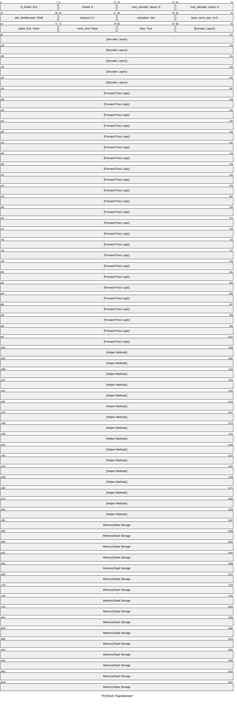

```mermaid
packet
title "PyTorch Transformer"
0-7: "d_model: 512"
8-15: "nhead: 8" 
16-23: "num_encoder_layers: 6"
24-31: "num_decoder_layers: 6" 
32-39: "dim_feedforward: 2048"
40-47: "dropout: 0.1"
48-55: "activation: relu"
56-63: "layer_norm_eps: 1e-5"
64-71: "batch_first: False"
72-79: "norm_first: False"
80-87: "bias: True"
88-95: "[Encoder Layers]"
96-255: "[Decoder Layers]"
256-1023: "[Forward Pass Logic]"
1024-1535: "[Helper Methods]"
1536-2047: "Memory/State Storage"
```
