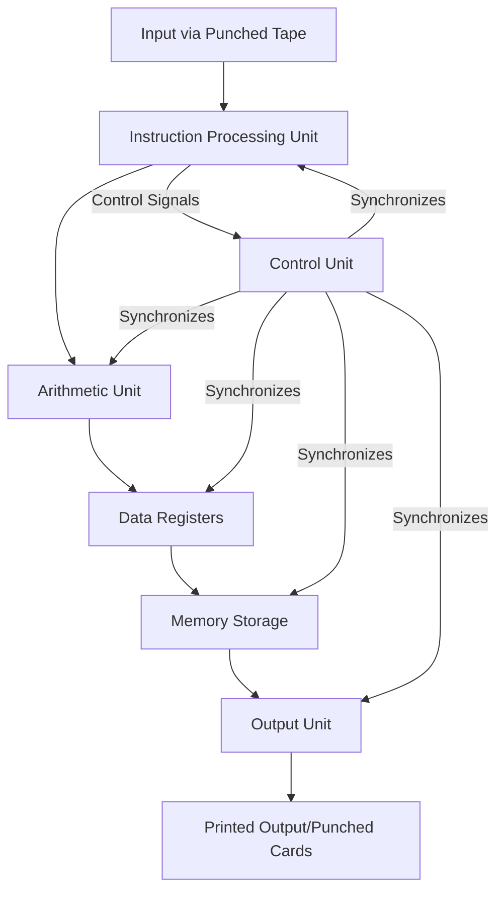

```mermaid
flowchart TD
    A[Input via Punched Tape] --> B[Instruction Processing Unit]
    B --> C[Arithmetic Unit]
    C --> D[Data Registers]
    D --> E[Memory Storage]
    E --> F[Output Unit]
    F --> G[Printed Output/Punched Cards]

    B -->|Control Signals| H[Control Unit]
    H -->|Synchronizes| B
    H -->|Synchronizes| C
    H -->|Synchronizes| D
    H -->|Synchronizes| E
    H -->|Synchronizes| F
```
