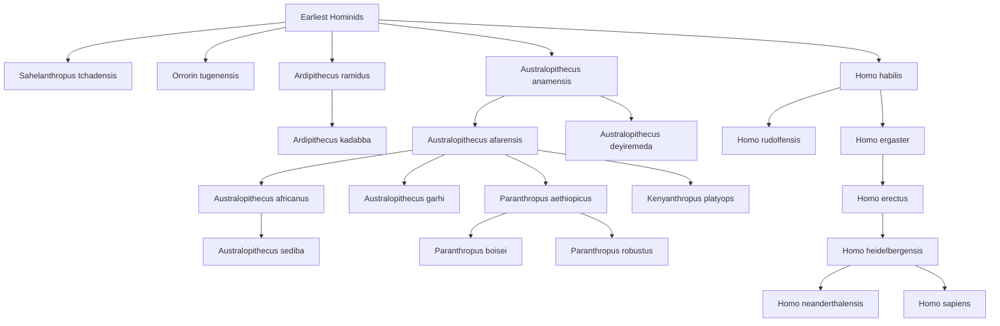

```mermaid
graph TD
    A["Earliest Hominids"] --> B["Sahelanthropus tchadensis"]
    A --> C["Orrorin tugenensis"]
    A --> D["Ardipithecus ramidus"]
    D --> E["Ardipithecus kadabba"]
    A --> F["Australopithecus anamensis"]
    F --> G["Australopithecus afarensis"]
    G --> H["Australopithecus africanus"]
    H --> I["Australopithecus sediba"]
    G --> J["Australopithecus garhi"]
    F --> K["Australopithecus deyiremeda"]
    G --> L["Paranthropus aethiopicus"]
    L --> M["Paranthropus boisei"]
    L --> N["Paranthropus robustus"]
    G --> O["Kenyanthropus platyops"]
    A --> P["Homo habilis"]
    P --> Q["Homo rudolfensis"]
    P --> R["Homo ergaster"]
    R --> S["Homo erectus"]
    S --> T["Homo heidelbergensis"]
    T --> U["Homo neanderthalensis"]
    T --> V["Homo sapiens"]
```
