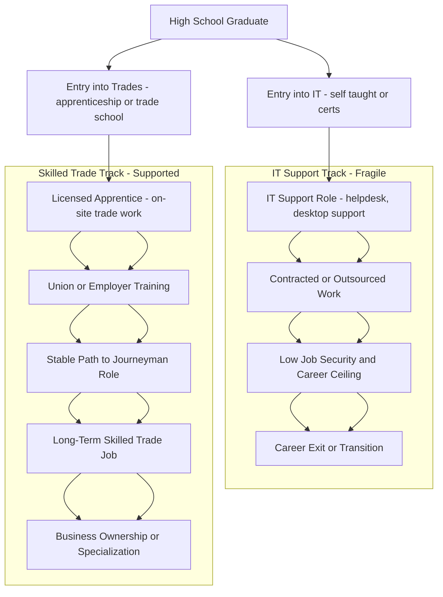

Why did entry-level middle class jobs in North America not emerge for a class of IT professionals such as network engineers but also just a work force of desktop support, on-site computer repair, and in-house computing services for many large scale companies?

ChatGPT said:
Great question — and it points to a structural contradiction at the heart of the North American information economy. Here are the key reasons why entry-level, middle-class jobs in IT (like desktop support, network engineering, etc.) failed to emerge at scale for the working and lower-middle class:

üöß 1. IT Was Treated as Cost Center, Not Core Capability
Most non-tech companies never viewed IT as a strategic domain — only as a cost to be minimized. Therefore:

In-house teams were gutted or never built.

IT work was outsourced (to contractors, offshore firms, or managed services).

Even when crucial to operations, the logic was "get it done as cheaply as possible."

This is in contrast to fields like sales or legal, which are often treated as core functions even in non-sales/non-legal companies.

üåç 2. Globalization and Labor Arbitrage
By the 1990s–2000s, the globalization of IT labor meant:

Remote help desks could be set up offshore (e.g., India, Philippines).

Even some network administration and sysadmin tasks became remotely manageable.

This removed the incentive to cultivate a domestic workforce of entry-level techs.

Why pay $70k/year for an on-site tech in Ohio when you can contract a remote team at $15k/year per head?

🧠 3. High Skill Bar + No Formal Pathway
Unlike trades (electrician, plumber), IT:

Has no universally respected licensing or apprenticeship path.

Demands rapid learning, constant retooling, and self-driven skill acquisition.

Was perceived as elite or nerd-coded, not blue-collar-adjacent.

So while the demand existed, the pipeline never developed institutionally. Community colleges and vocational programs often lagged the pace of industry.

🏢 4. Corporate Consolidation & Cloudification
The shift toward:

SaaS (e.g., Google Workspace vs in-house email),

Cloud computing (AWS, Azure), and

Centralized IT (shared services),

meant that fewer generalists were needed per company. One team of DevOps engineers could now manage infrastructure for dozens or hundreds of smaller business units. Thus:

Distributed IT labor was collapsed into centralized hubs.

Jobs disappeared at the edges.

🤖 5. Efficiency Culture + Anti-Labor Mentality
Companies embraced:

Lean operations,

Just-in-time staffing,

Gigification of technical labor.

Rather than full-time, career-track roles, you'd get:

Temp contracts

Zero upward mobility

No real benefits

This degraded the status of technical support work from potential "ladder job" to dead-end gig.

🪙 6. Finance and Software Ate the World
In the U.S., the best-paid and most-respected tech jobs:

Clustered around Big Tech, Wall Street, or VC-funded startups.

Required elite credentials, not community IT skill.

If you weren’t at Google, you were just "IT support" — which carried low social and economic prestige. Even though that work is foundational, it was:

Underpaid,

Undervalued, and

Outsourced or minimized wherever possible.

Summary:
The missing class of IT middle-class workers never emerged because:

The industry offshored, automated, or centralized much of the work,

The culture failed to build real domestic training pipelines,

And companies treated IT as expendable infrastructure rather than a skill to nurture.

DeepSeek's take on same Q:

The absence of a robust, entry-level middle-class job market for IT professionals—such as network engineers, desktop support technicians, and in-house computer repair roles—in North America can be attributed to several interrelated economic, technological, and corporate trends. Here’s a breakdown of the key factors:

---

### **1. Outsourcing and Offshoring**  
- **Cost-cutting pressures**: Many companies outsourced IT support and infrastructure management to low-wage countries (e.g., India, the Philippines) in the 2000s and 2010s, reducing demand for on-site roles.  
- **Managed Service Providers (MSPs)**: Small-to-medium businesses (SMBs) increasingly rely on third-party IT firms rather than in-house staff, shrinking traditional entry-level IT jobs.  

### **2. Automation and Cloud Computing**  
- **Self-healing systems**: Modern IT infrastructure (e.g., cloud platforms like AWS/Azure) requires fewer hands-on network engineers due to automation.  
- **Remote management**: Desktop support has diminished as software can be patched remotely, and hardware failures are less common.  
- **AI and chatbots**: Tier-1 helpdesk roles are being replaced by AI-driven support tools (e.g., Zendesk’s automated troubleshooting).  

### **3. Corporate Consolidation and Lean Operations**  
- **"Do more with less" mentality**: Companies have reduced dedicated IT departments, pushing responsibilities onto fewer employees or generalists.  
- **Gig-ification**: Some IT support work has shifted to contract or gig roles (e.g., field technicians via platforms like Field Nation), reducing stable middle-class positions.  

### **4. Credential Inflation and Skill Shifts**  
- **Degrees over experience**: Entry-level IT jobs now often require certifications (CompTIA, CCNA) or even degrees, despite the work not needing them historically.  
- **Specialization pressure**: Basic desktop support roles no longer lead to advancement; companies now hire specialists (cybersecurity, cloud architects) directly, skipping traditional career ladders.  

### **5. Decline of In-Person IT Infrastructure**  
- **Consumerization of IT**: Employees use personal devices (BYOD) or cloud apps, reducing the need for in-house repair and maintenance.  
- **Hardware longevity**: Modern computers and servers require less frequent servicing, shrinking repair jobs.  

### **6. Economic Pressures on Middle-Class Jobs**  
- **Wage stagnation**: IT support roles often pay near minimum wage now, making them "working poor" jobs rather than middle-class pathways.  
- **Corporate short-termism**: Firms prioritize shareholder returns over long-term workforce investment, leading to understaffed IT departments.  

---

### **Why This Didn’t Happen in Other Sectors**  
Unlike trades (electricians, plumbers) or healthcare (nursing), IT support roles were uniquely vulnerable to:  
- **Digital displacement** (automation hits IT first).  
- **Global labor arbitrage** (easier to offshore than manual labor).  
- **Rapid obsolescence** (skills from the 2000s are less relevant today).  

### **The Result**  
The traditional "IT guy" role—stable, middle-class, and locally embedded—has largely disappeared, replaced by a mix of outsourced services, automated systems, and precarious gig work. Those entering IT now often need to specialize early (e.g., cybersecurity, DevOps) or face low-wage, unstable positions.  

Would you like insights on potential exceptions (e.g., government jobs, unionized IT roles) or alternative career pathways in tech?
