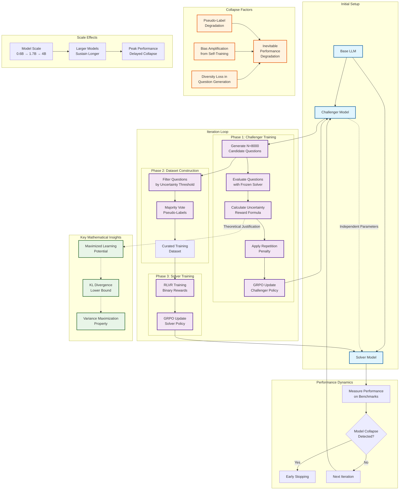

```mermaid
graph TB
    subgraph "Initial Setup"
        Base[Base LLM] --> C[Challenger Model]
        Base --> S[Solver Model]
        C -.->|Independent Parameters| S
    end
    
    subgraph "Iteration Loop"
        subgraph "Phase 1: Challenger Training"
            C --> QGen[Generate N=8000<br/>Candidate Questions]
            QGen --> Eval[Evaluate Questions<br/>with Frozen Solver]
            Eval --> UR[Calculate Uncertainty<br/>Reward Formula]
            UR --> RP[Apply Repetition<br/>Penalty]
            RP --> GRPO1[GRPO Update<br/>Challenger Policy]
            GRPO1 --> C
        end
        
        subgraph "Phase 2: Dataset Construction"
            QGen --> Filter[Filter Questions<br/>by Uncertainty Threshold]
            Filter --> MV[Majority Vote<br/>Pseudo-Labels]
            MV --> Dataset[Curated Training<br/>Dataset]
        end
        
        subgraph "Phase 3: Solver Training"
            Dataset --> RLVR[RLVR Training<br/>Binary Rewards]
            RLVR --> GRPO2[GRPO Update<br/>Solver Policy]
            GRPO2 --> S
        end
    end
    
    subgraph "Key Mathematical Insights"
        UR -.->|Theoretical Justification| Theory1[Maximized Learning<br/>Potential]
        Theory1 -.-> Theory2[KL Divergence<br/>Lower Bound]
        Theory2 -.-> Theory3[Variance Maximization<br/>Property]
    end
    
    subgraph "Performance Dynamics"
        S --> Perf[Measure Performance<br/>on Benchmarks]
        Perf --> Check{Model Collapse<br/>Detected?}
        Check -->|Yes| Stop[Early Stopping]
        Check -->|No| Continue[Next Iteration]
        Continue --> C
    end
    
    subgraph "Collapse Factors"
        LabelDeg[Pseudo-Label<br/>Degradation]
        BiasAmp[Bias Amplification<br/>from Self-Training]
        DivLoss[Diversity Loss in<br/>Question Generation]
        
        LabelDeg --> Collapse[Inevitable<br/>Performance<br/>Degradation]
        BiasAmp --> Collapse
        DivLoss --> Collapse
    end
    
    subgraph "Scale Effects"
        ModelSize[Model Scale<br/>0.6B → 1.7B → 4B]
        ModelSize --> Resilience[Larger Models<br/>Sustain Longer]
        Resilience --> PeakDelay[Peak Performance<br/>Delayed Collapse]
    end
    
    %% Styling
    classDef modelNode fill:#e1f5fe,stroke:#01579b,stroke-width:2px
    classDef processNode fill:#f3e5f5,stroke:#4a148c,stroke-width:2px
    classDef theoryNode fill:#e8f5e8,stroke:#1b5e20,stroke-width:2px
    classDef warningNode fill:#fff3e0,stroke:#e65100,stroke-width:2px
    
    class C,S,Base modelNode
    class QGen,Eval,UR,RP,GRPO1,Filter,MV,RLVR,GRPO2 processNode
    class Theory1,Theory2,Theory3 theoryNode
    class Collapse,LabelDeg,BiasAmp,DivLoss warningNode
```
