```mermaid
flowchart LR
  %% High level causal chain and blast radius
  subgraph DDB_DNS[ DDB DNS automation ]
    A[DNS planner generates plan]
    B[Two DNS enactors run at same time]
    C[Cleanup step deletes old plan]
  end

  A --> B
  B -->|race older plan wins| C
  C -->|active plan removed| D[Empty DNS record for dynamodb us-east-1 amazonaws com]
  D --> E[DynamoDB new connections fail 1:48 AM to 4:40 AM CDT]

  %% Propagation and knock-on effects
  E --> F[Clients cache bad or missing DNS answer then recover as TTLs expire]
  E --> G[EC2 DWFM checks fail and launches impaired]
  E --> H[IAM and STS auth errors]
  E --> I[ECS EKS Fargate launch and scale issues]
  E --> J[Lambda throttling and backlog control]
  E --> K[Amazon Connect errors]

  %% EC2 and NLB interaction
  G --> L[After DDB recovery DWFM enters congestive collapse state]
  L --> M[Engineers throttle and restart DWFM hosts]
  M --> M2[New instance connectivity normal by 12:36 PM CDT]

  %% NLB behavior amplifies
  M2 --> N[NLB health checks flap while network state propagates]
  N --> O[AZ DNS failover removes capacity and oscillates]
  O --> P[Engineers disable auto failover at 11:36 AM CDT which stabilizes]
  P --> P2[Failover re enabled at 4:09 PM CDT]

  %% Wrap up
  P2 --> Q[All major services stable by late afternoon Oct 20]
  F --> Q
  H --> Q
  I --> Q
  J --> Q
  K --> Q

  %% Remediations
  subgraph Fixes[ AWS remediations in progress ]
    R[Harden DNS enactor add stale plan guards and no empty endpoint rule]
    S[EC2 DWFM recovery tests smarter throttles and backoff]
    T[NLB velocity control limit capacity removal on failover]
  end
  Q --> Fixes
```

##
gantt
    dateFormat  YYYY-MM-DD HH:mm
    axisFormat  %m/%d %H:%M
    title  Oct 19-20 2025 CDT major impact windows

    section DynamoDB and DNS
    DDB DNS outage bad or empty record      :active, ddb, 2025-10-20 01:48, 2025-10-20 04:40
    Client DNS cache recovery               :milestone, ddbrec, 2025-10-20 04:40, 2025-10-20 04:40

    section EC2 and networking
    EC2 launches and some APIs impaired     :ec2a, 2025-10-20 01:48, 2025-10-20 15:50
    DWFM throttles and restarts begin       :milestone, 2025-10-20 06:14, 2025-10-20 06:14
    New instance connectivity normal        :milestone, 2025-10-20 12:36, 2025-10-20 12:36

    section NLB
    NLB connection errors health flapping   :nlb, 2025-10-20 07:30, 2025-10-20 16:09
    Disable auto AZ failover stabilize      :milestone, 2025-10-20 11:36, 2025-10-20 11:36
    Re enable failover                      :milestone, 2025-10-20 16:09, 2025-10-20 16:09

    section Other services
    Lambda throttling and backlog drained   :lambda, 2025-10-20 01:51, 2025-10-20 16:15
    ECS EKS Fargate impaired                :containers, 2025-10-20 01:45, 2025-10-20 16:20
    IAM and STS auth errors                 :auth, 2025-10-20 01:51, 2025-10-20 11:59
    Amazon Connect errors                   :connect, 2025-10-20 01:56, 2025-10-20 15:20
