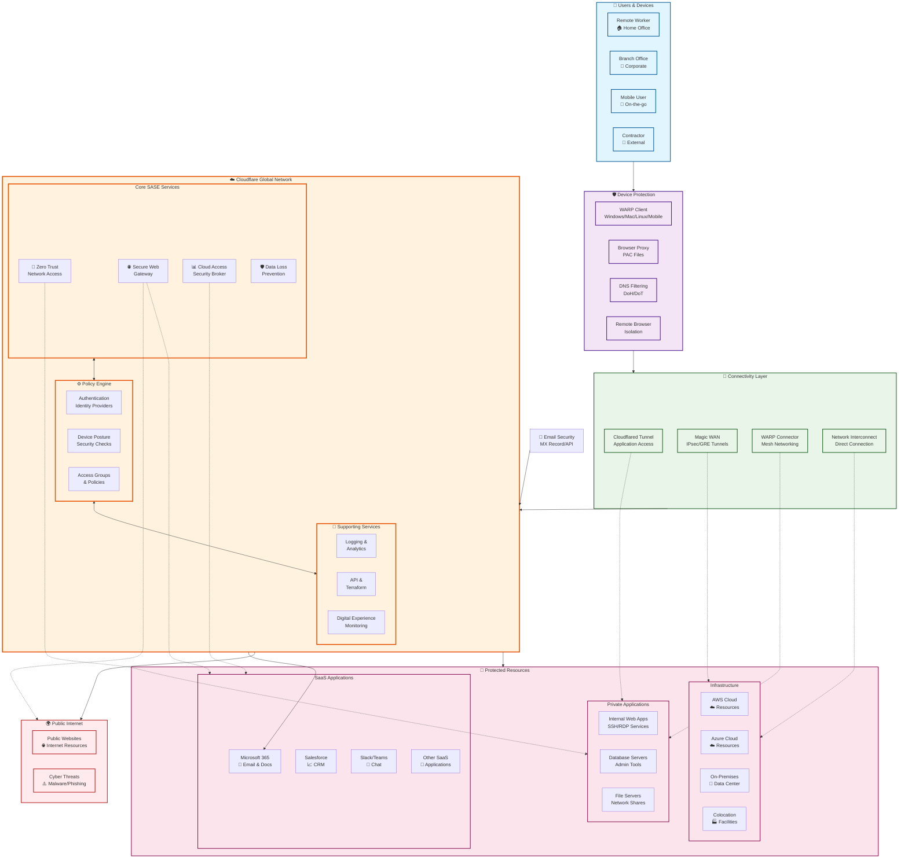

```mermaid
graph TB
    %% Users and Devices
    subgraph Users["👥 Users & Devices"]
        U1[Remote Worker<br/>🏠 Home Office]
        U2[Branch Office<br/>🏢 Corporate]
        U3[Mobile User<br/>📱 On-the-go]
        U4[Contractor<br/>💼 External]
    end

    %% Device Agents
    subgraph Agents["🛡️ Device Protection"]
        WARP[WARP Client<br/>Windows/Mac/Linux/Mobile]
        PAC[Browser Proxy<br/>PAC Files]
        DNS_FILTER[DNS Filtering<br/>DoH/DoT]
        RBI[Remote Browser<br/>Isolation]
    end

    %% Connectivity Methods
    subgraph Connectivity["🔗 Connectivity Layer"]
        CF_TUNNEL[Cloudflared Tunnel<br/>Application Access]
        MAGIC_WAN[Magic WAN<br/>IPsec/GRE Tunnels]
        WARP_CONN[WARP Connector<br/>Mesh Networking]
        CNI[Network Interconnect<br/>Direct Connection]
    end

    %% Cloudflare Global Network
    subgraph CF_Network["☁️ Cloudflare Global Network"]
        subgraph Core_Services["Core SASE Services"]
            ZTNA[🔐 Zero Trust<br/>Network Access]
            SWG[🌐 Secure Web<br/>Gateway]
            CASB[📊 Cloud Access<br/>Security Broker]
            DLP[🛡️ Data Loss<br/>Prevention]
        end
        
        subgraph Policy_Engine["⚙️ Policy Engine"]
            AUTH[Authentication<br/>Identity Providers]
            DEVICE_POSTURE[Device Posture<br/>Security Checks]
            ACCESS_GROUPS[Access Groups<br/>& Policies]
        end
        
        subgraph Support_Services["🔧 Supporting Services"]
            LOGS[Logging &<br/>Analytics]
            API[API &<br/>Terraform]
            DEM[Digital Experience<br/>Monitoring]
        end
    end

    %% Applications and Services
    subgraph Applications["🎯 Protected Resources"]
        subgraph Private_Apps["Private Applications"]
            INTERNAL[Internal Web Apps<br/>SSH/RDP Services]
            DB[Database Servers<br/>Admin Tools]
            FILE[File Servers<br/>Network Shares]
        end
        
        subgraph SaaS_Apps["SaaS Applications"]
            O365[Microsoft 365<br/>📧 Email & Docs]
            SALESFORCE[Salesforce<br/>📈 CRM]
            SLACK[Slack/Teams<br/>💬 Chat]
            OTHER_SAAS[Other SaaS<br/>🔗 Applications]
        end
        
        subgraph Infrastructure["Infrastructure"]
            AWS[AWS Cloud<br/>☁️ Resources]
            AZURE[Azure Cloud<br/>☁️ Resources]
            ON_PREM[On-Premises<br/>🏢 Data Center]
            COLO[Colocation<br/>🏭 Facilities]
        end
    end

    %% Internet and Threats
    subgraph Internet["🌍 Public Internet"]
        WEB[Public Websites<br/>🌐 Internet Resources]
        THREATS[Cyber Threats<br/>⚠️ Malware/Phishing]
    end

    %% Connections
    Users --> Agents
    Agents --> Connectivity
    Connectivity --> CF_Network
    
    %% Internal CF Network connections
    Core_Services <--> Policy_Engine
    Policy_Engine <--> Support_Services
    
    %% Outbound connections
    CF_Network --> Applications
    CF_Network --> Internet
    
    %% Specific flows
    CF_TUNNEL -.-> Private_Apps
    MAGIC_WAN -.-> Infrastructure
    WARP_CONN -.-> Private_Apps
    CNI -.-> Infrastructure
    
    SWG -.-> SaaS_Apps
    SWG -.-> Internet
    CASB -.-> SaaS_Apps
    ZTNA -.-> Private_Apps
    
    %% Email Security (separate flow)
    EMAIL[📧 Email Security<br/>MX Record/API]
    EMAIL --> CF_Network
    CF_Network --> O365

    %% Styling
    classDef userClass fill:#e1f5fe,stroke:#01579b,stroke-width:2px
    classDef agentClass fill:#f3e5f5,stroke:#4a148c,stroke-width:2px
    classDef connectClass fill:#e8f5e8,stroke:#1b5e20,stroke-width:2px
    classDef cfClass fill:#fff3e0,stroke:#e65100,stroke-width:3px
    classDef appClass fill:#fce4ec,stroke:#880e4f,stroke-width:2px
    classDef internetClass fill:#ffebee,stroke:#b71c1c,stroke-width:2px
    
    class Users,U1,U2,U3,U4 userClass
    class Agents,WARP,PAC,DNS_FILTER,RBI agentClass
    class Connectivity,CF_TUNNEL,MAGIC_WAN,WARP_CONN,CNI connectClass
    class CF_Network,Core_Services,Policy_Engine,Support_Services cfClass
    class Applications,Private_Apps,SaaS_Apps,Infrastructure appClass
    class Internet,WEB,THREATS internetClass
```
