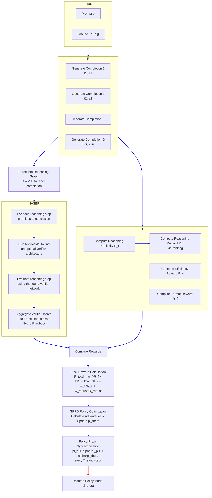

```mermaid
flowchart TD
    subgraph S1 [Input]
        P[Prompt p]
        G[Ground Truth g]
    end

    S1 --> R[Rollout Generation<br>via Policy Model pi_theta]

    subgraph R
        direction LR
        R1[Generate Completion 1<br>t1, a1]
        R2[Generate Completion 2<br>t2, a2]
        R3[Generate Completion ...]
        R4[Generate Completion G<br>t_G, a_G]
    end

    R --> PG[Parse into Reasoning Graph<br>G = V, E for each completion]

    PG --> NASBR[Neural Architecture Search Bottom-Up Reward]
    
    subgraph NASBR
        direction TB
        SG[For each reasoning step<br>premises to conclusion]
        SG --> NAS[Run Micro-NAS to find<br>an optimal verifier architecture]
        NAS --> EVAL[Evaluate reasoning step<br>using the found verifier network]
        EVAL --> AR[Aggregate verifier scores<br>into Trace Robustness Score R_robust]
    end

    NASBR --> CR[Combine Rewards]
    
    R --> TR[Top-Down Reward Calculation]
    
    subgraph TR
        direction LR
        PR[Compute Reasoning Perplexity P_r]
        PR --> RR[Compute Reasoning Reward R_r<br>via ranking]
        ER[Compute Efficiency Reward R_e]
        FR[Compute Format Reward R_f]
    end

    TR --> CR

    CR --> FRW[Final Reward Calculation<br>R_total = w_f*R_f + I*R_f=1*w_r*R_r + w_e*R_e + w_robust*R_robust]

    FRW --> GRPO[GRPO Policy Optimization<br>Calculate Advantages & Update pi_theta]

    GRPO --> Sync[Policy-Proxy Synchronization<br>pi_p <- alpha*pi_p + 1-alpha*pi_theta<br>every T_sync steps]

    Sync --> Final[Updated Policy Model pi_theta]
    
    %% Style Links
    linkStyle 0,1,2,3,4,5,6,7,8,9,10,11,12 stroke:blue,stroke-width:2px;
    linkStyle 13 stroke:red,stroke-width:3px;
```
