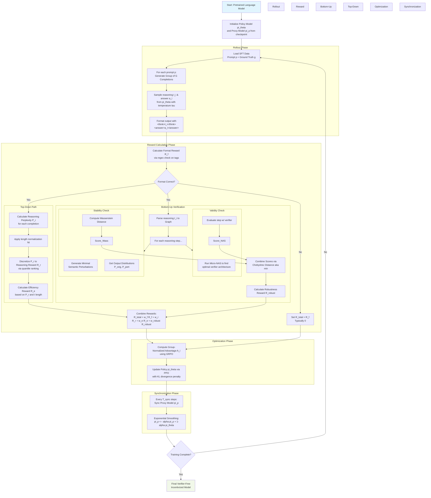

```mermaid
flowchart TD
    A[Start: Pretrained Language Model] --> B[Initialize Policy Model pi_theta<br>and Proxy Model pi_p from checkpoint]
    B --> C[Load SFT Data<br>Prompt p + Ground Truth g]

    subgraph Rollout Phase
        C --> D[For each prompt p:<br>Generate Group of G Completions]
        D --> E[Sample reasoning t_i & answer a_i<br>from pi_theta with temperature tau]
        E --> F[Format output with<br>&lt;think&gt;t_i&lt;/think&gt;<br>&lt;answer&gt;a_i&lt;/answer&gt;]
    end

    subgraph Reward Calculation Phase
        F --> G[Calculate Format Reward R_f<br>via regex check on tags]
        G --> H{Format Correct?}
        
        subgraph Top-Down Path
            direction TB
            I[Calculate Reasoning Perplexity P_r<br>for each completion]
            I --> J[Apply length normalization Nt]
            J --> K[Discretize P_r to Reasoning Reward R_r<br>via quantile ranking]
            K --> L[Calculate Efficiency Reward R_e<br>based on P_r and t length]
        end

        subgraph Bottom-Up Verification
            direction TB
            BU_Start[Parse reasoning t_i to Graph] --> SG[For each reasoning step...]

            subgraph NAS_Verifier [Validity Check]
                direction TB
                NAS[Run Micro-NAS to find<br>optimal verifier architecture]
                EVAL[Evaluate step w/ verifier] --> SN[Score_NAS]
            end

            subgraph Wass_Verifier [Stability Check]
                direction TB
                PERT[Generate Minimal<br>Semantic Perturbations]
                DIST[Get Output Distributions<br>P_orig, P_pert]
                WASS[Compute Wasserstein Distance] --> SW[Score_Wass]
            end

            SG --> NAS_Verifier
            SG --> Wass_Verifier

            SN --> COMBINE[Combine Scores via<br>Chebyshev Distance aka min]
            SW --> COMBINE

            COMBINE --> R_robust[Calculate Robustness Reward R_robust]
        end

        H -- Yes --> I
        H -- Yes --> BU_Start
        
        L --> M[Combine Rewards:<br>R_total = w_f R_f + w_r R_r + w_e R_e + w_robust R_robust]
        R_robust --> M

        H -- No --> N[Set R_total = R_f<br>Typically 0]
    end

    subgraph Optimization Phase
        M --> O[Compute Group-Normalized Advantage A_i<br>using GRPO]
        N --> O
        O --> P[Update Policy pi_theta via PPO<br>with KL divergence penalty]
    end

    subgraph Synchronization Phase
        P --> Q[Every T_sync steps:<br>Sync Proxy Model pi_p]
        Q --> R[Exponential Smoothing:<br>pi_p <-- alpha pi_p + 1-alpha pi_theta]
    end

    R --> S{Training Complete?}
    S -- No --> C
    S -- Yes --> T[Final Verifier-Free<br>Incentivized Model]

    %% Styles
    style A fill:#e1f5fe
    style T fill:#f1f8e9
    style Rollout Phase fill:#f3e5f5
    style Reward Calculation Phase fill:#ffecb3
    style Bottom-Up Verification fill:#e0f2f1
    style Top-Down Path fill:#fff9c4
    style Optimization Phase fill:#e8f5e9
    style Synchronization Phase fill:#ffcdd2
```
