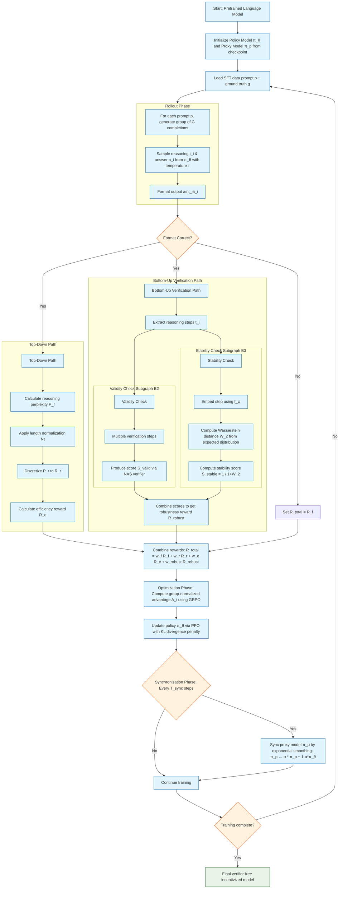

```mermaid
flowchart TD
    A[Start: Pretrained Language Model]
    A --> B[Initialize Policy Model π_θ and Proxy Model π_p from checkpoint]
    B --> C[Load SFT data prompt p + ground truth g]
    
    subgraph Rollout_Phase[Rollout Phase]
        D[For each prompt p, generate group of G completions]
        D --> E[Sample reasoning t_i & answer a_i from π_θ with temperature τ]
        E --> F[Format output as <think>t_i</think><answer>a_i</answer>]
    end
    
    C --> Rollout_Phase
    F --> G{Format Correct?}
    
    G -- No --> H[Set R_total = R_f]
    G -- Yes --> I[Top-Down Path]
    G -- Yes --> J[Bottom-Up Verification Path]
    
    subgraph Top_Down[Top-Down Path]
        I --> K[Calculate reasoning perplexity P_r]
        K --> L[Apply length normalization Nt]
        L --> M[Discretize P_r to R_r]
        M --> N[Calculate efficiency reward R_e]
    end
    
    subgraph Bottom_Up[Bottom-Up Verification Path]
        J --> O[Extract reasoning steps t_i]
        O --> P[Validity Check]
        O --> Q[Stability Check]
        
        subgraph Validity_Check[Validity Check Subgraph B2]
            P --> R[Multiple verification steps]
            R --> S[Produce score S_valid via NAS verifier]
        end
        
        subgraph Stability_Check[Stability Check Subgraph B3]
            Q --> T[Embed step using f_φ]
            T --> U[Compute Wasserstein distance W_2 from expected distribution]
            U --> V[Compute stability score S_stable = 1 / 1+W_2]
        end
        
        S --> W[Combine scores to get robustness reward R_robust]
        V --> W
    end
    
    N --> X[Combine rewards: R_total = w_f R_f + w_r R_r + w_e R_e + w_robust R_robust]
    W --> X
    H --> X
    
    X --> Y[Optimization Phase: Compute group-normalized advantage A_i using GRPO]
    Y --> Z[Update policy π_θ via PPO with KL divergence penalty]
    
    Z --> AA{Synchronization Phase: Every T_sync steps}
    AA -- Yes --> AB[Sync proxy model π_p by exponential smoothing: π_p ← α * π_p + 1-α*π_θ]
    AA -- No --> AC[Continue training]
    
    AB --> AC
    AC --> AD{Training complete?}
    AD -- No --> C
    AD -- Yes --> AE[Final verifier-free incentivized model]
    
    %% Style nodes for visual distinction
    classDef process fill:#e1f5fe,stroke:#01579b
    classDef decision fill:#fff3e0,stroke:#e65100
    classDef terminal fill:#e8f5e8,stroke:#1b5e20
    
    class A,B,C,D,E,F,I,J,K,L,M,N,O,P,Q,R,S,T,U,V,W,X,Y,Z,AB,AC process
    class G,AA,AD decision
    class AE terminal
```
