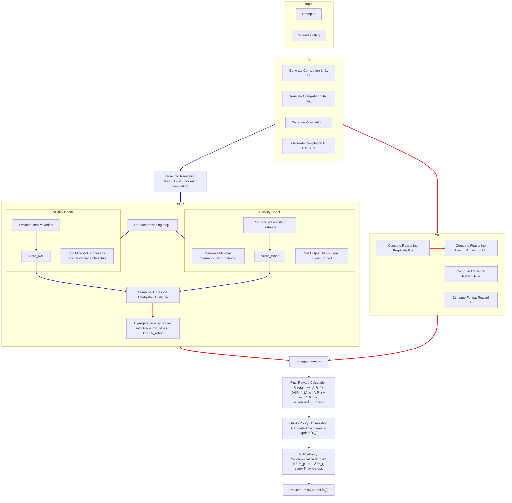

```mermaid
flowchart TD
    subgraph S1[Input]
        P[Prompt p]
        G[Ground Truth g]
    end

    S1 --> R[Rollout Generation via Policy Model π_θ]

    subgraph R
        direction LR
        R1[Generate Completion 1 tâ‚, aâ‚]
        R2[Generate Completion 2 tâ‚‚, aâ‚‚]
        R3[Generate Completion ...]
        R4[Generate Completion G t_G, a_G]
    end

    R --> PG[Parse into Reasoning Graph G = V, E for each completion]

    PG --> BUR[Bottom-Up Reward Calculation]
    
    subgraph BUR
        direction TB
        SG[For each reasoning step...]
        
        subgraph NAS_Verifier[Validity Check]
            direction TB
            NAS[Run Micro-NAS to find an optimal verifier architecture]
            EVAL[Evaluate step w/ verifier] --> SN[Score_NAS]
        end

        subgraph Wass_Verifier[Stability Check]
            direction TB
            PERT[Generate Minimal Semantic Perturbations]
            DIST[Get Output Distributions P_orig, P_pert]
            WASS[Compute Wasserstein Distance] --> SW[Score_Wass]
        end

        SG --> NAS_Verifier
        SG --> Wass_Verifier

        SN --> COMBINE[Combine Scores via Chebyshev Distance]
        SW --> COMBINE

        COMBINE --> AR[Aggregate per-step scores into Trace Robustness Score R_robust]
    end

    BUR --> CR[Combine Rewards]
    
    R --> TR[Top-Down Reward Calculation]
    
    subgraph TR
        direction LR
        PR[Compute Reasoning Perplexity P_r]
        PR --> RR[Compute Reasoning Reward R_r via ranking]
        ER[Compute Efficiency Reward R_e]
        FR[Compute Format Reward R_f]
    end

    TR --> CR

    CR --> FRW[Final Reward Calculation R_total = w_f·R_f + ð•€R_f=1·w_r·R_r + w_e·R_e + w_robust·R_robust]

    FRW --> GRPO[GRPO Policy Optimization Calculate Advantages & Update π_θ]

    GRPO --> Sync[Policy-Proxy Synchronization π_p ↠α·π_p + 1-α·π_θ every T_sync steps]

    Sync --> Final[Updated Policy Model π_θ]
    
    %% Style Links
    linkStyle default stroke:#333,stroke-width:1px;
    linkStyle 0,1,2,3,4,5,6,7,8 stroke:blue,stroke-width:2px;
    linkStyle 9,10,11,12,13 stroke:red,stroke-width:3px;
```
