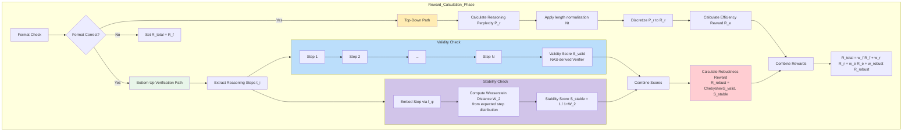

```mermaid
flowchart TD
    subgraph Reward_Calculation_Phase
        F[Format Check] --> H{Format Correct?}
        
        H -- Yes --> TOP[Top-Down Path]
        H -- Yes --> BOT[Bottom-Up Verification Path]
        H -- No --> N[Set R_total = R_f]

        TOP --> I[Calculate Reasoning Perplexity P_r]
        I --> J[Apply length normalization Nt]
        J --> K[Discretize P_r to R_r]
        K --> L[Calculate Efficiency Reward R_e]
        
        BOT --> B1[Extract Reasoning Steps t_i]
        B1 --> B2[Validity Check]
        B1 --> B3[Stability Check]
        
        subgraph B2[Validity Check]
            B21[Step 1] --> B22[Step 2] --> B23[...] --> B24[Step N]
            B24 --> B25[Validity Score S_valid<br>NAS-derived Verifier]
        end
        
        subgraph B3[Stability Check]
            B31[Embed Step via f_φ] --> B32[Compute Wasserstein Distance W_2<br>from expected step distribution]
            B32 --> B33[Stability Score S_stable = 1 / 1+W_2]
        end
        
        B25 --> CMB
        B33 --> CMB
        CMB[Combine Scores] --> R_robust[Calculate Robustness Reward<br>R_robust = ChebyshevS_valid, S_stable]
        
        L --> M
        R_robust --> M[Combine Rewards]
        
        M --> R_total[R_total = w_f R_f + w_r R_r + w_e R_e + w_robust R_robust]
    end

    style TOP fill:#ffecb3
    style BOT fill:#e8f5e9
    style B2 fill:#bbdefb
    style B3 fill:#d1c4e9
    style R_robust fill:#ffcdd2
```
