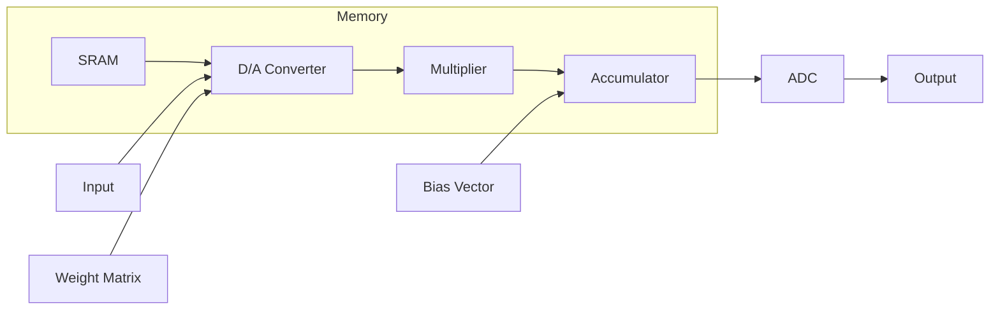

A novel interleaved switched-capacitor and SRAM-based multibit matrix-vector multiply-accumulate engine for in-memory computing. The circuit implements both the digital-to-analog (D/A) conversion and the analog multiplication operations in a single integrated unit. The architecture allows 
for both signed and unsigned multiplications, and it supports multibit weights and inputs. The paper analyzes the energy consumption of the analog computation and examines the impact of fabrication mismatch on the accuracy. The full system architecture is described, including the interleaved switched-capacitor 
D/A converter, the analog multiplier, and the analog accumulator. Finally, a specific design of a 128 × 2048 6-bit weight and 6-bit input signed matrix-vector multiplication accelerator system is presented.

From: An SRAM-Based Multibit In-Memory
Matrix-Vector Multiplier With a Precision That
Scales Linearly in Area, Time, and Power
Riduan Khaddam-Aljameh , Graduate Student Member, IEEE, Pier-Andrea Francese , Senior Member, IEEE,
Luca Benini , Fellow, IEEE, and Evangelos Eleftheriou , Life Fellow, IEEE
