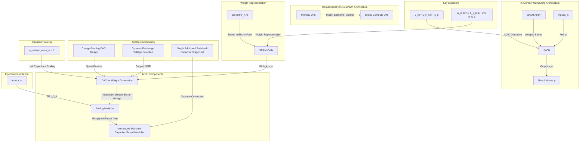

To refactor the provided text into a Mermaid diagram, we need to represent the key components and their relationships in a visual format. Below is the Mermaid diagram that captures the essence of the multibit in-memory compute unit (IMCU) and its components:

### Explanation:

1. **Conventional von-Neumann Architecture:**
   - Represents the traditional architecture where memory and processing units are separate.
   - Matrix elements are transferred from the memory unit to the digital compute unit for processing.

2. **In-Memory Computing Architecture:**
   - Represents the in-memory computing architecture where memory and processing units are collocated.
   - Weights are stored in the SRAM array and processed in the IMCU.
   - Inputs are fed to the IMCU, and the result is output as a vector.

3. **IMCU Components:**
   - **DAC for Weight Conversion:** Converts stored weight bits into a voltage.
   - **Analog Multiplier:** Multiplies the converted weight with input data.
   - **Interleaved Switched-Capacitor-Based Multiplier:** Combines the DAC and analog multiplier.

4. **Weight Representation:**
   - Weights are stored in binary form in SRAM cells.
   - Each bit of the weight is fed to the DAC.

5. **Input Representation:**
   - Inputs are represented as bits and fed to the analog multiplier.

6. **Analog Computation:**
   - **Charge-Sharing DAC Design:** Quasi-passive design for DAC.
   - **Dynamic Precharge Voltage Selection:** Supports signed magnitude representation (SMR).
   - **Single Additional Switched-Capacitor Stage Unit:** Cascaded connection for multiplication.

7. **Key Equations:**
   - Represents the MAC operation and weight representation equations.

8. **Capacitor Scaling:**
   - Represents the scaling of unit capacitors with the number of weight bits.

This Mermaid diagram provides a visual representation of the multibit in-memory compute unit (IMCU) and its components, helping to understand the architecture and flow of operations in the system.
