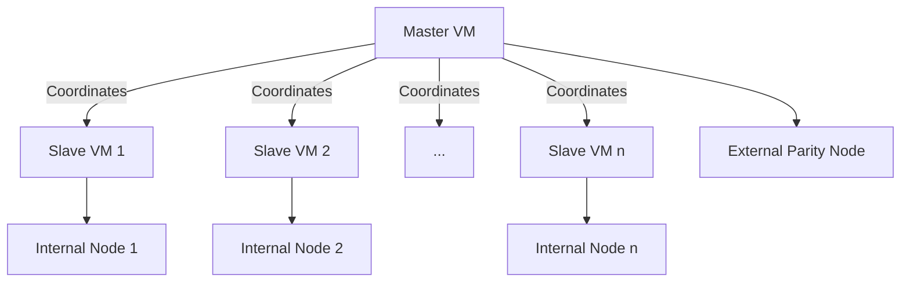

Summary:

# GPU-Accelerated Hierarchical RAID System for Virtual Machine Environments

## 📌 Overview
This research presents an innovative hierarchical RAID architecture leveraging GPU acceleration in virtualized environments, achieving **11.03% faster encoding** and **59.61% better decoding** performance compared to traditional RAID 51/61 implementations.

## 🏆 Key Contributions

### 1. Novel RAID Architecture
- **Hierarchical RAID 55/66** replacing conventional RAID 51/61
- **Pass-through GPU** technology for dedicated VM GPU access
- **Master-Slave VM** design:
  - **Master VM**: Handles data chunking + external parity
  - **Slave VMs**: Process internal parity generation

### 2. Performance Breakthroughs
| Metric | Improvement |
|--------|------------|
| Encoding | +11.03% |
| Disk-based Decoding | +59.61% |

### 3. System Advantages
✅ **Storage Efficiency**: Erasure codes > replication  
✅ **Reduced GPU Overhead**: Centralized chunking in master VM  
✅ **Enhanced Fault Tolerance**: Survives complete node failures  

## 🖥️ Technical Implementation

### System Architecture

This is an interesting research paper on GPU-accelerated hierarchical RAID systems in virtual machine environments. Let me provide you with a summary of the key contributions:
Main Contributions
1. Proposed Hierarchical RAID Architecture:

Uses RAID 55/66 instead of traditional RAID 51/61
Employs pass-through GPU technology for dedicated GPU access per VM
Master VM handles data chunking and external parity generation
Multiple slave VMs handle internal parity generation

2. Performance Improvements:

Average encoding performance improves by 11.03% compared to hierarchical RAID 51
Average disk-based decoding performance improves by 59.61%

3. Key Advantages:

Storage efficiency: Uses erasure codes instead of replication
Reduced GPU overhead: Data chunking occurs in master VM rather than each node
Node failure resistance: Can recover from complete node failures using survival nodes and external parity

Technical Approach
The system uses:

Pass-through GPU instead of vGPU for better performance (1024MB vs 256MB frame buffer)
Master-slave VM architecture with distributed parity generation
Multiple erasure codes: SPC, Reed-Solomon, and EVENODD
Xen hypervisor with NVIDIA Grid K1 GPUs

Experimental Results
The paper shows significant improvements across different file sizes (8MB to 512MB) and various erasure coding schemes, with particularly strong performance in decoding operations.
What specific aspects of this research would you like to explore further? Are you interested in the technical implementation, performance analysis, or perhaps comparing it with other RAID approaches?RetryBtechnical implementationEditDissected GPU-accelerated RAID system's technical implementation details.3sThe user wants to understand the technical implementation details of this GPU-accelerated hierarchical RAID system. Let me go through the paper and extract the key technical implementation aspects, including the algorithms, architecture details, and how the system actually works.
Key technical implementation aspects to cover:

System architecture and components
Encoding and decoding algorithms
GPU implementation details
Virtual machine setup and pass-through GPU configuration
Data flow and processing pipeline
Failure handling mechanisms

Let me organize this information clearly.Technical Implementation Details
System Architecture
Master-Slave VM Configuration
Master VM:
- Handles data chunking (n × p chunks)
- Generates external parity using RAID 5/6
- Coordinates slave VMs
- Uses pass-through GPU for external parity computation

Slave VMs (multiple):
- Handle internal data storage
- Generate internal parity using RAID 5/6
- Each has dedicated pass-through GPU access
- Process data chunks independently
Pass-through GPU vs vGPU

Pass-through: Direct 1:1 GPU-to-VM mapping via IOMMU
Frame buffer: 1024MB vs 256MB (vGPU)
Performance: No VMM bottleneck, dedicated GPU cores
Hardware: NVIDIA Grid K1 with 4 independent Kepler GPUs

Encoding Implementation
Master VM Encoding Algorithm
pseudocodeMaster_VM_Encoder(d[n][p], n, p):
1. Partition input data into n×p chunks
2. FOR i = 1 to p:
   3. Launch GPU kernel in parallel:
      4. FOR j = 1 to n (parallel threads):
         5. qi = qi ⊕ (Hj,i × dj,i)
6. Transfer external parities q1...qp to CPU
7. Write to external parity node
Slave VM Encoding Algorithm
pseudocodeSlave_VM_Encoder(d[k][p], k, p):
1. Copy dk,1...dk,p to CPU memory
2. Launch GPU kernel:
   3. FOR j = 1 to p (parallel):
      4. Pk = Pk ⊕ (Xk,j × dk,j)
5. Transfer internal parity Pk to CPU
6. Write data chunks and parity to disks
GPU Implementation Details
Memory Management
CPU → GPU Transfer:
- Data chunks copied to GPU global memory
- Coding matrices (H for external, X for internal) loaded
- Inverted matrices (B⁻¹, D⁻¹) for decoding

GPU Processing:
- Multiple CUDA threads for parallel XOR operations
- Shared memory for coding matrices
- Thread blocks process different data chunks

GPU → CPU Transfer:
- Computed parity data returned to CPU memory
- Results written to storage disks
Erasure Coding Matrices
The system supports three coding schemes:
SPC (Single Parity Code):
[1 0 0 1]
[0 1 0 1] 
[0 0 1 1]
Reed-Solomon: More complex finite field arithmetic
EVENODD: Optimized XOR patterns for dual parity
Decoding Implementation
Three Failure Scenarios
1. Single Disk Failure
pseudocodeSingle_Disk_Recovery:
1. Read surviving disks + internal parity
2. Transfer to GPU memory
3. Parallel XOR: d1,1 = d1,2 ⊕ ... ⊕ d1,p ⊕ P1
4. Write recovered data to spare disk
2. Multiple Disk Failure
pseudocodeMultiple_Disk_Recovery:
1. Read survival data from unaffected slave VMs
2. Master VM reads external parity disks
3. GPU parallel processing:
   d1,1 = d2,1 ⊕ ... ⊕ dn,1 ⊕ q1
   d1,p = d2,p ⊕ ... ⊕ dn,p ⊕ qp
4. Store recovered data in spare disks
3. Node Failure
pseudocodeNode_Failure_Recovery:
1. Unaffected slave VMs provide survival data
2. Master VM uses external parity disks
3. Recover all data for failed node
4. Rebuild internal parity: p1 = d1,1 ⊕ ... ⊕ d1,p
Data Flow Pipeline
Write Operation
Client Data → Master VM → Data Chunking → 
Distribute to Slave VMs → Parallel GPU Processing → 
Internal Parity Generation → External Parity Generation → 
Disk Storage
Read Operation
Disk Read → GPU Memory Transfer → 
Parallel XOR Operations → CPU Memory → 
Data Reconstruction → Client Response
Virtual Machine Configuration
Hardware Specifications
Master VM:
- CentOS 7, DDR3 16GB RAM
- Intel Xeon E5-2620 CPU
- NVIDIA Grid K1 GPU (4GB memory)

Slave VMs:
- CentOS 7, DDR3 4GB RAM  
- Intel Xeon E5-2620 CPU
- NVIDIA Grid K1 GPU (4GB memory)
Hypervisor Setup
Xen Hypervisor:
- Pass-through GPU via IOMMU
- PCI Express direct connection
- No GPU resource sharing between VMs
- Maximum 4 VMs per physical GPU card
Performance Optimizations
GPU Overhead Reduction

Traditional: Data chunking at each node → Multiple CPU↔GPU transfers
Proposed: Centralized chunking at master VM → Single transfer per VM

Parallel Processing

External parity: Master VM GPU handles multiple data streams
Internal parity: Each slave VM GPU processes independently
Load balancing: Work distributed across multiple GPUs

Memory Optimization

Shared memory for frequently accessed coding matrices
Global memory for large data chunks
Texture memory for read-only coefficient access

This implementation achieves the reported 11.03% encoding and 59.61% decoding performance improvements through efficient GPU utilization and reduced data transfer overhead.RetryBExpand: Master-slave VM architecture with distributed parity generationEditMapped out intricate master-slave VM architecture with distributed parity.3sThe user wants me to expand on the master-slave VM architecture with distributed parity generation. This is a key technical aspect of the paper. Let me break down the architecture in detail, covering:

The hierarchical structure (vertical and horizontal stripes)
How the master VM coordinates the system
How slave VMs operate independently
The distributed parity generation process
Data distribution and coordination
Communication patterns
Load balancing
Fault tolerance aspects

I should provide detailed diagrams in text form, algorithmic descriptions, and explain the coordination mechanisms.Master-Slave VM Architecture with Distributed Parity Generation
Architectural Overview
Hierarchical Structure
                    Master VM (Coordinator)
                         |
        ┌────────────────┼────────────────┐
        |                |                |
   Slave VM 1        Slave VM 2      ... Slave VM n
   (RAID 5/6)        (RAID 5/6)          (RAID 5/6)
        |                |                |
   Internal Node 1   Internal Node 2   Internal Node n
   [d1,1...d1,p,P1]  [d2,1...d2,p,P2]  [dn,1...dn,p,Pn]
        |                |                |
        └────────────────┼────────────────┘
                         |
               External Parity Node
               [q1, q2, ..., qp]
Data Organization - Two-Level Striping
Horizontal Striping (Within Nodes):
Slave VM 1: [d1,1] [d1,2] [d1,3] ... [d1,p] [P1]
Slave VM 2: [d2,1] [d2,2] [d2,3] ... [d2,p] [P2]
Slave VM 3: [d3,1] [d3,2] [d3,3] ... [d3,p] [P3]
...
Slave VM n: [dn,1] [dn,2] [dn,3] ... [dn,p] [Pn]
Vertical Striping (Across Nodes):
Column 1: d1,1 ⊕ d2,1 ⊕ d3,1 ⊕ ... ⊕ dn,1 = q1
Column 2: d1,2 ⊕ d2,2 ⊕ d3,2 ⊕ ... ⊕ dn,2 = q2
...
Column p: d1,p ⊕ d2,p ⊕ d3,p ⊕ ... ⊕ dn,p = qp
Master VM Implementation
Master VM Responsibilities
cppclass MasterVM {
private:
    vector<SlaveVM*> slaveNodes;
    GPUDevice* masterGPU;
    ExternalParityNode* externalParity;
    
public:
    // Data coordination
    void distributeData(InputData& data);
    void generateExternalParity();
    void coordinateRecovery(FailureType type);
    void loadBalance();
};
Data Distribution Algorithm
pseudocodeMASTER_VM_DATA_DISTRIBUTION:
Input: Original data D, n slave VMs, p disks per VM
Output: Distributed data chunks

1. CHUNKING_PHASE:
   chunk_size = |D| / (n × p)
   FOR i = 1 to n:
       FOR j = 1 to p:
           d[i,j] = extract_chunk(D, (i-1)*p + j, chunk_size)

2. DISTRIBUTION_PHASE:
   FOR each slave_vm_i in parallel:
       send_data_chunks(slave_vm_i, {d[i,1], d[i,2], ..., d[i,p]})
       trigger_internal_parity_generation(slave_vm_i)

3. EXTERNAL_PARITY_PHASE:
   wait_for_slave_completion()
   generate_external_parity_parallel()
External Parity Generation
pseudocodeEXTERNAL_PARITY_GENERATION:
1. GATHER_DATA:
   FOR i = 1 to n:
       FOR j = 1 to p:
           copy d[i,j] to master_GPU_memory

2. GPU_PARALLEL_PROCESSING:
   launch_cuda_kernel(external_parity_kernel)
   
   __global__ external_parity_kernel():
       thread_id = blockIdx.x * blockDim.x + threadIdx.x
       column_id = thread_id % p
       
       shared_memory[column_id] = 0
       for slave_id in range(n):
           shared_memory[column_id] ^= d[slave_id, column_id]
       
       q[column_id] = shared_memory[column_id]

3. STORE_EXTERNAL_PARITY:
   copy q[1...p] from GPU to CPU
   write_to_external_parity_node(q[1...p])
Slave VM Implementation
Slave VM Architecture
cppclass SlaveVM {
private:
    int vmID;
    vector<DataDisk> dataDisks;
    ParityDisk internalParity;
    GPUDevice* slaveGPU;
    
public:
    void receiveDataFromMaster(vector<DataChunk>& chunks);
    void generateInternalParity();
    void handleLocalFailure();
    void participateInRecovery();
};
Internal Parity Generation
pseudocodeSLAVE_VM_INTERNAL_PARITY:
Input: Data chunks d[k,1], d[k,2], ..., d[k,p] for slave VM k
Output: Internal parity P[k]

1. LOAD_TO_GPU:
   copy d[k,1...p] to slave_GPU_memory
   load_coding_matrix X[k] to GPU_shared_memory

2. GPU_PARALLEL_PARITY:
   launch_cuda_kernel(internal_parity_kernel)
   
   __global__ internal_parity_kernel():
       thread_id = threadIdx.x
       local_parity = 0
       
       for j in range(p):
           local_parity ^= (X[k,j] * d[k,j])
       
       P[k] = local_parity

3. STORE_LOCALLY:
   copy P[k] from GPU to CPU
   write_to_local_parity_disk(P[k])
   write_data_chunks_to_disks(d[k,1...p])
Distributed Coordination Mechanisms
Communication Protocol
pseudocodeMASTER_SLAVE_COMMUNICATION:

Master VM Side:
1. INITIALIZATION:
   broadcast_system_parameters(n, p, coding_scheme)
   establish_communication_channels()

2. WRITE_COORDINATION:
   send_data_chunks_async(slave_vms)
   wait_for_acknowledgments()
   start_external_parity_generation()

3. FAILURE_COORDINATION:
   detect_failure_type()
   coordinate_recovery_strategy()
   redistribute_workload()

Slave VM Side:
1. LISTEN_FOR_COMMANDS:
   while (system_active):
       command = receive_from_master()
       execute_command(command)
       send_acknowledgment()

2. LOCAL_PROCESSING:
   process_data_chunks()
   generate_internal_parity()
   monitor_local_health()
Load Balancing Strategy
pseudocodeDYNAMIC_LOAD_BALANCING:

1. WORKLOAD_MONITORING:
   FOR each slave_vm:
       monitor_metrics = {
           gpu_utilization,
           memory_usage,
           disk_io_load,
           network_bandwidth
       }

2. LOAD_REDISTRIBUTION:
   IF detect_imbalance():
       identify_bottleneck_vm()
       calculate_optimal_redistribution()
       migrate_data_chunks()
       update_parity_mappings()

3. ADAPTIVE_CHUNK_SIZING:
   adjust_chunk_size_based_on_performance()
   rebalance_stripe_distribution()
Fault Tolerance and Recovery
Distributed Recovery Coordination
pseudocodeDISTRIBUTED_RECOVERY_PROTOCOL:

1. FAILURE_DETECTION:
   master_vm_monitor():
       ping_all_slaves()
       check_heartbeat_timeouts()
       identify_failure_scope()

2. RECOVERY_STRATEGY_SELECTION:
   switch (failure_type):
       case SINGLE_DISK:
           coordinate_local_recovery()
       case MULTIPLE_DISK:
           coordinate_cross_vm_recovery()
       case NODE_FAILURE:
           coordinate_full_node_recovery()

3. RECOVERY_EXECUTION:
   LOCAL_RECOVERY:
       affected_slave.recover_using_internal_parity()
   
   CROSS_VM_RECOVERY:
       gather_survival_data_from_slaves()
       master.generate_recovery_data_using_external_parity()
       redistribute_recovered_data()
   
   NODE_RECOVERY:
       reallocate_failed_node_to_spare_vm()
       reconstruct_all_data_using_external_parity()
       regenerate_internal_parity_for_new_node()
Consistency Management
pseudocodeCONSISTENCY_PROTOCOL:

1. WRITE_CONSISTENCY:
   two_phase_commit():
       phase1: prepare_all_slaves()
       phase2: commit_if_all_ready()
   
   versioning_scheme():
       maintain_version_vectors()
       handle_concurrent_updates()

2. READ_CONSISTENCY:
   quorum_reads():
       read_from_majority_of_replicas()
       resolve_conflicts_using_timestamps()

3. RECOVERY_CONSISTENCY:
   ensure_atomic_recovery():
       lock_affected_stripes()
       perform_recovery_atomically()
       update_all_metadata_consistently()
Performance Optimization Features
GPU Resource Management
pseudocodeGPU_RESOURCE_OPTIMIZATION:

1. MEMORY_HIERARCHY_USAGE:
   // Global memory for large data chunks
   __global__ void process_large_chunks(float* global_data)
   
   // Shared memory for coding matrices  
   __shared__ float coding_matrix[MAX_MATRIX_SIZE]
   
   // Texture memory for read-only coefficients
   texture<float> coeff_texture

2. KERNEL_OPTIMIZATION:
   // Coalesced memory access patterns
   optimize_memory_access_patterns()
   
   // Optimal thread block sizes
   calculate_optimal_block_dimensions()
   
   // Stream processing for overlapped execution
   use_cuda_streams_for_overlap()

3. MULTI_GPU_COORDINATION:
   peer_to_peer_memory_access()
   load_balance_across_gpus()
   synchronize_multi_gpu_operations()
Network Optimization
pseudocodeNETWORK_OPTIMIZATION:

1. COMMUNICATION_PATTERNS:
   // Minimize cross-VM communication
   optimize_data_locality()
   
   // Batch small messages
   aggregate_control_messages()
   
   // Use asynchronous communication
   implement_non_blocking_transfers()

2. BANDWIDTH_MANAGEMENT:
   // Prioritize critical recovery traffic
   implement_qos_for_recovery()
   
   // Compress data transfers
   use_compression_for_large_transfers()
   
   // Pipeline data movement
   overlap_computation_and_communication()
Scalability Features
Dynamic VM Management
pseudocodeDYNAMIC_SCALING:

1. HORIZONTAL_SCALING:
   add_slave_vm():
       provision_new_vm()
       configure_gpu_passthrough()
       redistribute_existing_data()
       update_parity_calculations()
   
   remove_slave_vm():
       migrate_data_to_remaining_vms()
       recalculate_stripe_distribution()
       update_fault_tolerance_parameters()

2. VERTICAL_SCALING:
   scale_vm_resources():
       adjust_memory_allocation()
       modify_gpu_resource_assignment()
       rebalance_workload_distribution()
This master-slave architecture with distributed parity generation provides:

Scalability: Easy addition/removal of slave VMs
Performance: Parallel parity generation across multiple GPUs
Fault Tolerance: Multiple levels of redundancy
Load Distribution: Balanced workload across all nodes
Coordination Efficiency: Minimal communication overhead between master and slaves

The key innovation is separating internal parity (handled by slaves) from external parity (handled by master), creating a two-level protection scheme that's both efficient and resilient.

Source: J Supercomput
DOI 10.1007/s11227-017-1969-y
GPU-accelerated high-performance encoding and
decoding of hierarchical RAID in virtual machines
Tae-Geon Song1 · Mehdi Pirahandeh1 ·
Cheong-Jin Ahn1 · Deok-Hwan Kim1
