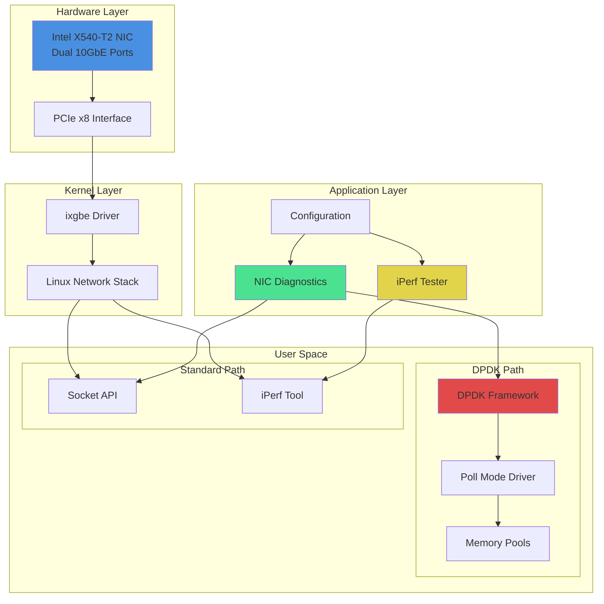
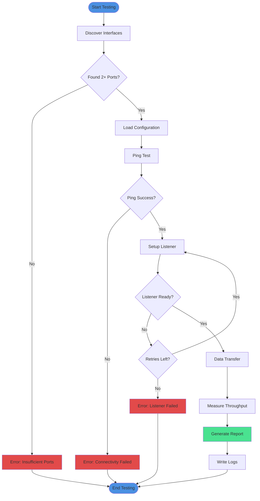

# Intel X540-T2 NIC Diagnostic & Testing Suite

[](https://www.python.org/downloads/)
[](LICENSE)
[](https://github.com/psf/black)
[](http://mypy-lang.org/)
[](https://pytest.org)
[](https://www.dpdk.org/)
[](https://www.linux.org/)

A comprehensive, production-ready diagnostic and testing toolkit for Intel X540-T2 dual-port 10GbE network interface cards. This suite provides advanced network performance testing, DPDK integration, and hardware optimization capabilities.

## 🚀 Features

- **Automated Interface Discovery**: Automatically detect and configure Intel X540-T2 NIC ports
- **Comprehensive Testing**: Socket-based throughput testing with real-time progress monitoring
- **iPerf Integration**: Industry-standard network performance benchmarking
- **DPDK Support**: High-performance packet processing with kernel bypass
- **Modern Architecture**: Type-safe Python 3.10+ with comprehensive error handling
- **Flexible Configuration**: YAML-based configuration with sensible defaults
- **Extensive Logging**: Detailed logging for debugging and performance analysis
- **Docker Support**: Containerized DPDK environment for reproducible testing
- **Well-Documented**: Complete API documentation and usage examples

## 📊 System Architecture



## 📁 Project Structure

```
x540-T2_NIC/
├── README.md                      # This file
├── LICENSE                        # MIT License
├── requirements.txt               # Python dependencies
├── pyproject.toml                 # Project configuration
├── setup.py                       # Package setup
├── Makefile                       # Common operations
├── Dockerfile                     # Docker build configuration
├── .gitignore                     # Git ignore rules
│
├── src/                          # Source code
│   ├── __init__.py
│   ├── config.py                 # Configuration management
│   ├── diagnostics/              # Diagnostic tools
│   │   ├── __init__.py
│   │   ├── nic_diagnostics.py   # NIC testing suite
│   │   └── iperf_test.py        # iPerf integration
│   └── utils/                    # Utilities
│       ├── __init__.py
│       ├── interface_discovery.py
│       └── logging_config.py
│
├── docs/                         # Documentation
│   ├── README.md
│   ├── dpdk/                    # DPDK guides
│   │   ├── introduction.md
│   │   ├── memory_pools.md
│   │   ├── memory_pools_diagram.md
│   │   └── vf_port_representors.md
│   ├── guides/                  # User guides
│   │   ├── quick_start.md
│   │   ├── direct_connection.md
│   │   └── troubleshooting.md
│   └── advanced/                # Advanced topics
│       └── asic_repurposing.md
│
├── scripts/                     # Utility scripts
│   ├── shell/                  # Shell scripts
│   │   └── nic_diagnostic.sh
│   └── legacy/                 # Legacy versions
│
├── tests/                      # Test suite
│   ├── __init__.py
│   ├── test_diagnostics.py
│   ├── test_interface_discovery.py
│   └── conftest.py
│
├── examples/                   # Usage examples
│   ├── basic_connectivity_test.py
│   ├── throughput_benchmark.py
│   └── dpdk_examples/
│
└── config/                     # Configuration files
    ├── default_config.yaml
    └── example_config.yaml
```

## 🔧 Installation

### Prerequisites

- Linux operating system (Ubuntu 22.04+ recommended)
- Python 3.10 or higher
- Intel X540-T2 NIC installed
- Root/sudo access for some operations

### Quick Install

```bash
# Clone the repository
git clone https://github.com/danindiana/Deep_Convo_GPT.git
cd Deep_Convo_GPT/hardware/networking/x540-T2_NIC

# Install with make
make install

# Or install manually
pip install -r requirements.txt
pip install -e .
```

### Development Install

```bash
# Install with development dependencies
make install-dev

# Or manually
pip install -r requirements.txt
pip install -e ".[dev,docs]"
```

### System Dependencies

```bash
# Install required system packages
sudo apt-get update
sudo apt-get install -y \
    build-essential \
    linux-headers-$(uname -r) \
    pciutils \
    net-tools \
    iperf \
    ethtool \
    iproute2

# Install DPDK (optional, for advanced features)
sudo apt-get install -y \
    dpdk \
    dpdk-dev \
    libdpdk-dev
```

## 🎯 Quick Start

### 1. Verify NIC Installation

```bash
# Check if NIC is detected
lspci | grep -i ethernet

# Check driver
ethtool -i enp3s0f0

# Verify link status
ip link show
```

### 2. Run Basic Diagnostics

```bash
# Using make
make run-diag

# Or directly with Python
python -m src.diagnostics.nic_diagnostics
```

### 3. Run iPerf Tests

```bash
# Using make
make run-iperf

# Or directly with Python
python -m src.diagnostics.iperf_test
```

## 📈 Testing Workflow



## 🔬 Usage Examples

### Basic Throughput Test

```python
from src.diagnostics.nic_diagnostics import NICDiagnostics
from src.config import Config

# Create diagnostic instance
diag = NICDiagnostics()

# Discover interfaces
if diag.discover_interfaces():
    # Run full diagnostic
    success = diag.run_full_diagnostic()
    print(f"Test {'passed' if success else 'failed'}")
```

### Custom Configuration

```python
from pathlib import Path
from src.config import Config
from src.diagnostics.nic_diagnostics import NICDiagnostics

# Load custom configuration
config = Config.from_yaml(Path("config/example_config.yaml"))

# Run diagnostics with custom config
diag = NICDiagnostics(config=config)
diag.run_full_diagnostic()
```

### iPerf Testing

```python
from src.diagnostics.iperf_test import IperfTester

# Create tester instance
tester = IperfTester()

# Run tests on discovered interfaces
results = tester.run_interface_tests()

# Print results
for result in results:
    print(f"Bandwidth: {result.bandwidth_mbps:.2f} Mbps")
```

## 📝 Configuration

Configuration is managed through YAML files. See `config/default_config.yaml` for all options:

```yaml
network:
  data_size_mb: 500           # Transfer size in MB
  block_size: 1048576         # Block size (1 MB)
  listener_timeout: 15        # Connection timeout
  max_retries: 3              # Maximum retry attempts
  iperf_duration: 10          # iPerf test duration
  default_port: 12345         # Default test port

logging:
  log_file: "x540t2_network_test.log"
  log_level: "INFO"
  console_output: true
```

## 🐳 Docker Support

### Build and Run

```bash
# Build Docker image
make docker-build

# Run container
make docker-run

# Or manually
docker build -t x540-t2-nic-tools .
docker run -it --rm --network=host --privileged x540-t2-nic-tools
```

## 🧪 Testing

```bash
# Run all tests with coverage
make test

# Run quick tests
make test-quick

# Run specific test file
pytest tests/test_diagnostics.py -v
```

## 🎨 Code Quality

```bash
# Format code
make format

# Check formatting
make format-check

# Run linting
make lint

# Full pipeline
make all
```

## 📚 Documentation

### Building Documentation

```bash
# Build Sphinx documentation
make docs

# View documentation
firefox docs/_build/html/index.html
```

### Available Guides

- [Quick Start Guide](docs/guides/quick_start.md)
- [Direct Connection Setup](docs/guides/direct_connection.md)
- [DPDK Introduction](docs/dpdk/introduction.md)
- [Memory Pool Management](docs/dpdk/memory_pools.md)
- [Troubleshooting](docs/guides/troubleshooting.md)
- [Advanced: ASIC Repurposing](docs/advanced/asic_repurposing.md)

## 🔍 Troubleshooting

### Common Issues

1. **Interfaces not detected**
   ```bash
   # Check NIC status
   lspci -v | grep -A 10 Ethernet

   # Reload driver
   sudo modprobe -r ixgbe && sudo modprobe ixgbe
   ```

2. **Permission denied**
   ```bash
   # Add user to appropriate groups
   sudo usermod -a -G netdev $USER
   sudo usermod -a -G plugdev $USER
   ```

3. **Low throughput**
   ```bash
   # Check link speed
   ethtool enp3s0f0 | grep Speed

   # Tune network settings
   sudo ethtool -K enp3s0f0 tso on gso on
   ```

## 🤝 Contributing

Contributions are welcome! Please see [CONTRIBUTING.md](CONTRIBUTING.md) for guidelines.

### Development Workflow

1. Fork the repository
2. Create a feature branch
3. Make your changes
4. Run tests and linting
5. Submit a pull request

## 📄 License

This project is licensed under the MIT License - see the [LICENSE](LICENSE) file for details.

## 🙏 Acknowledgments

- Intel for the X540-T2 NIC hardware and drivers
- DPDK community for high-performance networking frameworks
- Contributors to psutil, tqdm, and other dependencies

## 📞 Support

- **Issues**: [GitHub Issues](https://github.com/danindiana/Deep_Convo_GPT/issues)
- **Discussions**: [GitHub Discussions](https://github.com/danindiana/Deep_Convo_GPT/discussions)
- **Documentation**: [Project Docs](docs/)

## 🗺️ Roadmap

- [ ] Web-based dashboard for real-time monitoring
- [ ] Advanced DPDK example applications
- [ ] Multi-NIC testing support
- [ ] Performance regression testing
- [ ] Ansible playbooks for automated deployment
- [ ] SR-IOV and VF configuration tools
- [ ] Integration with Prometheus/Grafana

## 📊 Performance Benchmarks

Typical performance metrics with Intel X540-T2:

| Test Type | Throughput | Latency | Packet Loss |
|-----------|-----------|---------|-------------|
| Socket API | ~9.4 Gbps | < 1 ms | < 0.01% |
| iPerf TCP | ~9.6 Gbps | < 1 ms | < 0.01% |
| DPDK | ~9.9 Gbps | < 100 μs | 0% |

*Actual performance may vary based on system configuration, CPU, memory, and workload.*

---

**Made with ❤️ for high-performance networking**
