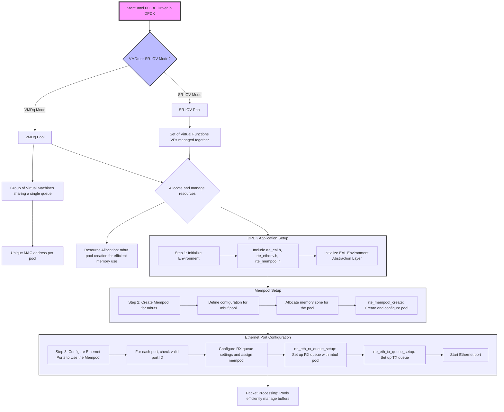

```mermaid
flowchart TD
    A[Start: Intel IXGBE Driver in DPDK] --> B{VMDq or SR-IOV Mode?}

    B -- VMDq Mode --> C[VMDq Pool]
    C --> D[Group of Virtual Machines sharing a single queue]
    D --> E[Unique MAC address per pool]
    
    B -- SR-IOV Mode --> F[SR-IOV Pool]
    F --> G[Set of Virtual Functions VFs managed together]
    
    G --> H{Allocate and manage resources}
    C --> H
    
    H --> I[Resource Allocation: mbuf pool creation for efficient memory use]

    %% DPDK Application Setup subgraph
    subgraph DPDK_Application_Setup [DPDK Application Setup]
        A1[Step 1: Initialize Environment]
        A2[Include rte_eal.h, rte_ethdev.h, rte_mempool.h]
        A3[Initialize EAL Environment Abstraction Layer]
        A1 --> A2 --> A3
    end

    H --> DPDK_Application_Setup

    %% Mempool Setup subgraph
    subgraph Mempool_Setup [Mempool Setup]
        B1[Step 2: Create Mempool for mbufs]
        B2[Define configuration for mbuf pool]
        B3[Allocate memory zone for the pool]
        B4[rte_mempool_create: Create and configure pool]
        B1 --> B2 --> B3 --> B4
    end
    
    DPDK_Application_Setup --> Mempool_Setup
    
    %% Ethernet Port Configuration subgraph
    subgraph Ethernet_Port_Configuration [Ethernet Port Configuration]
        C1[Step 3: Configure Ethernet Ports to Use the Mempool]
        C2[For each port, check valid port ID]
        C3[Configure RX queue settings and assign mempool]
        C4[rte_eth_rx_queue_setup: Set up RX queue with mbuf pool]
        C5[rte_eth_tx_queue_setup: Set up TX queue]
        C6[Start Ethernet port]
        C1 --> C2 --> C3 --> C4 --> C5 --> C6
    end
    
    Mempool_Setup --> Ethernet_Port_Configuration

    Ethernet_Port_Configuration --> K[Packet Processing: Pools efficiently manage buffers]
    
    style A fill:#f9f,stroke:#333,stroke-width:4px
    style B fill:#bbf,stroke:#333,stroke-width:2px
    style Mempool_Setup fill:#eef,stroke:#333,stroke-width:2px
    style Ethernet_Port_Configuration fill:#eef,stroke:#333,stroke-width:2px
    style DPDK_Application_Setup fill:#eef,stroke:#333,stroke-width:2px
```
