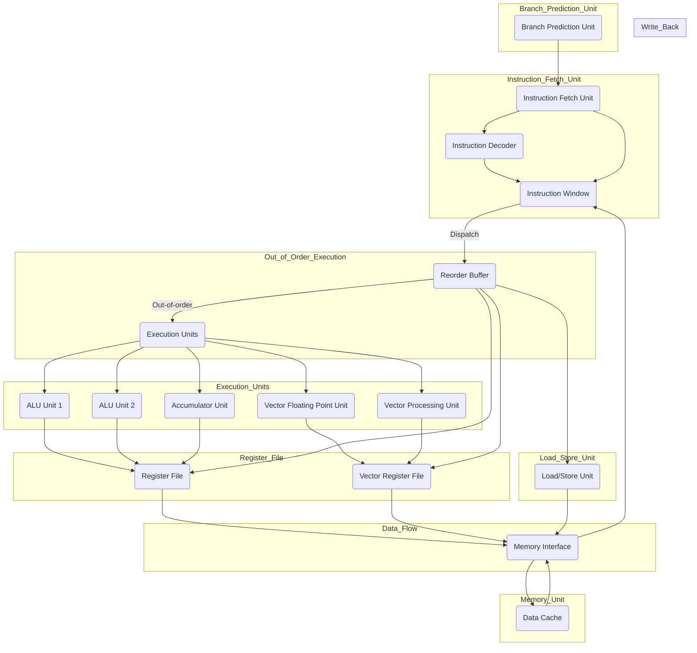

### **Key Components Explanation**:
- **Instruction Fetch Unit (IFU)**: Fetches instructions from memory.
- **Instruction Decoder (ID)**: Decodes the instruction for execution.
- **Instruction Window (IW)**: Holds instructions waiting for dispatch, enabling out-of-order scheduling.
- **Reorder Buffer (ROB)**: Tracks instructions to ensure correct execution order and manages write-backs.
- **Execution Units (ALU, VPU, VFPU)**: Multiple functional units for vector and scalar operations.
- **Accumulator Unit (AU)**: Specialized for accumulating results, common in vector processing.
- **Register File (RF, VRF)**: Stores scalar and vector data.
- **Memory Interface and Load/Store Unit (LSU)**: Manages memory access for load/store instructions.
- **Branch Prediction Unit (BPU)**: Helps reduce pipeline stalls by predicting branches.

This design combines vector processing capabilities with out-of-order execution to efficiently manage both scalar and vectorized workloads.

Yes, combining **vector processing** and **out-of-order execution** into a single object or entity is feasible and would create a highly efficient processing unit optimized for parallelism, high-performance numerical computation, and dynamic execution.

Here's how it would work:

### **Overview of the Combined System**
1. **Vector Processing Capabilities**:
   - The processor would be designed to operate on large, one-dimensional arrays of data (vectors), making it ideal for tasks like numerical simulations, graphics processing, machine learning, etc.
   - Each instruction would apply operations (such as arithmetic, logical, or bitwise) across multiple data elements simultaneously, leveraging SIMD (Single Instruction, Multiple Data) or similar techniques.

2. **Out-of-Order Execution**:
   - To optimize performance further, the processor would dynamically reorder instructions based on the availability of operands and execution units.
   - It would avoid waiting for dependencies by executing independent vector operations that are ready to run, even if they are out of program order.

### **Benefits of Combining These Technologies**:
- **Enhanced Parallelism**: Vector processing already operates on multiple data points simultaneously. By adding out-of-order execution, you enable the processor to execute independent vector operations whenever the necessary data and resources are available, further improving parallelism.
- **Increased Throughput**: Out-of-order execution reduces idle time in the processor. When combined with vector processing, which already increases the number of operations per cycle, this could significantly boost throughput, especially for workloads with high levels of parallelism, such as matrix operations, physics simulations, and real-time graphics rendering.
- **Efficiency in Numerical and Data-Heavy Tasks**: Numerical simulations, machine learning tasks, and graphics processing often involve operations on large arrays of data. By combining vector processing with out-of-order execution, the processor can avoid stalls and process these data-intensive tasks much faster, making the architecture ideal for high-performance computing (HPC) environments.

### **Challenges**:
- **Complexity in Design**: Combining vector processing with out-of-order execution adds significant complexity to the processor's control unit. The control logic would need to track dependencies between vector operations, handle the out-of-order instruction window, and ensure correct final results despite reordering.
- **Resource Management**: The architecture would need a sophisticated resource management system to handle the scheduling of vector instructions and ensure that execution units are optimally used without causing conflicts or stalls.

### **Possible Applications**:
- **Scientific Simulations**: Fields such as climate modeling, fluid dynamics, and quantum physics simulations could benefit from this hybrid architecture, as they often rely on large-scale matrix and vector operations.
- **Artificial Intelligence (AI) and Machine Learning (ML)**: Training large models involves operations on massive data arrays. A combined vector and out-of-order execution processor could handle the necessary matrix multiplications and other linear algebra operations more efficiently.
- **Graphics Processing**: Real-time graphics rendering, especially with modern shaders and physics engines, could benefit from the increased parallelism and dynamic execution provided by this design.
- **Gaming Consoles and GPUs**: Such an architecture could be particularly effective in gaming systems, where both vectorized workloads (like rendering) and dynamic workloads (like physics and AI) need to be processed efficiently in real-time.

### **Potential Architecture Example**:
- **Execution Units**: Multiple vector arithmetic units capable of SIMD processing.
- **Dynamic Scheduler**: A component responsible for analyzing the dependencies between vector instructions and reordering them dynamically.
- **Register File**: Capable of handling vector registers and tracking the status of each instruction's data dependencies.
- **Load/Store Unit**: Optimized for fetching vector data from memory and ensuring memory consistency despite out-of-order execution.

In summary, combining vector processing with out-of-order execution would create a processor capable of handling complex, data-parallel workloads dynamically and efficiently. This would be a powerful architecture for many modern computing tasks, particularly in scientific computing, graphics processing, AI, and machine learning.
