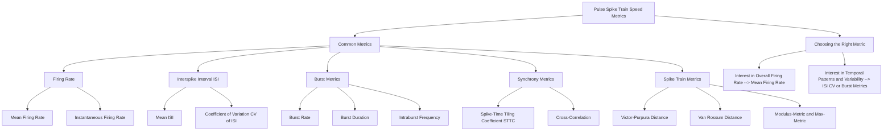

Pulse spike train speed metrics are used to quantify the temporal characteristics of neuronal activity. They provide valuable insights into the rate and patterns of neuron firing, which are crucial for understanding brain function.

Here are some common pulse spike train speed metrics:

1. Firing Rate:

Mean Firing Rate: The average number of spikes per unit of time (e.g., spikes per second or Hz).
Instantaneous Firing Rate: The firing rate at a specific moment in time, often estimated using a smoothing window or kernel.
2. Interspike Interval (ISI):

Mean ISI: The average time between successive spikes.

Coefficient of Variation (CV) of ISI: A measure of the variability of interspike intervals. A higher CV indicates more irregular firing patterns.   
3. Burst Metrics:

Burst Rate: The number of bursts per unit of time.
Burst Duration: The length of time a burst lasts.
Intraburst Frequency: The average firing rate within a burst.
4. Synchrony Metrics:

Spike-Time Tiling Coefficient (STTC): Measures the degree of synchrony between two spike trains.   
Cross-Correlation: Assesses the temporal relationship between two spike trains.   
5. Spike Train Metrics:

Victor-Purpura Distance: Measures the dissimilarity between two spike trains.   
Van Rossum Distance: A parameter-dependent metric for comparing spike trains, often used in machine learning applications.   
Modulus-Metric and Max-Metric: Suitable for measuring distances between spike trains with bursts.   
These are just a few examples, and many other metrics exist depending on the specific research question and data analysis approach.

Choosing the right metric:

The choice of metric depends on the specific aspect of neuronal activity you want to investigate. For example, if you're interested in the overall firing rate, mean firing rate might be sufficient. However, if you want to understand the temporal patterns and variability of firing, you might need to consider metrics like ISI CV or burst metrics.





Python Dict
```
pulse_spike_train_speed_metrics = {
    "PulseSpikeTrainSpeedMetrics": {
        "CommonMetrics": {
            "FiringRate": ["MeanFiringRate", "InstantaneousFiringRate"],
            "InterspikeInterval": ["MeanISI", "CoefficientOfVariationISI"],
            "BurstMetrics": ["BurstRate", "BurstDuration", "IntraburstFrequency"],
            "SynchronyMetrics": ["SpikeTimeTilingCoefficientSTTC", "CrossCorrelation"],
            "SpikeTrainMetrics": ["VictorPurpuraDistance", "VanRossumDistance", "ModulusMetric", "MaxMetric"]
        },
        "ChoosingTheRightMetric": {
            "InterestInOverallFiringRate": "MeanFiringRate",
            "InterestInTemporalPatternsAndVariability": ["ISICV", "BurstMetrics"]
        }
    }
}
```

# Pulse Spike Train Speed Metrics

## Common Metrics
- Firing Rate
  - Mean Firing Rate
  - Instantaneous Firing Rate
- Interspike Interval (ISI)
  - Mean ISI
  - Coefficient of Variation (CV) of ISI
- Burst Metrics
  - Burst Rate
  - Burst Duration
  - Intraburst Frequency
- Synchrony Metrics
  - Spike-Time Tiling Coefficient (STTC)
  - Cross-Correlation
- Spike Train Metrics
  - Victor-Purpura Distance
  - Van Rossum Distance
  - Modulus-Metric and Max-Metric

## Choosing the Right Metric
- Interest in Overall Firing Rate
  - Mean Firing Rate
- Interest in Temporal Patterns and Variability
  - ISI CV
  - Burst Metrics
