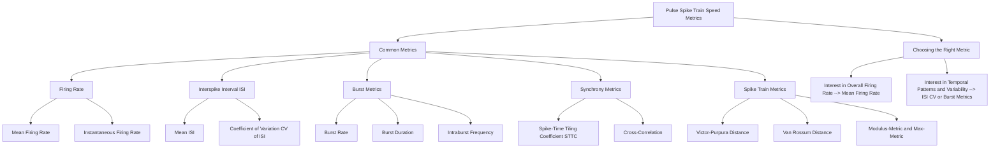

Python Dict
```
pulse_spike_train_speed_metrics = {
    "PulseSpikeTrainSpeedMetrics": {
        "CommonMetrics": {
            "FiringRate": ["MeanFiringRate", "InstantaneousFiringRate"],
            "InterspikeInterval": ["MeanISI", "CoefficientOfVariationISI"],
            "BurstMetrics": ["BurstRate", "BurstDuration", "IntraburstFrequency"],
            "SynchronyMetrics": ["SpikeTimeTilingCoefficientSTTC", "CrossCorrelation"],
            "SpikeTrainMetrics": ["VictorPurpuraDistance", "VanRossumDistance", "ModulusMetric", "MaxMetric"]
        },
        "ChoosingTheRightMetric": {
            "InterestInOverallFiringRate": "MeanFiringRate",
            "InterestInTemporalPatternsAndVariability": ["ISICV", "BurstMetrics"]
        }
    }
}
```

# Pulse Spike Train Speed Metrics

## Common Metrics
- Firing Rate
  - Mean Firing Rate
  - Instantaneous Firing Rate
- Interspike Interval (ISI)
  - Mean ISI
  - Coefficient of Variation (CV) of ISI
- Burst Metrics
  - Burst Rate
  - Burst Duration
  - Intraburst Frequency
- Synchrony Metrics
  - Spike-Time Tiling Coefficient (STTC)
  - Cross-Correlation
- Spike Train Metrics
  - Victor-Purpura Distance
  - Van Rossum Distance
  - Modulus-Metric and Max-Metric

## Choosing the Right Metric
- Interest in Overall Firing Rate
  - Mean Firing Rate
- Interest in Temporal Patterns and Variability
  - ISI CV
  - Burst Metrics
