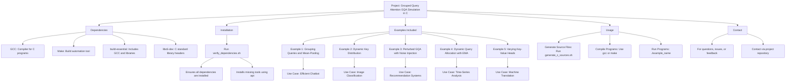

```mermaid
graph TD
    A[Project: Grouped Query Attention GQA Simulation in C] --> B[Dependencies]
    B --> B1[GCC: Compiler for C programs]
    B --> B2[Make: Build automation tool]
    B --> B3[build-essential: Includes GCC and libraries]
    B --> B4[libc6-dev: C standard library headers]

    A --> C[Installation]
    C --> C1[Run verify_dependencies.sh]
    C1 --> C2[Ensures all dependencies are installed]
    C1 --> C3[Installs missing tools using apt]

    A --> D[Examples Included]
    D --> D1[Example 1: Grouping Queries and Mean-Pooling]
    D1 --> D1a[Use Case: Efficient Chatbot]
    D --> D2[Example 2: Dynamic Key Distribution]
    D2 --> D2a[Use Case: Image Classification]
    D --> D3[Example 3: Perturbed GQA with Noise Injection]
    D3 --> D3a[Use Case: Recommendation Systems]
    D --> D4[Example 4: Dynamic Query Allocation with EMA]
    D4 --> D4a[Use Case: Time-Series Analysis]
    D --> D5[Example 5: Varying Key-Value Heads]
    D5 --> D5a[Use Case: Machine Translation]

    A --> E[Usage]
    E --> E1[Generate Source Files: Run generate_c_sources.sh]
    E --> E2[Compile Programs: Use gcc or make]
    E --> E3[Run Programs: ./example_name]

    A --> F[Contact]
    F --> F1[For questions, issues, or feedback]
    F --> F2[Contact via project repository]
```
