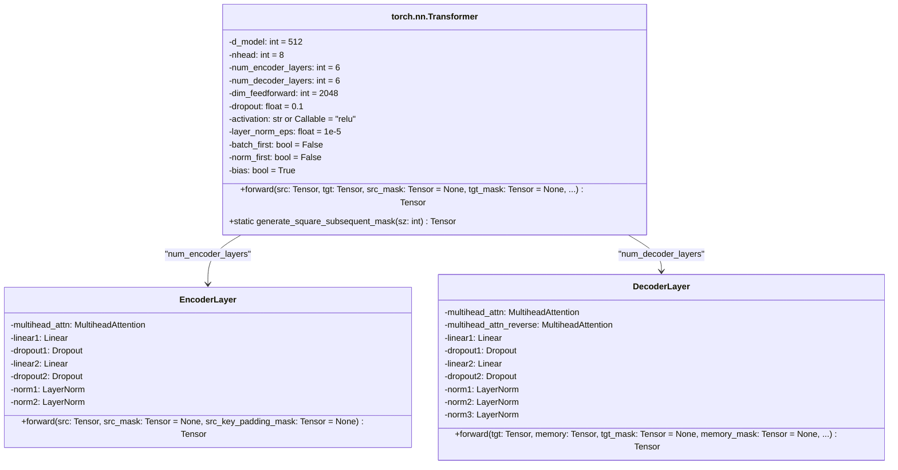

```
This diagram shows:
1. The main Transformer class with its key parameters
2. The forward method signature
3. The static mask generation method
4. Composition relationships with EncoderLayer and DecoderLayer
5. Key components of the encoder and decoder layers

The diagram highlights:
- Core parameters with their default values
- The modular structure of encoder/decoder layers
- Basic attention mechanisms in both encoder and decoder layers
- Layer normalization and dropout components
- The forward pass flow through encoder and decoder layers

Note: This is a simplified representation focusing on the architectural components. The actual implementation has additional helper classes and detailed tensor operations not shown here for clarity.
