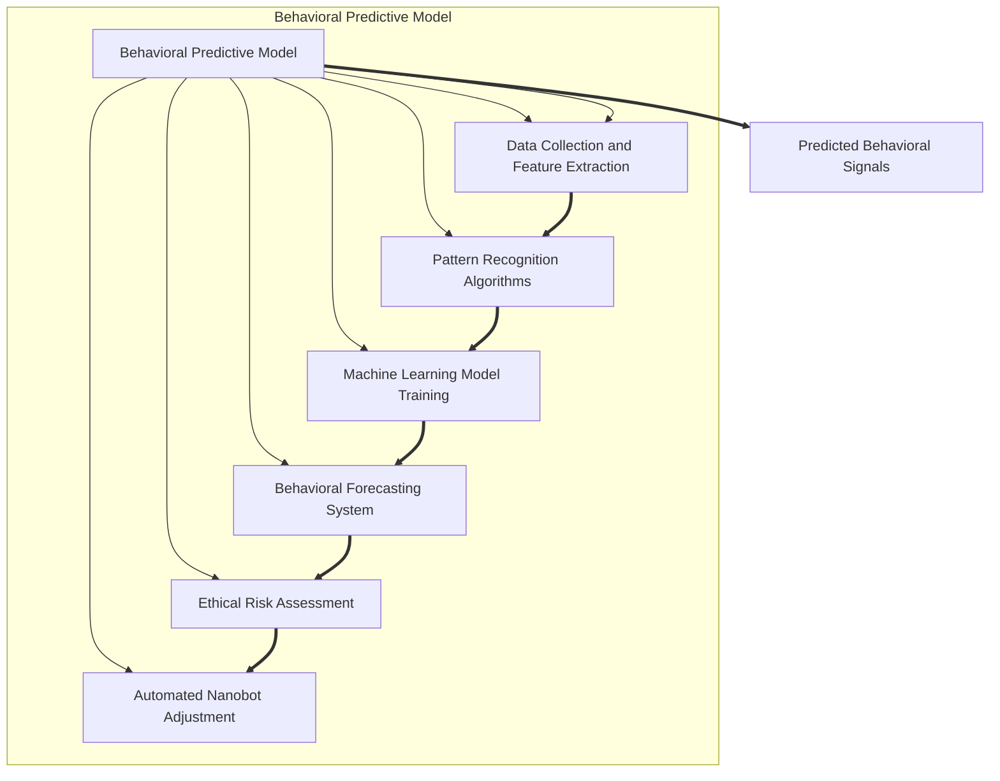

```mermaid
graph TD
    F4_5[Behavioral Predictive Model] --> F4_5_1[Data Collection and Feature Extraction]
    subgraph Behavioral Predictive Model
        F4_5 --> F4_5_1[Data Collection and Feature Extraction]
        F4_5 --> F4_5_2[Pattern Recognition Algorithms]
        F4_5 --> F4_5_3[Machine Learning Model Training]
        F4_5 --> F4_5_4[Behavioral Forecasting System]
        F4_5 --> F4_5_5[Ethical Risk Assessment]
        F4_5 --> F4_5_6[Automated Nanobot Adjustment]
    end

    F4_5_1 ==> F4_5_2
    F4_5_2 ==> F4_5_3
    F4_5_3 ==> F4_5_4
    F4_5_4 ==> F4_5_5
    F4_5_5 ==> F4_5_6

    F4_5 ==> PredictionOutput[Predicted Behavioral Signals]
```
