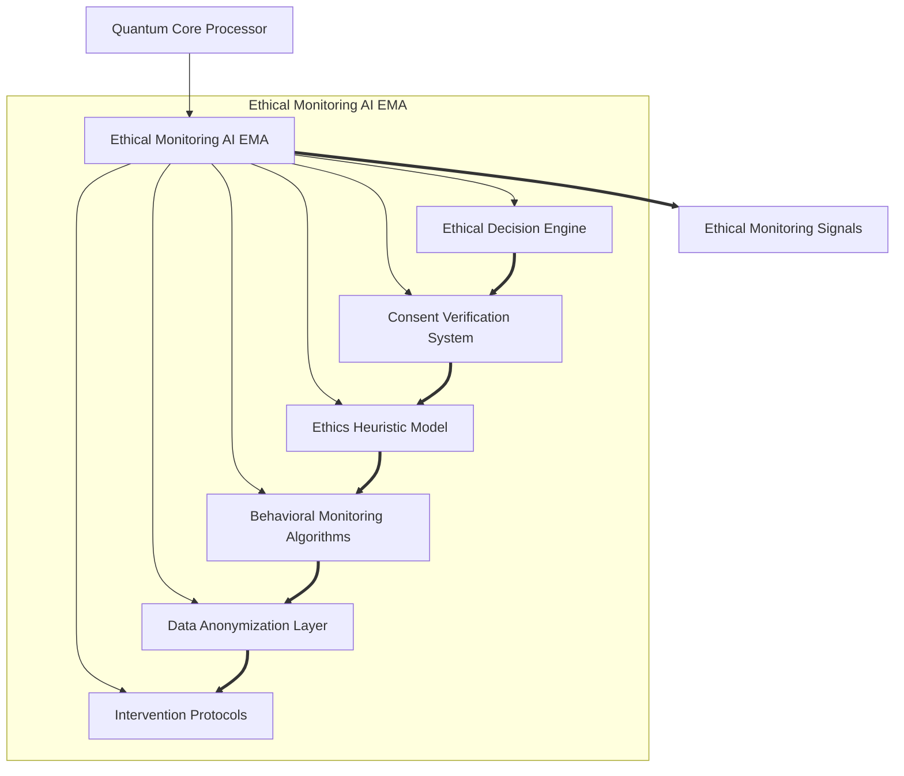

```mermaid
graph TD
    A[Quantum Core Processor] --> F[Ethical Monitoring AI EMA]
    subgraph Ethical Monitoring AI EMA
        F --> F1[Ethical Decision Engine]
        F --> F2[Consent Verification System]
        F --> F3[Ethics Heuristic Model]
        F --> F4[Behavioral Monitoring Algorithms]
        F --> F5[Data Anonymization Layer]
        F --> F6[Intervention Protocols]
    end

    F1 ==> F2
    F2 ==> F3
    F3 ==> F4
    F4 ==> F5
    F5 ==> F6

    F ==> EthicalDecisions[Ethical Monitoring Signals]
```
