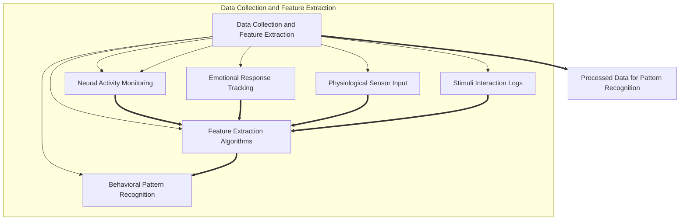

```mermaid
graph TD
    F4_5_1[Data Collection and Feature Extraction] --> F4_5_1_1[Neural Activity Monitoring]
    subgraph Data Collection and Feature Extraction
        F4_5_1 --> F4_5_1_1[Neural Activity Monitoring]
        F4_5_1 --> F4_5_1_2[Emotional Response Tracking]
        F4_5_1 --> F4_5_1_3[Physiological Sensor Input]
        F4_5_1 --> F4_5_1_4[Stimuli Interaction Logs]
        F4_5_1 --> F4_5_1_5[Feature Extraction Algorithms]
        F4_5_1 --> F4_5_1_6[Behavioral Pattern Recognition]
    end

    F4_5_1_1 ==> F4_5_1_5
    F4_5_1_2 ==> F4_5_1_5
    F4_5_1_3 ==> F4_5_1_5
    F4_5_1_4 ==> F4_5_1_5
    F4_5_1_5 ==> F4_5_1_6

    F4_5_1 ==> FeatureOutput[Processed Data for Pattern Recognition]
```
