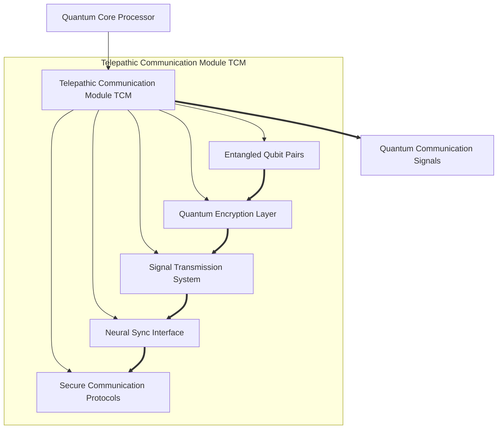

```mermaid
graph TD
    A[Quantum Core Processor] --> C[Telepathic Communication Module TCM]
    subgraph Telepathic Communication Module TCM
        C --> C1[Entangled Qubit Pairs]
        C --> C2[Quantum Encryption Layer]
        C --> C3[Signal Transmission System]
        C --> C4[Neural Sync Interface]
        C --> C5[Secure Communication Protocols]
    end

    C1 ==> C2
    C2 ==> C3
    C3 ==> C4
    C4 ==> C5

    C ==> DataFlow[Quantum Communication Signals]
```
