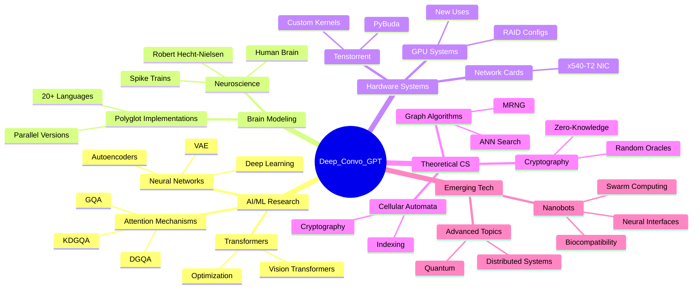
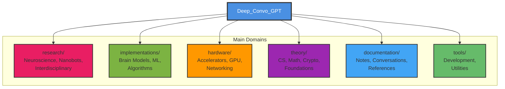
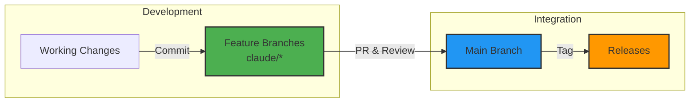
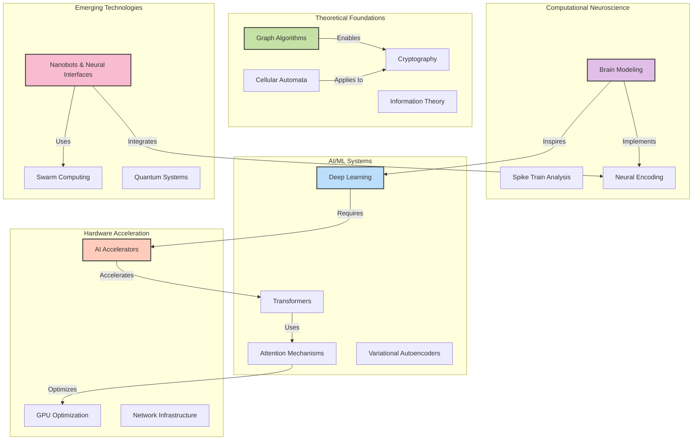
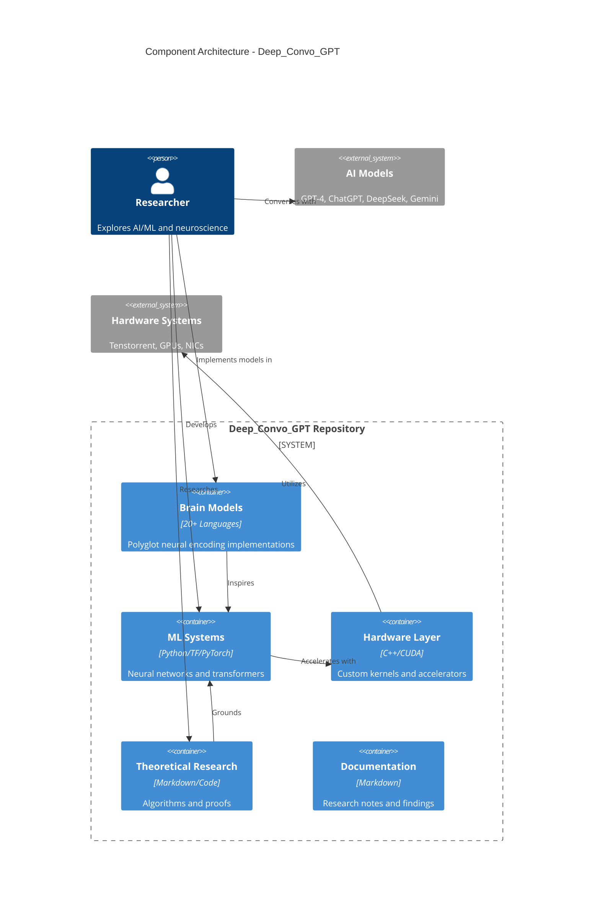
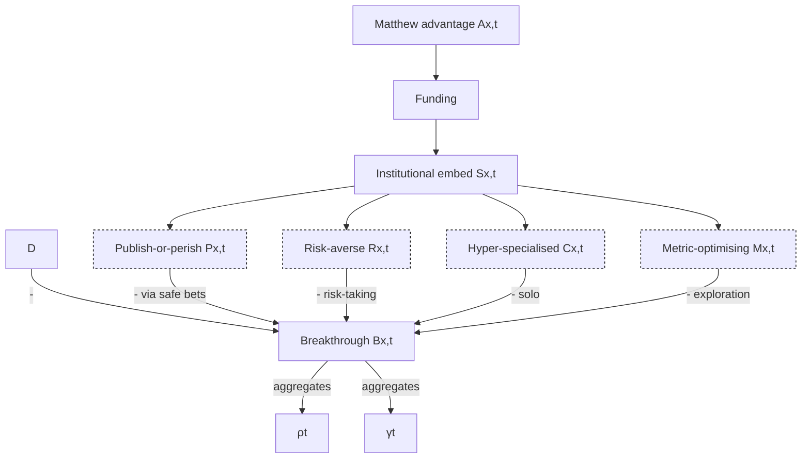
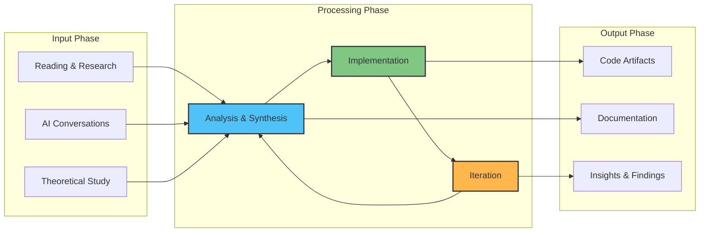
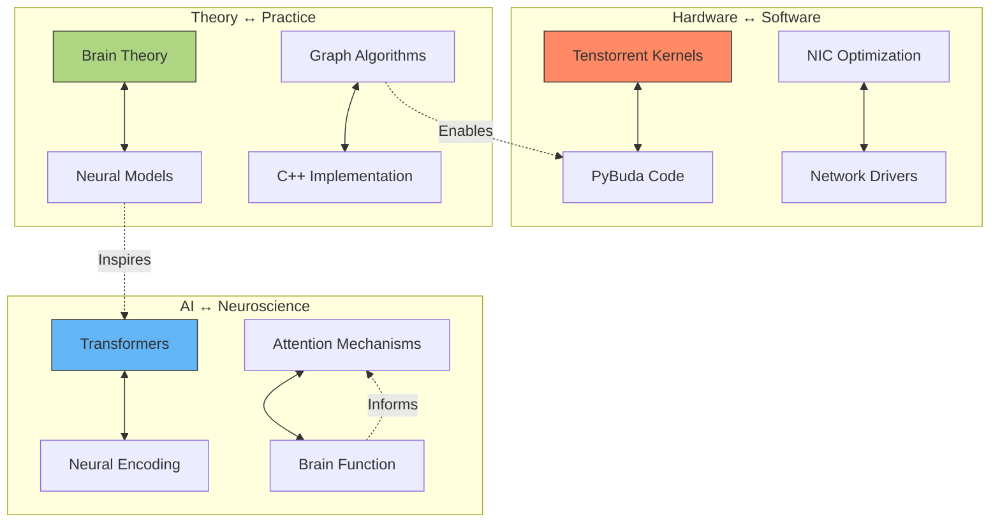

# Deep_Convo_GPT: Polymath Knowledge Base & Research Repository

A comprehensive knowledge repository spanning computational neuroscience, AI/ML systems, hardware acceleration, theoretical computer science, and emerging technologies. This repository serves as a personal research archive, code experimentation lab, and documentation hub for deep technical explorations.

## 📚 Table of Contents

- [Repository Overview](#repository-overview)
- [Repository Structure](#repository-structure)
- [Git Workflow](#git-workflow)
- [Research Domains](#research-domains)
- [Component Architecture](#component-architecture)
- [Key Features](#key-features)
- [Getting Started](#getting-started)
- [Institutional Research Context](#institutional-research-context)

## Repository Overview



## Repository Structure

The repository is now organized into six main domains for improved navigation and maintainability:



### Directory Overview

```
Deep_Convo_GPT/
├── research/              # Research domains
│   ├── neuroscience/      # Brain research, spike trains, arousal
│   ├── nanobots/          # Nanobot theory and applications
│   ├── emerging-technologies/  # Proof of workforce, etc.
│   └── interdisciplinary/ # Buddhism, jumping spiders, phylogenetics, etc.
│
├── implementations/       # Code implementations
│   ├── brain-models/      # 20+ language implementations
│   │   └── polyglot/      # functional, systems, scientific, specialized, classic
│   ├── machine-learning/  # Neural networks, attention, architectures
│   └── algorithms/        # Graph algorithms, cellular automata
│
├── hardware/              # Hardware acceleration
│   ├── accelerators/      # Tenstorrent, Colossus
│   ├── gpu/              # GPU optimization and new uses
│   ├── networking/       # x540-T2 NIC, DPDK
│   └── voomrisc/         # VoomRISC architecture
│
├── theory/               # Theoretical foundations
│   ├── computer-science/ # BCNF, PRAM computation
│   ├── mathematics/      # Graph theory, Markov chains
│   ├── cryptography/     # Polybius, zero-knowledge
│   └── foundations/      # Gödel, logic
│
├── documentation/        # Documentation and notes
│   ├── notes/           # Surprising facts, brain info
│   ├── conversations/   # AI research dialogues
│   ├── references/      # Learning resources
│   └── personal/        # CV, achievements
│
└── tools/               # Development tools
    ├── development/     # Software ideas and resources
    ├── routing/         # LLM routing (Pilot)
    └── utilities/       # Vagrant, scripts
```

Each major directory contains an `INDEX.md` file for detailed navigation.

## Git Workflow

```mermaid
gitGraph
    commit id: "Initial commit"
    commit id: "Add brain models"
    branch main
    commit id: "Update README"
    commit id: "Add network diagrams"
    branch claude/add-git-mermaid-diagrams-01KWgHKLQKf6fxDSLuHDbZXL
    commit id: "Create cloudflare.md" tag: "6c58fa1"
    commit id: "Create awsroute53outage.md" tag: "a182b0a"
    commit id: "Add R-zero diagram" tag: "676c725"
    commit id: "Add mermaid diagrams" type: HIGHLIGHT
    checkout main
```

### Branch Strategy



## Research Domains



## Component Architecture



## Key Features

### 🧠 Brain Modeling Polyglot Implementation

Implementations in **20+ programming languages**:
- **Functional**: Haskell, F#, Lisp, Erlang, Scala
- **Systems**: C++, Rust, Verilog, VHDL
- **Scientific**: R, Fortran, Julia, Python
- **Specialized**: APL, Chapel, SQL, Janus
- **Classic**: BASIC, COBOL, Pascal, Perl
- **Parallel**: OpenMP variants

### 🤖 Neural Network Research

- **Attention Mechanisms**: GQA, KDGQA, DGQA for memory-efficient transformers
- **Autoencoders**: Variational autoencoders in TensorFlow and PyTorch
- **Deep Learning**: Custom architectures with attention-based encoding
- **Vision Transformers**: Optimizations for memory-constrained environments

### ⚡ Hardware Acceleration

- **Tenstorrent Integration**: PyBuda custom kernels (convolution, LSTM, activations)
- **GPU Optimization**: RAID configurations and novel use cases
- **Network Infrastructure**: x540-T2 NIC specifications and optimization

### 📊 Graph Algorithms

- **MRNG**: Monotonic Relative Neighborhood Graph optimization
- **ANN Search**: Approximate nearest neighbor with dynamic edge optimization
- **Range Search**: Efficient spatial queries

### 🔬 Nanobot Research

Extensive theoretical framework covering:
- Thought-reading nanobots and neural interfaces
- Swarm computing and data transfer modalities
- Biocompatibility and operational efficiency
- Clinical applications and ethical considerations

### 📚 Knowledge Documentation

- 200+ counterintuitive facts from mathematics, CS, physics
- Extended CV with AI analysis of technical skills
- Research conversations with multiple AI models
- Iterative refinement across v2, v3, v4, v5 versions

## Getting Started

### Navigation Guide

| Domain | Key Directories | Description |
|--------|----------------|-------------|
| **Research** | `research/neuroscience/`, `research/nanobots/`, `research/interdisciplinary/` | Neuroscience, nanobots, phylogenetics, and cross-domain research |
| **Implementations** | `implementations/brain-models/`, `implementations/machine-learning/`, `implementations/algorithms/` | Brain models in 20+ languages, neural networks, graph algorithms |
| **Hardware** | `hardware/accelerators/`, `hardware/gpu/`, `hardware/networking/` | Tenstorrent, GPU optimization, NIC configuration |
| **Theory** | `theory/mathematics/`, `theory/cryptography/`, `theory/computer-science/` | Graph theory, Markov chains, cryptography, PRAM algorithms |
| **Documentation** | `documentation/notes/`, `documentation/conversations/`, `documentation/personal/` | Research notes, AI dialogues, CV and achievements |
| **Tools** | `tools/development/`, `tools/routing/`, `tools/utilities/` | Software ideas, LLM routing, development utilities |

### Quick Start

```bash
# Clone the repository
git clone <repository-url>
cd Deep_Convo_GPT

# Explore brain models organized by language
ls implementations/brain-models/polyglot/*/

# Review neural network implementations
cd implementations/machine-learning/neural-networks/
python DeepBrainModel.py
python VAE.py

# Browse research documentation
cd ../../research/nanobots/
ls *.md

# Check INDEX files for navigation
cat ../INDEX.md
cat ../../implementations/INDEX.md
```

## Institutional Research Context

The following diagram illustrates institutional barriers to scientific breakthroughs, contextualizing the independent research approach of this repository:



This repository represents an alternative research model: independent, cross-disciplinary exploration without the constraints of institutional publishing pressures or hyper-specialization.

## Research Methodology



## Cross-Domain Integration



## Contributing

This is a personal research repository. For collaboration or questions, please open an issue.

## License

Research and educational purposes. Individual components may have specific licenses - check subdirectories.

---

**Last Updated**: 2025-11-16
**Branch**: `claude/organize-main-files-016c7saXXFT39XRJDXQoUPKR`
**Maintained by**: Personal research initiative
**Structure**: Fully reorganized into 6 main domains (see documentation/STRUCTURE_IMPROVEMENTS.md for details)
