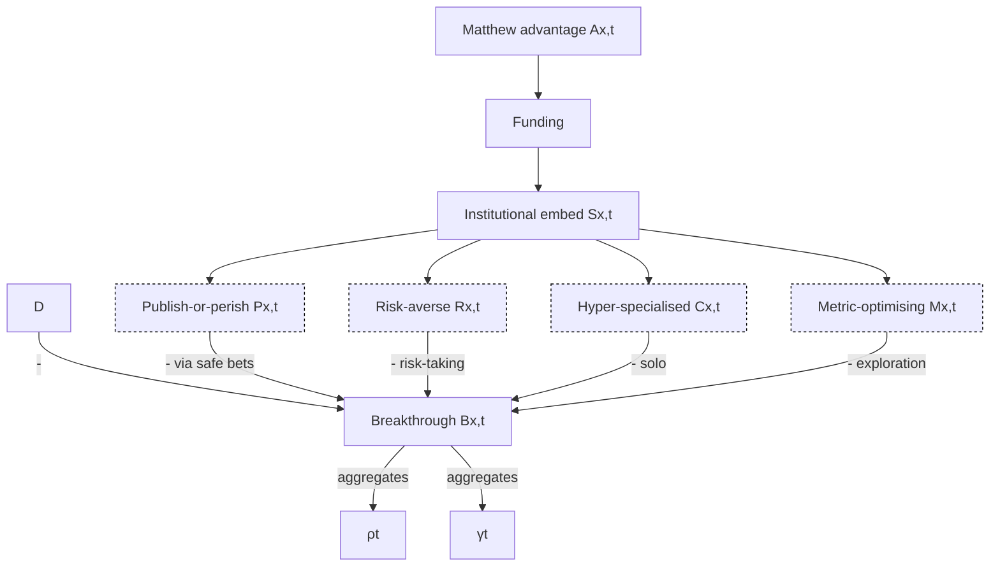

```mermaid
  flowchart TD
    D -->|-| B[Breakthrough Bx,t]
  S[Institutional embed Sx,t] --> P[Publish-or-perish Px,t]
  S --> R[Risk-averse Rx,t]
  S --> C[Hyper-specialised Cx,t]
  S --> M[Metric-optimising Mx,t]
  P -->|- via safe bets| B
  R -->|- risk-taking| B
  C -->|- solo| B
  M -->|- exploration| B
  A[Matthew advantage Ax,t] --> Fund[Funding]
  Fund --> S
  B -->|aggregates| rho[ρt]
  B -->|aggregates| gamma[γt]
  classDef neg stroke:#000,stroke-dasharray: 3 3;
  class P,R,C,M neg;
  classDef neg stroke:#000,stroke-dasharray: 3 3;
```
