# Deep_Convo_GPT: Polymath Knowledge Base & Research Repository

A comprehensive knowledge repository spanning computational neuroscience, AI/ML systems, hardware acceleration, theoretical computer science, and emerging technologies. This repository serves as a personal research archive, code experimentation lab, and documentation hub for deep technical explorations.

## 📚 Table of Contents

- [Repository Overview](#repository-overview)
- [Repository Structure](#repository-structure)
- [Git Workflow](#git-workflow)
- [Research Domains](#research-domains)
- [Component Architecture](#component-architecture)
- [Key Features](#key-features)
- [Getting Started](#getting-started)
- [Institutional Research Context](#institutional-research-context)

## Repository Overview


## Repository Structure

```mermaid
graph TB
    subgraph "Root Level"
        ROOT[Deep_Convo_GPT]
        BRAIN[Brain Models<br/>20+ Languages]
        NN[Neural Networks<br/>Python/TF/PyTorch]
        DOCS[Documentation<br/>README files]
    end

    subgraph "AI/ML Domain"
        ATT[attention/<br/>GQA Research]
        GRU[GRU/<br/>Gated Units]
        RELU[RELU/<br/>Activations]
        VAE[VAE/<br/>Autoencoders]
        PILOT[Pilot_LLM_router]
    end

    subgraph "Hardware Domain"
        TENS[tenstorrent/<br/>AI Accelerators]
        GPU[GPU_new_uses/<br/>Optimization]
        NIC[x540-T2_NIC/<br/>Network Cards]
        COLOSSUS[colossus/<br/>Hardware Specs]
    end

    subgraph "Theory Domain"
        GRAPHS[graphs/<br/>Algorithms & Viz]
        CA[cellular_automata/<br/>Indexing & Crypto]
        MARKOV[markov_chains]
        POLY[polybius/<br/>Cryptography]
    end

    subgraph "Research Domain"
        NANO[nanobots/<br/>Extensive Research]
        NEURO[human_brain/<br/>Neuroscience]
        RHN[Robert Hecht-Nielsen]
        EARLY[early_homonids]
    end

    subgraph "Software & Dev"
        SW[software_dev]
        IDEAS[software_ideas]
        CPP[C_PP/<br/>Algorithms]
    end

    ROOT --> BRAIN
    ROOT --> NN
    ROOT --> DOCS
    ROOT --> ATT
    ROOT --> TENS
    ROOT --> GRAPHS
    ROOT --> NANO
    ROOT --> SW

    style ROOT fill:#4a90e2,stroke:#333,stroke-width:3px,color:#fff
    style BRAIN fill:#7cb342,stroke:#333,stroke-width:2px
    style NN fill:#7cb342,stroke:#333,stroke-width:2px
    style NANO fill:#e91e63,stroke:#333,stroke-width:2px
    style TENS fill:#ff9800,stroke:#333,stroke-width:2px
    style ATT fill:#9c27b0,stroke:#333,stroke-width:2px
```



## Git Workflow

```mermaid
gitGraph
    commit id: "Initial commit"
    commit id: "Add brain models"
    branch main
    commit id: "Update README"
    commit id: "Add network diagrams"
    branch claude/add-git-mermaid-diagrams-01KWgHKLQKf6fxDSLuHDbZXL
    commit id: "Create cloudflare.md" tag: "6c58fa1"
    commit id: "Create awsroute53outage.md" tag: "a182b0a"
    commit id: "Add R-zero diagram" tag: "676c725"
    commit id: "Add mermaid diagrams" type: HIGHLIGHT
    checkout main
```

### Branch Strategy


## Research Domains


## Component Architecture


## Key Features

### 🧠 Brain Modeling Polyglot Implementation

Implementations in **20+ programming languages**:
- **Functional**: Haskell, F#, Lisp, Erlang, Scala
- **Systems**: C++, Rust, Verilog, VHDL
- **Scientific**: R, Fortran, Julia, Python
- **Specialized**: APL, Chapel, SQL, Janus
- **Classic**: BASIC, COBOL, Pascal, Perl
- **Parallel**: OpenMP variants

### 🤖 Neural Network Research

- **Attention Mechanisms**: GQA, KDGQA, DGQA for memory-efficient transformers
- **Autoencoders**: Variational autoencoders in TensorFlow and PyTorch
- **Deep Learning**: Custom architectures with attention-based encoding
- **Vision Transformers**: Optimizations for memory-constrained environments

### ⚡ Hardware Acceleration

- **Tenstorrent Integration**: PyBuda custom kernels (convolution, LSTM, activations)
- **GPU Optimization**: RAID configurations and novel use cases
- **Network Infrastructure**: x540-T2 NIC specifications and optimization

### 📊 Graph Algorithms

- **MRNG**: Monotonic Relative Neighborhood Graph optimization
- **ANN Search**: Approximate nearest neighbor with dynamic edge optimization
- **Range Search**: Efficient spatial queries

### 🔬 Nanobot Research

Extensive theoretical framework covering:
- Thought-reading nanobots and neural interfaces
- Swarm computing and data transfer modalities
- Biocompatibility and operational efficiency
- Clinical applications and ethical considerations

### 📚 Knowledge Documentation

- 200+ counterintuitive facts from mathematics, CS, physics
- Extended CV with AI analysis of technical skills
- Research conversations with multiple AI models
- Iterative refinement across v2, v3, v4, v5 versions

## Getting Started

### Navigation Guide

| Domain | Key Directories | Description |
|--------|----------------|-------------|
| **AI/ML** | `attention/`, `VAE/`, `GRU/`, `RELU/` | Neural network research and implementations |
| **Brain** | Root `.apl`, `.awk`, `.py`, etc. files | Multi-language brain models |
| **Hardware** | `tenstorrent/`, `GPU_new_uses/`, `colossus/` | Hardware acceleration and optimization |
| **Theory** | `graphs/`, `cellular_automata/`, `markov_chains/` | Algorithms and theoretical CS |
| **Research** | `nanobots/`, `human_brain/`, `Robert Hecht-Nielsen/` | Cutting-edge research topics |
| **Software** | `software_dev/`, `C_PP/`, `Pilot_LLM_router/` | Development and tools |

### Quick Start

```bash
# Clone the repository
git clone <repository-url>
cd Deep_Convo_GPT

# Explore brain models
ls *.py *.cpp *.hs *.lisp

# Review neural network implementations
python DeepBrainModel.py
python VAE.py

# Browse research documentation
cd nanobots/
ls README*.md
```

## Institutional Research Context

The following diagram illustrates institutional barriers to scientific breakthroughs, contextualizing the independent research approach of this repository:


This repository represents an alternative research model: independent, cross-disciplinary exploration without the constraints of institutional publishing pressures or hyper-specialization.

## Research Methodology


## Cross-Domain Integration


## Contributing

This is a personal research repository. For collaboration or questions, please open an issue.

## License

Research and educational purposes. Individual components may have specific licenses - check subdirectories.

---

**Last Updated**: 2025-11-14
**Branch**: `claude/add-git-mermaid-diagrams-01KWgHKLQKf6fxDSLuHDbZXL`
**Maintained by**: Personal research initiative
