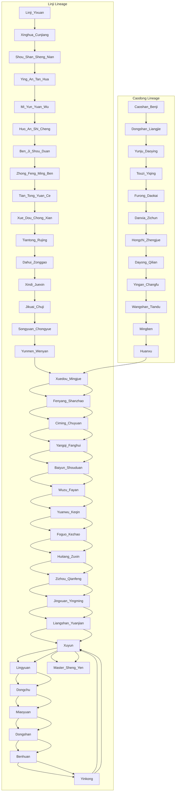

```mermaid
graph TD
    subgraph Linji Lineage
        Linji_Yixuan --> Xinghua_Cunjiang --> Shou_Shan_Sheng_Nian --> Ying_An_Tan_Hua --> Mi_Yun_Yuan_Wu --> Huo_An_Shi_Cheng --> Ben_Ji_Shou_Duan --> Zhong_Feng_Ming_Ben --> Tian_Tong_Yuan_Ce --> Xue_Dou_Chong_Xian --> Tiantong_Rujing --> Dahui_Zonggao --> Xindi_Juexin --> Jikuai_Chuji --> Songyuan_Chongyue --> Yunmen_Wenyan --> Xuedou_Mingjue --> Fenyang_Shanzhao
        Fenyang_Shanzhao --> Ciming_Chuyuan --> Yangqi_Fanghui --> Baiyun_Shouduan --> Wuzu_Fayan --> Yuanwu_Keqin --> Foguo_Kezhao --> Huitang_Zuxin --> Zizhou_Qianfeng --> Jingxuan_Yingming --> Liangshan_Yuanjian --> Xuyun --> Lingyuan --> Dongchu
        Dongchu --> Miaoyuan
        Miaoyuan --> Dongshan
        Dongshan --> Benhuan
        Benhuan --> Yinkong
        Yinkong --> Xuyun
        Xuyun --> Master_Sheng_Yen
    end
    subgraph Caodong Lineage
        Caoshan_Benji --> Dongshan_Liangjie --> Yunju_Daoying --> Touzi_Yiqing --> Furong_Daokai --> Danxia_Zichun --> Hongzhi_Zhengjue --> Dayong_Qilian --> Yingan_Changfu --> Wangshan_Tiandu
        Wangshan_Tiandu --> Mingben
        Mingben --> Huanxu
        Huanxu --> Xuedou_Mingjue
        Xuedou_Mingjue --> Fenyang_Shanzhao --> Ciming_Chuyuan --> Yangqi_Fanghui --> Baiyun_Shouduan --> Wuzu_Fayan --> Yuanwu_Keqin --> Foguo_Kezhao --> Huitang_Zuxin --> Zizhou_Qianfeng --> Jingxuan_Yingming --> Liangshan_Yuanjian --> Xuyun --> Lingyuan --> Dongchu
        Dongchu --> Miaoyuan
        Miaoyuan --> Dongshan
        Dongshan --> Benhuan
        Benhuan --> Yinkong
        Yinkong --> Xuyun
        Xuyun --> Master_Sheng_Yen
    end
```
