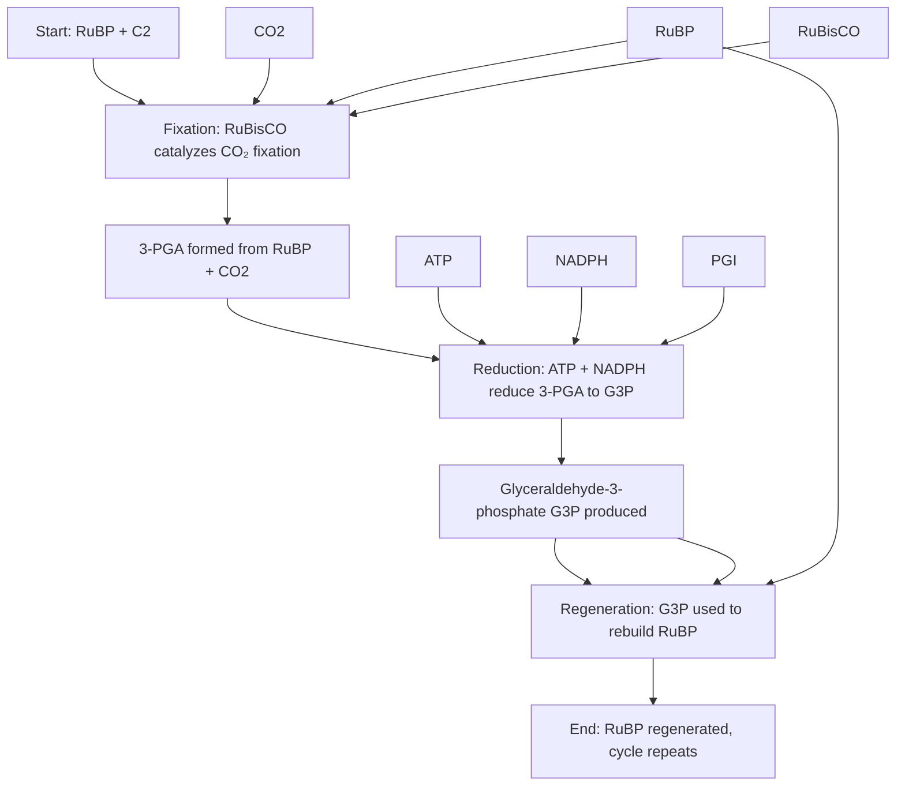

### 🧬 **Explanation of the Diagram**
1. **Start**: The Calvin Cycle begins with **RuBP** (Ribulose-1,5-bisphosphate) and **CO₂** (carbon dioxide).
2. **Fixation**: **RuBisCO** (an enzyme) catalyzes the fixation of CO₂ into RuBP, forming **3-PGA** (3-phosphoglycerate).
3. **Reduction**: **ATP** and **NADPH** (energy carriers from the light-dependent reactions) reduce 3-PGA to **G3P** (glyceraldehyde-3-phosphate).
4. **Regeneration**: G3P is used to regenerate RuBP, completing the cycle and allowing it to continue.

---

### 📌 **Key Molecules & Enzymes**
- **RuBP**: Starting molecule; regenerated at the end.
- **CO₂**: Fixed into organic molecules.
- **3-PGA**: Intermediate product of CO₂ fixation.
- **G3P**: Key output used to build glucose and regenerate RuBP.
- **ATP/NADPH**: Energy carriers from light reactions.
- **RuBisCO**: Key enzyme for CO₂ fixation.
- **PGI**: Enzyme for G3P production.

---
