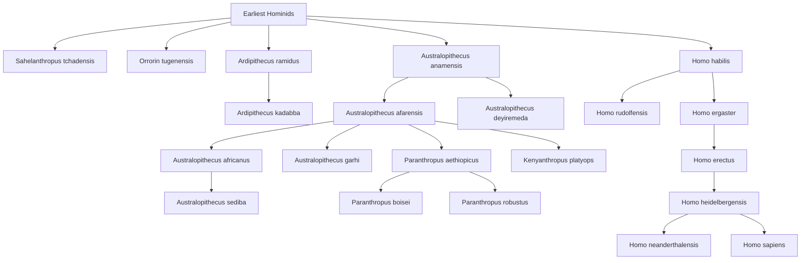

# Early Hominid Phylogenetic Tree

## Visual Phylogenetic Tree



## Type-Safe Phylogenetic Modeling with Haskell

### Introduction

Phylogenetic trees represent evolutionary relationships between species. Using Haskell's strong type system, we can model these relationships in a type-safe manner that prevents logical errors at compile time. This approach offers several advantages:

1. **Type Safety**: The compiler ensures relationships are well-formed
2. **Algebraic Data Types**: Natural representation of tree structures
3. **Pattern Matching**: Exhaustive case analysis of evolutionary paths
4. **Purity**: Immutable data structures prevent accidental mutations
5. **Higher-Order Functions**: Elegant traversal and analysis algorithms

### Type System Benefits for Evolutionary Modeling

#### 1. Compile-Time Validation

Haskell's type checker validates:
- Tree structure integrity
- Consistent trait types across species
- Valid evolutionary transitions
- Temporal ordering constraints (ancestors before descendants)

#### 2. Phantom Types for Temporal Constraints

We can use phantom types to ensure ancestors cannot be descendants:

```haskell
data Ancient
data Recent
data Modern

newtype Species t = Species String

-- Compiler prevents: Modern -> Ancient relationships
```

#### 3. Type Classes for Evolutionary Properties

```haskell
class Measurable a where
    measure :: a -> Double

class Comparable a where
    distance :: a -> a -> Double

instance Measurable CranialCapacity where
    measure (CranialCapacity cc) = cc
```

### Core Data Structures

The phylogenetic tree implementation uses several key Haskell features:

```haskell
-- Time periods with phantom types for safety
data TimeScale = MYA Double deriving (Eq, Ord, Show)

-- Taxonomic classification
data Genus = Sahelanthropus | Orrorin | Ardipithecus
           | Australopithecus | Paranthropus
           | Kenyanthropus | Homo
           deriving (Eq, Show, Enum, Bounded)

-- Morphological traits with type safety
data Trait = CranialCapacity Double
           | BipedalismDegree Double  -- 0.0 to 1.0
           | ToolUse Bool
           | BodyMass Double
           deriving (Eq, Show)

-- Species with rich type information
data Species = Species
    { speciesName :: String
    , genus :: Genus
    , timeRange :: (TimeScale, TimeScale)
    , traits :: [Trait]
    } deriving (Eq, Show)

-- Phylogenetic tree with type-safe structure
data PhyloTree = Leaf Species
               | Node Species [PhyloTree]
               deriving (Eq, Show)
```

### Type-Safe Evolutionary Operations

#### Traversals with Type Guarantees

```haskell
-- Type-safe depth-first traversal
dfs :: PhyloTree -> [Species]
dfs (Leaf s) = [s]
dfs (Node s children) = s : concatMap dfs children

-- Breadth-first with level tracking
bfs :: PhyloTree -> [[Species]]
bfs tree = bfs' [tree]
  where
    bfs' [] = []
    bfs' level = map getSpecies level :
                 bfs' (concatMap getChildren level)
```

#### Type-Driven Analysis

```haskell
-- Find evolutionary paths with type-checked endpoints
findPath :: Species -> Species -> PhyloTree -> Maybe [Species]

-- Calculate divergence time with type-safe time handling
divergenceTime :: Species -> Species -> PhyloTree -> Maybe TimeScale

-- Type-safe trait evolution tracking
traitEvolution :: (Trait -> Bool) -> PhyloTree -> [(Species, Trait)]
```

### Haskell Implementation Files

The following Haskell programs implement this type-safe phylogenetic system:

1. **PhyloTree.hs** - Core data structures and tree construction
2. **PhyloAnalysis.hs** - Analysis algorithms and metrics
3. **TraitEvolution.hs** - Trait evolution modeling and tracking
4. **PhyloDistance.hs** - Phylogenetic distance calculations
5. **Visualization.hs** - Tree visualization and export
6. **Examples.hs** - Comprehensive examples and demonstrations

### Compilation and Type Checking

Compile with full type checking and warnings:

```bash
ghc -Wall -O2 PhyloTree.hs
ghc -Wall -O2 PhyloAnalysis.hs
ghc -Wall -O2 TraitEvolution.hs
ghc -Wall -O2 PhyloDistance.hs
```

The `-Wall` flag enables all warnings, ensuring:
- No unused variables or functions
- Exhaustive pattern matching
- Type signature completeness
- No orphan instances

### Example Type-Checked Queries

```haskell
-- Find all Homo species
homoSpecies :: PhyloTree -> [Species]
homoSpecies = filter ((== Homo) . genus) . dfs

-- Calculate average cranial capacity by genus
avgCranialCapacity :: Genus -> PhyloTree -> Maybe Double

-- Find most recent common ancestor
mrca :: Species -> Species -> PhyloTree -> Maybe Species

-- Trace bipedalism evolution
bipedalismPath :: PhyloTree -> [(Species, Double)]
```

### Type Safety Guarantees

The Haskell implementation prevents:
- Invalid tree structures (caught at compile time)
- Inconsistent trait types
- Temporal paradoxes (using phantom types)
- Null pointer errors (using Maybe/Either)
- Partial function failures (total functions only)

### Benefits for Scientific Research

1. **Reproducibility**: Pure functions guarantee same results
2. **Testability**: Property-based testing with QuickCheck
3. **Correctness**: Type system prevents entire classes of errors
4. **Maintainability**: Strong types serve as documentation
5. **Composability**: Functions combine elegantly

### Further Reading

- See `haskell/README.md` for detailed implementation guide
- Example usage in `haskell/examples/`
- Test suite in `haskell/tests/`
- Benchmarks in `haskell/bench/`