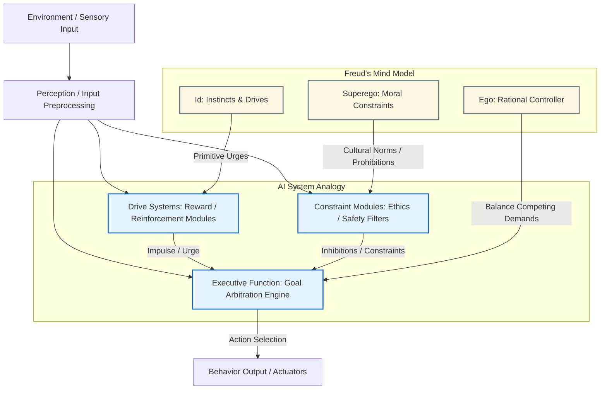

Here's a **Mermaid diagram (.mmd)** that maps **Freud's tripartite psyche model** to **components of a modular AI system**, using Minsky's interpretation.

### Mapping Notes:

* **Id ↔ Drive Systems**: AI modules that act based on instinctual rules or reward feedback (e.g., RL agents).
* **Ego ↔ Executive Control**: Arbitration between goals, context, and constraints.
* **Superego ↔ Constraint Modules**: Analogous to ethics filters, safety checks, or long-term planning evaluators.

