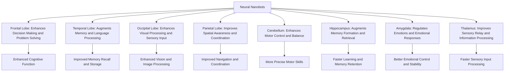

```mermaid
graph TD
    A[Neural Nanobots] --> B1[Frontal Lobe: Enhances Decision Making and Problem Solving]
    A --> B2[Temporal Lobe: Augments Memory and Language Processing]
    A --> B3[Occipital Lobe: Enhances Visual Processing and Sensory Input]
    A --> B4[Parietal Lobe: Improves Spatial Awareness and Coordination]
    A --> B5[Cerebellum: Enhances Motor Control and Balance]
    A --> B6[Hippocampus: Augments Memory Formation and Retrieval]
    A --> B7[Amygdala: Regulates Emotions and Emotional Responses]
    A --> B8[Thalamus: Improves Sensory Relay and Information Processing]
    
    B1 --> C1[Enhanced Cognitive Function]
    B2 --> C2[Improved Memory Recall and Storage]
    B3 --> C3[Enhanced Vision and Image Processing]
    B4 --> C4[Improved Navigation and Coordination]
    B5 --> C5[More Precise Motor Skills]
    B6 --> C6[Faster Learning and Memory Retention]
    B7 --> C7[Better Emotional Control and Stability]
    B8 --> C8[Faster Sensory Input Processing]
```
