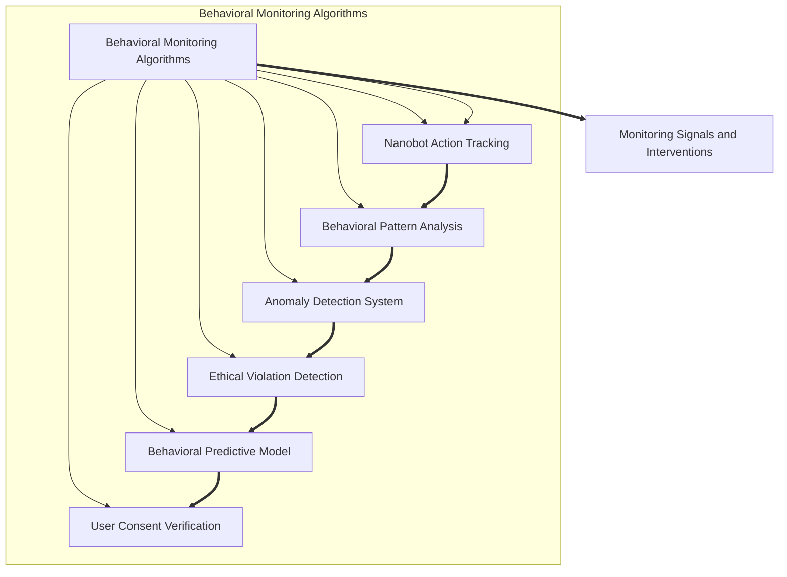

```mermaid
graph TD
    F4[Behavioral Monitoring Algorithms] --> F4_1[Nanobot Action Tracking]
    subgraph Behavioral Monitoring Algorithms
        F4 --> F4_1[Nanobot Action Tracking]
        F4 --> F4_2[Behavioral Pattern Analysis]
        F4 --> F4_3[Anomaly Detection System]
        F4 --> F4_4[Ethical Violation Detection]
        F4 --> F4_5[Behavioral Predictive Model]
        F4 --> F4_6[User Consent Verification]
    end

    F4_1 ==> F4_2
    F4_2 ==> F4_3
    F4_3 ==> F4_4
    F4_4 ==> F4_5
    F4_5 ==> F4_6

    F4 ==> MonitoringFeedback[Monitoring Signals and Interventions]
```
