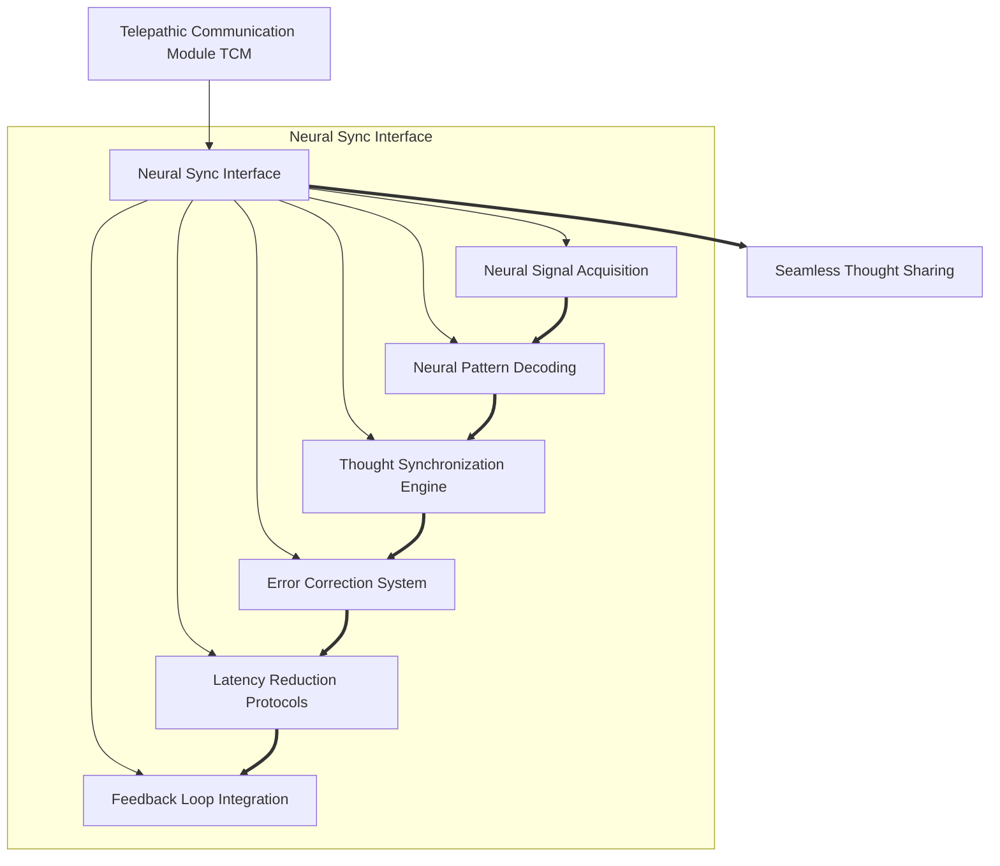

```mermaid
graph TD
    C[Telepathic Communication Module TCM] --> C4[Neural Sync Interface]
    subgraph Neural Sync Interface
        C4 --> C4_1[Neural Signal Acquisition]
        C4 --> C4_2[Neural Pattern Decoding]
        C4 --> C4_3[Thought Synchronization Engine]
        C4 --> C4_4[Error Correction System]
        C4 --> C4_5[Latency Reduction Protocols]
        C4 --> C4_6[Feedback Loop Integration]
    end

    C4_1 ==> C4_2
    C4_2 ==> C4_3
    C4_3 ==> C4_4
    C4_4 ==> C4_5
    C4_5 ==> C4_6

    C4 ==> ThoughtSync[Seamless Thought Sharing]
```
