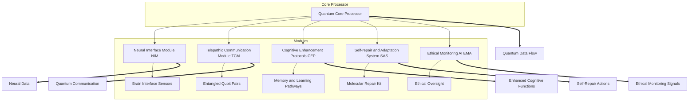

```mermaid
graph TD
    A[Quantum Core Processor] --> B[Neural Interface Module NIM]
    A --> C[Telepathic Communication Module TCM]
    A --> D[Cognitive Enhancement Protocols CEP]
    A --> E[Self-repair and Adaptation System SAS]
    A --> F[Ethical Monitoring AI EMA]

    subgraph Core Processor
        A
    end

    subgraph Modules
        B --> G[Brain Interface Sensors]
        C --> H[Entangled Qubit Pairs]
        D --> I[Memory and Learning Pathways]
        E --> J[Molecular Repair Kit]
        F --> K[Ethical Oversight]
    end

    A ==> DataFlow[Quantum Data Flow]
    B ==> BrainInterface[Neural Data]
    C ==> QuantumComm[Quantum Communication]
    D ==> EnhancedMemory[Enhanced Cognitive Functions]
    E ==> SelfRepair[Self-Repair Actions]
    F ==> EthicalDecisions[Ethical Monitoring Signals]
```
