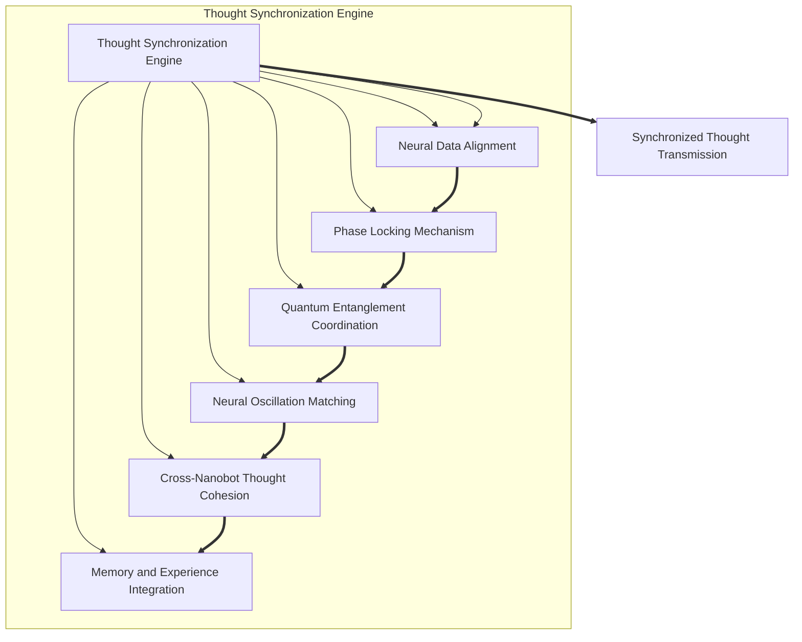

```mermaid
graph TD
    C4_3[Thought Synchronization Engine] --> C4_3_1[Neural Data Alignment]
    subgraph Thought Synchronization Engine
        C4_3 --> C4_3_1[Neural Data Alignment]
        C4_3 --> C4_3_2[Phase Locking Mechanism]
        C4_3 --> C4_3_3[Quantum Entanglement Coordination]
        C4_3 --> C4_3_4[Neural Oscillation Matching]
        C4_3 --> C4_3_5[Cross-Nanobot Thought Cohesion]
        C4_3 --> C4_3_6[Memory and Experience Integration]
    end

    C4_3_1 ==> C4_3_2
    C4_3_2 ==> C4_3_3
    C4_3_3 ==> C4_3_4
    C4_3_4 ==> C4_3_5
    C4_3_5 ==> C4_3_6

    C4_3 ==> ThoughtSyncProcess[Synchronized Thought Transmission]
```
