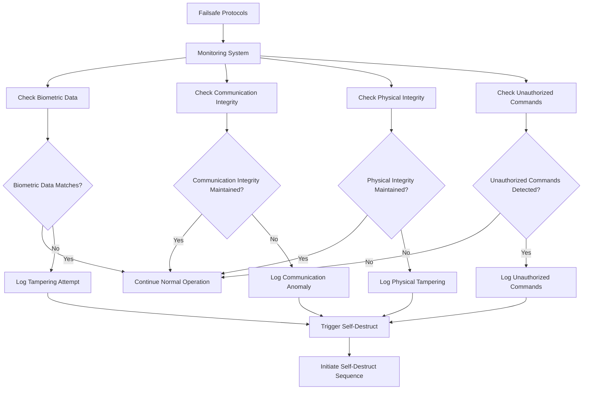

```mermaid
graph TD
    A[Failsafe Protocols] --> B[Monitoring System]
    B --> C[Check Biometric Data]
    B --> D[Check Communication Integrity]
    B --> E[Check Physical Integrity]
    B --> F[Check Unauthorized Commands]

    C --> G{Biometric Data Matches?}
    G --> |Yes| H[Continue Normal Operation]
    G --> |No| I[Log Tampering Attempt]
    I --> J[Trigger Self-Destruct]

    D --> K{Communication Integrity Maintained?}
    K --> |Yes| H
    K --> |No| L[Log Communication Anomaly]
    L --> J

    E --> M{Physical Integrity Maintained?}
    M --> |Yes| H
    M --> |No| N[Log Physical Tampering]
    N --> J

    F --> O{Unauthorized Commands Detected?}
    O --> |No| H
    O --> |Yes| P[Log Unauthorized Commands]
    P --> J

    J --> Q[Initiate Self-Destruct Sequence]
```
