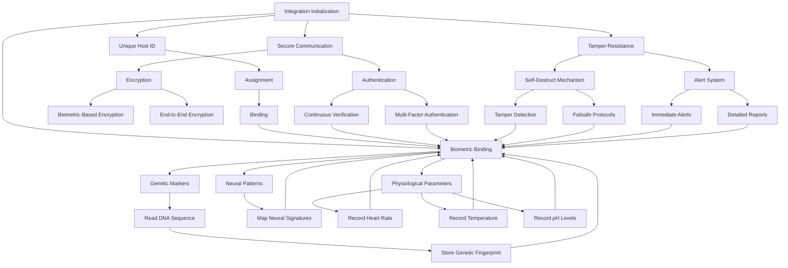

```mermaid
graph TD
    A[Integration Initialization] --> B[Unique Host ID]
    B --> C[Assignment]
    C --> D[Binding]
    
    A --> E[Biometric Binding]
    E --> F[Genetic Markers]
    F --> G[Read DNA Sequence]
    G --> H[Store Genetic Fingerprint]
    E --> I[Neural Patterns]
    I --> J[Map Neural Signatures]
    E --> K[Physiological Parameters]
    K --> L[Record Heart Rate]
    K --> M[Record Temperature]
    K --> N[Record pH Levels]
    
    A --> O[Secure Communication]
    O --> P[Encryption]
    P --> Q[Biometric-Based Encryption]
    P --> R[End-to-End Encryption]
    O --> S[Authentication]
    S --> T[Continuous Verification]
    S --> U[Multi-Factor Authentication]
    
    A --> V[Tamper-Resistance]
    V --> W[Self-Destruct Mechanism]
    W --> X[Tamper Detection]
    W --> Y[Failsafe Protocols]
    V --> Z[Alert System]
    Z --> AA[Immediate Alerts]
    Z --> AB[Detailed Reports]
    
    D --> E
    H --> E
    J --> E
    L --> E
    M --> E
    N --> E
    T --> E
    U --> E
    X --> E
    Y --> E
    AA --> E
    AB --> E
```
