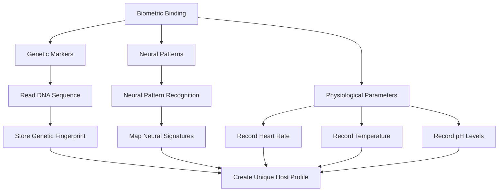

```mermaid
graph TD
    A[Biometric Binding] --> B[Genetic Markers]
    A --> C[Neural Patterns]
    A --> D[Physiological Parameters]

    B --> E[Read DNA Sequence]
    E --> F[Store Genetic Fingerprint]

    C --> G[Neural Pattern Recognition]
    G --> H[Map Neural Signatures]

    D --> I[Record Heart Rate]
    D --> J[Record Temperature]
    D --> K[Record pH Levels]

    F --> L[Create Unique Host Profile]
    H --> L
    I --> L
    J --> L
    K --> L
```
