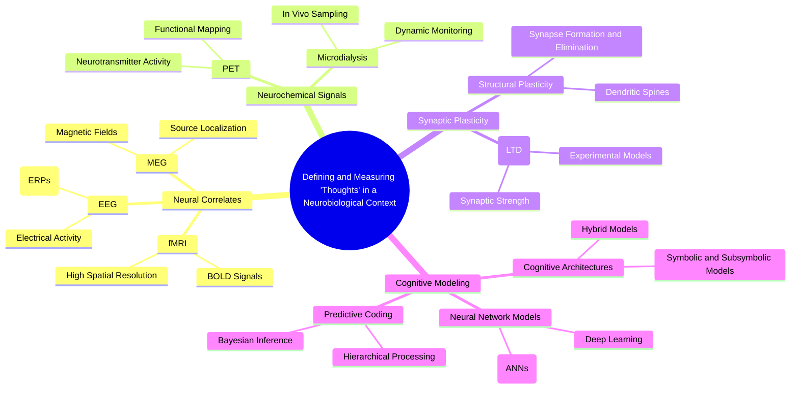
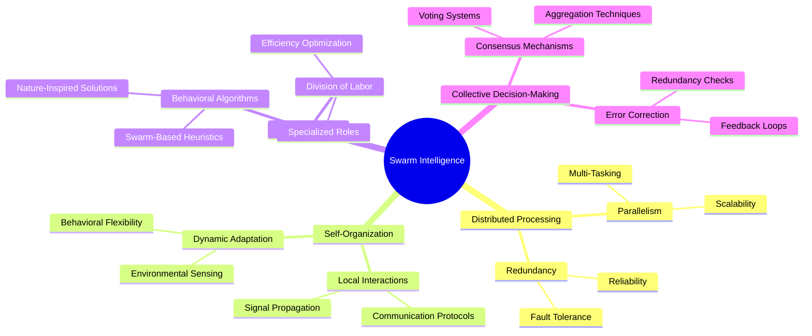

```mermaid
mindmap
  root((Defining and Measuring 'Thoughts' in a Neurobiological Context))
    Neural Correlates
      fMRI
        BOLD Signals
        High Spatial Resolution
      EEG
        Electrical Activity
        Event-Related Potentials (ERPs)
      MEG
        Magnetic Fields
        Source Localization
    Neurochemical Signals
      PET
        Neurotransmitter Activity
        Functional Mapping
      Microdialysis
        In Vivo Sampling
        Dynamic Monitoring
    Synaptic Plasticity
      Long-Term Potentiation LTP and Long-Term Depression (LTD)
        Synaptic Strength
        Experimental Models
      Structural Plasticity
        Dendritic Spines
        Synapse Formation and Elimination
    Cognitive Modeling
      Neural Network Models
        Artificial Neural Networks (ANNs)
        Deep Learning
      Cognitive Architectures
        Symbolic and Subsymbolic Models
        Hybrid Models
      Predictive Coding
        Bayesian Inference
        Hierarchical Processing
```

```mermaid
mindmap
  root((Swarm Intelligence))
    Distributed Processing
      Parallelism
        Multi-Tasking
        Scalability
      Redundancy
        Fault Tolerance
        Reliability
    Self-Organization
      Local Interactions
        Communication Protocols
        Signal Propagation
      Dynamic Adaptation
        Environmental Sensing
        Behavioral Flexibility
    Task Allocation
      Division of Labor
        Specialized Roles
        Efficiency Optimization
      Behavioral Algorithms
        Swarm-Based Heuristics
        Nature-Inspired Solutions
    Collective Decision-Making
      Consensus Mechanisms
        Voting Systems
        Aggregation Techniques
      Error Correction
        Feedback Loops
        Redundancy Checks
```
