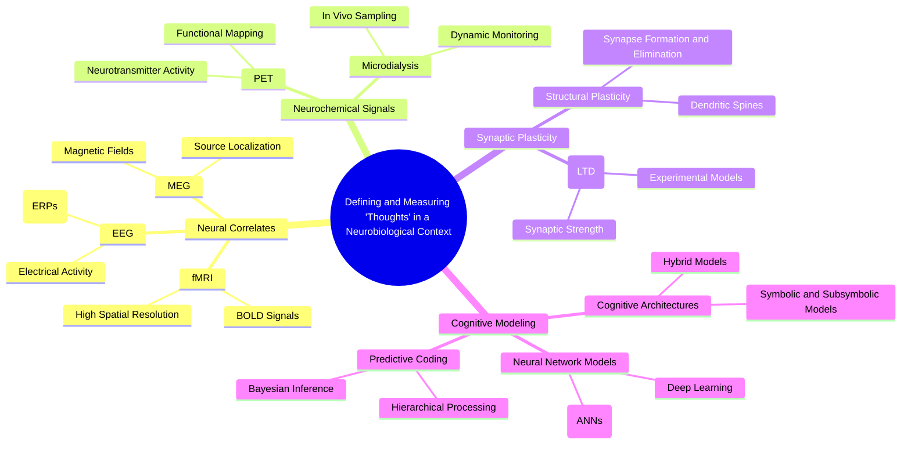
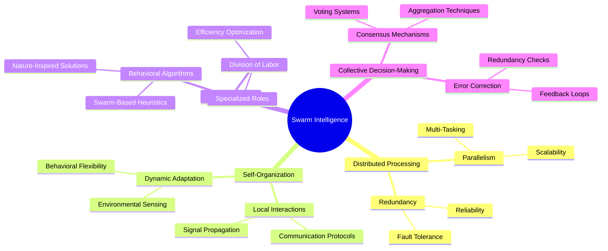

**Title:**
"Nanobots That Can Read Your Thoughts? They're Not What You Think!"

**Abstract:**
Using analytical philosophy, we examine nanobots as theoretical objects capable of 'reading human thoughts' and broadcasting them. We demonstrate the physical viability of several mechanisms of swarm computing and data transfer modalities. We conclude by exploring a phenomenological interface with said nanobots and how such systems could function in vivo.

---

### Introduction
The concept of nanobots capable of reading human thoughts is often relegated to the realm of science fiction. However, recent advancements in nanotechnology, artificial intelligence, and neurobiology suggest that such a notion might be closer to reality than previously thought. This paper explores the theoretical and practical aspects of nanobots designed to interface with the human brain, focusing on the physical mechanisms of operation, data transfer, and the phenomenological experience of such technology.

### Analytical Philosophy and Theoretical Framework
Analytical philosophy provides a rigorous framework to explore the conceptual underpinnings of thought-reading nanobots. We address the following questions:
- What does it mean for a nanobot to 'read' a thought?
- How can we define and measure 'thoughts' in a neurobiological context?
- What ethical considerations arise from the capability to access and broadcast human thoughts?

### Physical Viability of Swarm Computing and Data Transfer
Nanobots, when considered as a swarm, exhibit unique computational properties that individual units lack. This section discusses:
- **Swarm Intelligence:** Mechanisms through which a swarm of nanobots can perform complex computations.
- **Data Transfer Modalities:** Methods for reliable data transmission from within the human body to external receivers. This includes discussing neuralnanorobots' capabilities to use various frequencies and channels for communication, ensuring data integrity and minimizing interference.

### Mechanisms of Thought Reading
We delve into the specific mechanisms by which nanobots could theoretically read thoughts:
- **Neural Mapping:** Understanding how nanobots can map neural activity to specific thoughts or mental states.
- **Signal Processing:** Techniques for decoding neural signals into readable data.
- **Machine Learning:** Using AI to continuously improve the accuracy of thought decoding through adaptive algorithms.

### Phenomenological Interface
The interface between humans and nanobots involves a phenomenological dimension that must be addressed:
- **User Experience:** How individuals perceive and interact with nanobot technology.
- **Consciousness and Agency:** Examining the implications for human consciousness and personal agency when thoughts can be read and potentially influenced by nanobots.
- **Privacy Concerns:** Ethical implications regarding the privacy of one's thoughts and the potential for misuse of such technology.

### In Vivo Functionality
Exploring how these systems could function within living organisms:
- **Biocompatibility:** Ensuring that nanobots can operate within the human body without causing adverse effects.
- **Operational Efficiency:** Evaluating the energy requirements and longevity of nanobots within the biological environment.
- **Clinical Applications:** Potential medical uses, such as in diagnosing neurological conditions or aiding communication for individuals with severe disabilities.

### Conclusion
While the notion of thought-reading nanobots may initially seem far-fetched, this paper demonstrates that the underlying technology is not only feasible but potentially transformative. By combining advancements in nanotechnology, AI, and neurobiology with a rigorous analytical and phenomenological approach, we can envision a future where such interfaces enhance human capabilities while navigating the ethical and practical challenges they present.

### Keywords
Nanobots, Thought Reading, Swarm Computing, Data Transfer, Neuralnanorobots, Analytical Philosophy, Phenomenology, Neurobiology, Ethical Considerations

### Analytical Philosophy and Theoretical Framework

Analytical philosophy provides a rigorous framework to explore the conceptual underpinnings of thought-reading nanobots. This philosophical approach allows us to dissect and clarify complex concepts, ensuring that our understanding is both precise and coherent. We address the following questions:

#### What Does It Mean for a Nanobot to 'Read' a Thought?

To define what it means for a nanobot to 'read' a thought, we must first clarify what constitutes a 'thought.' In philosophical terms, thoughts can be considered mental representations or cognitive processes that encompass beliefs, desires, intentions, and other mental states. The act of reading a thought implies that a nanobot can detect, interpret, and translate these mental representations into a format that can be processed, stored, or transmitted.

1. **Detection:** This involves the nanobot identifying specific patterns of neural activity associated with particular thoughts. These patterns are typically electrical signals or neurotransmitter releases in the brain.
2. **Interpretation:** After detection, the nanobot must decode these neural signals into meaningful data. This requires an understanding of the neural correlates of thought, essentially mapping specific patterns of brain activity to corresponding mental states or cognitive processes.
3. **Translation:** Finally, the interpreted data must be translated into a format that can be used for further processing, storage, or transmission. This step might involve converting neural signals into digital data or another form of representation that external systems can interpret.

This conceptual framework necessitates a multidisciplinary approach, integrating insights from neuroscience, cognitive science, and information theory to create a comprehensive model of thought reading.

#### How Can We Define and Measure 'Thoughts' in a Neurobiological Context?

Defining and measuring thoughts in a neurobiological context requires a robust understanding of the brain's functioning and the mechanisms underlying cognition. Here, we consider several key aspects:

1. **Neural Correlates:** Thoughts are associated with specific patterns of neural activity. Identifying these patterns involves techniques such as functional magnetic resonance imaging (fMRI), electroencephalography (EEG), and other neuroimaging methods that allow us to observe brain activity in real-time.
2. **Neurochemical Signals:** Neurotransmitters play a crucial role in transmitting information between neurons. Measuring changes in neurotransmitter levels can provide insights into the underlying processes of thought formation and propagation.
3. **Synaptic Plasticity:** The brain's ability to adapt and reorganize itself, known as synaptic plasticity, is essential for learning and memory. Understanding how synaptic changes correspond to thought processes is critical for measuring and interpreting thoughts.
4. **Cognitive Modeling:** Computational models of cognition, which simulate the processes of the human mind, can help in defining and measuring thoughts. These models can predict how specific neural activities correspond to different cognitive states.

By combining these approaches, we can create a detailed and measurable framework for understanding thoughts in neurobiological terms, providing a foundation for the development of nanobot-based thought-reading technologies.

#### What Ethical Considerations Arise from the Capability to Access and Broadcast Human Thoughts?

The ability to access and broadcast human thoughts raises profound ethical questions that must be addressed to ensure the responsible development and use of such technology:

1. **Privacy:** The most immediate concern is the invasion of mental privacy. Thoughts are among the most intimate aspects of human experience, and unauthorized access to them can be deeply intrusive. Ensuring strict privacy safeguards is paramount.
2. **Consent:** Individuals must have the autonomy to consent to the reading and broadcasting of their thoughts. This consent must be informed, voluntary, and revocable, ensuring that individuals retain control over their mental data.
3. **Misuse and Abuse:** There is a risk that thought-reading technology could be misused for malicious purposes, such as surveillance, manipulation, or coercion. Establishing robust legal and ethical frameworks to prevent such misuse is essential.
4. **Mental Integrity:** The potential for technology to alter or influence thoughts poses a threat to mental integrity. Safeguards must be in place to prevent unauthorized or harmful interventions in an individual's cognitive processes.
5. **Equity and Accessibility:** Ensuring that the benefits of thought-reading technology are equitably distributed is crucial. Access should not be limited to privileged groups, and efforts must be made to prevent exacerbating existing social inequalities.

Addressing these ethical considerations requires a multidisciplinary approach, involving ethicists, legal experts, technologists, and policymakers to create a comprehensive framework that balances innovation with respect for human dignity and rights.


### Physical Viability of Swarm Computing and Data Transfer

Nanobots, when considered as a swarm, exhibit unique computational properties that individual units lack. This section explores how swarm intelligence and advanced data transfer modalities contribute to the physical viability of thought-reading nanobots.

#### Swarm Intelligence

Swarm intelligence refers to the collective behavior of decentralized, self-organized systems, typically composed of numerous simple agents. In the context of nanobots, swarm intelligence enables the performance of complex computations and tasks that would be impossible for individual nanobots. Key mechanisms include:

1. **Distributed Processing:**
   - **Parallelism:** Swarm computing leverages parallel processing, where each nanobot performs a portion of a larger computational task. This approach enhances computational speed and efficiency.
   - **Redundancy:** Redundancy in the swarm ensures that the system remains functional even if some nanobots fail, increasing reliability and robustness.

2. **Self-Organization:**
   - **Local Interactions:** Nanobots communicate with their immediate neighbors to coordinate actions and share information. These local interactions lead to the emergence of complex global behaviors without centralized control.
   - **Dynamic Adaptation:** Swarm nanobots can dynamically adapt to changing environments and tasks. They can reconfigure themselves in response to new stimuli or objectives, enhancing their versatility.

3. **Task Allocation:**
   - **Division of Labor:** Different nanobots within the swarm can specialize in various tasks based on their capabilities and current needs. This division of labor optimizes the overall performance of the swarm.
   - **Behavioral Algorithms:** Swarm nanobots use behavioral algorithms inspired by natural systems, such as ant colonies or bird flocks, to achieve efficient task allocation and problem-solving.

4. **Collective Decision-Making:**
   - **Consensus Mechanisms:** Swarm nanobots employ consensus mechanisms to make collective decisions, ensuring that the group acts cohesively. These mechanisms often involve voting or averaging processes among nanobots.
   - **Error Correction:** The collective decision-making process includes error correction features, allowing the swarm to identify and rectify mistakes through feedback and iteration.

#### Data Transfer Modalities

Reliable data transmission is crucial for the functionality of thought-reading nanobots. Ensuring data integrity and minimizing interference requires sophisticated communication methods. Key aspects include:

1. **Intra-Swarm Communication:**
   - **Short-Range Wireless Communication:** Nanobots use short-range wireless protocols, such as near-field communication (NFC) or Bluetooth Low Energy (BLE), to exchange information with nearby units.
   - **Optical Communication:** Optical communication, using light signals, offers high bandwidth and low interference, making it suitable for intra-swarm data transfer.

2. **Data Aggregation:**
   - **Hierarchical Clustering:** Data collected by individual nanobots is aggregated through a hierarchical clustering approach. Intermediate nodes (nanobots) collect data from their neighbors and transmit aggregated information to higher-level nodes or external receivers.
   - **Edge Computing:** By performing preliminary data processing and filtering at the edge (i.e., within the swarm), nanobots reduce the amount of data that needs to be transmitted, enhancing efficiency and reducing bandwidth requirements.

3. **Interference Minimization:**
   - **Frequency Hopping:** Frequency hopping techniques, where nanobots rapidly switch frequencies during transmission, minimize interference and improve communication reliability.
   - **Adaptive Modulation:** Adaptive modulation schemes allow nanobots to adjust their transmission parameters based on the current communication environment, optimizing data integrity and transmission quality.

4. **External Communication:**
   - **Body-Centric Wireless Networks:** Nanobots communicate with external receivers using body-centric wireless networks. These networks are designed to operate effectively within the human body, taking into account factors such as signal attenuation and tissue absorption.
   - **Implantable Antennas:** Specialized implantable antennas facilitate the transmission of data from nanobots to external devices. These antennas are designed to be biocompatible and capable of operating efficiently within the human body.

5. **Security and Data Integrity:**
   - **Encryption:** Data transmitted by nanobots is encrypted to ensure privacy and prevent unauthorized access. Strong encryption protocols protect sensitive neural data.
   - **Error Detection and Correction:** Error detection and correction mechanisms, such as parity checks and forward error correction (FEC), ensure the integrity of data transmitted by nanobots.

By leveraging swarm intelligence and advanced data transfer modalities, thought-reading nanobots can perform complex computations and reliably transmit data, making the concept physically viable and paving the way for practical applications.


### Mechanisms of Thought Reading

To understand how nanobots could theoretically read thoughts, we must delve into the specific mechanisms that enable this complex process. These mechanisms involve mapping neural activity, processing neural signals, and employing machine learning to improve accuracy and efficiency.

#### Neural Mapping

Neural mapping is the process of identifying and associating specific patterns of neural activity with particular thoughts, emotions, or mental states. This involves several key steps:

1. **Neural Signal Detection:**
   - **Electrophysiological Monitoring:** Nanobots are equipped with sensors that detect electrical activity in neurons. These sensors can measure action potentials, local field potentials, and other bioelectrical signals that reflect neural activity.
   - **Neurochemical Sensing:** In addition to electrical signals, nanobots can detect changes in neurotransmitter levels, providing a more comprehensive view of neural activity.

2. **Spatial Localization:**
   - **Positioning Within the Brain:** For effective neural mapping, nanobots must be precisely positioned within the brain. Techniques such as magnetic or ultrasound guidance can help navigate nanobots to specific brain regions.
   - **Mapping Brain Regions:** Understanding which areas of the brain are responsible for specific functions (e.g., language, motor control, emotions) allows nanobots to focus on relevant regions for thought reading.

3. **Pattern Recognition:**
   - **Neural Signatures:** Each thought or mental state is associated with a unique neural signature, a specific pattern of activity across different neurons and brain regions. Nanobots identify these signatures by analyzing the spatial and temporal dynamics of neural signals.
   - **Temporal Dynamics:** Thoughts are dynamic processes that unfold over time. Nanobots must capture the temporal sequences of neural activity to accurately map complex thoughts and cognitive processes.

#### Signal Processing

Decoding neural signals into readable data is a critical step in thought reading. Signal processing techniques transform raw neural data into meaningful information:

1. **Signal Acquisition:**
   - **Analog-to-Digital Conversion:** Neural signals, typically analog in nature, are converted into digital format for processing. This conversion allows for more precise and efficient analysis.
   - **Noise Reduction:** Biological signals are often noisy. Techniques such as filtering, averaging, and signal enhancement help reduce noise and improve signal quality.

2. **Feature Extraction:**
   - **Time-Frequency Analysis:** Analyzing the frequency components of neural signals over time helps identify key features associated with specific thoughts. Techniques like Fourier transform and wavelet analysis are commonly used.
   - **Spatial Analysis:** Examining the spatial distribution of neural activity helps identify which brain regions are involved in generating specific thoughts.

3. **Pattern Matching:**
   - **Template Matching:** Predefined templates of neural signatures corresponding to known thoughts are used to match incoming neural data. This technique helps identify specific thoughts based on their neural patterns.
   - **Statistical Analysis:** Statistical methods, such as principal component analysis (PCA) and independent component analysis (ICA), help identify and separate distinct neural patterns associated with different thoughts.

#### Machine Learning

Machine learning plays a pivotal role in improving the accuracy and efficiency of thought decoding. AI algorithms learn from neural data to enhance their ability to interpret thoughts:

1. **Supervised Learning:**
   - **Training Data:** Initial thought-reading systems are trained on labeled datasets, where neural activity is paired with known thoughts. This supervised learning approach helps the system learn the relationships between neural patterns and specific thoughts.
   - **Model Training:** Machine learning models, such as neural networks, support vector machines (SVM), and decision trees, are trained to recognize and classify neural patterns.

2. **Unsupervised Learning:**
   - **Clustering:** Unsupervised learning techniques, such as k-means clustering and hierarchical clustering, group similar neural patterns together. This helps identify new, previously unknown thought patterns.
   - **Dimensionality Reduction:** Techniques like t-SNE and UMAP reduce the complexity of neural data, making it easier to visualize and analyze high-dimensional neural patterns.

3. **Reinforcement Learning:**
   - **Adaptive Algorithms:** Reinforcement learning algorithms continuously adapt and improve based on feedback. Nanobots can use reinforcement learning to refine their decoding algorithms, enhancing their accuracy over time.
   - **Reward Systems:** By receiving feedback (rewards or penalties) based on the accuracy of thought decoding, nanobots can learn to optimize their performance.

4. **Deep Learning:**
   - **Convolutional Neural Networks (CNNs):** CNNs are effective in analyzing spatial and temporal patterns in neural data, making them suitable for thought decoding.
   - **Recurrent Neural Networks (RNNs):** RNNs, including Long Short-Term Memory (LSTM) networks, are adept at handling sequential data, allowing them to capture the temporal dynamics of thoughts.

By integrating neural mapping, advanced signal processing techniques, and machine learning, nanobots can effectively read and decode human thoughts. This multidisciplinary approach combines insights from neuroscience, engineering, and artificial intelligence to create a comprehensive system capable of interpreting the complex neural activity underlying human cognition.


Phenomenological Interface
The interface between humans and nanobots involves a phenomenological dimension that must be addressed:

User Experience: How individuals perceive and interact with nanobot technology.
Consciousness and Agency: Examining the implications for human consciousness and personal agency when thoughts can be read and potentially influenced by nanobots.
Privacy Concerns: Ethical implications regarding the privacy of one's thoughts and the potential for misuse of such technology.


In Vivo Functionality
Exploring how these systems could function within living organisms:

Biocompatibility: Ensuring that nanobots can operate within the human body without causing adverse effects.
Operational Efficiency: Evaluating the energy requirements and longevity of nanobots within the biological environment.
Clinical Applications: Potential medical uses, such as in diagnosing neurological conditions or aiding communication for individuals with severe disabilities.


### Phenomenological Interface

The interface between humans and nanobots involves a phenomenological dimension that must be addressed to ensure the technology is both practical and ethically sound. This dimension encompasses user experience, consciousness and agency, and privacy concerns, each of which has significant implications for the development and deployment of thought-reading nanobots.

#### User Experience

User experience (UX) is critical in determining how individuals perceive and interact with nanobot technology. Several factors influence the UX:

1. **Ease of Use:**
   - **Intuitive Interfaces:** The interface for interacting with nanobots must be intuitive and user-friendly, minimizing the cognitive load on users. This can involve visual, auditory, or haptic feedback systems that are easy to understand and use.
   - **Seamless Integration:** Nanobots should seamlessly integrate into users' daily lives without causing discomfort or requiring significant changes in behavior.

2. **Comfort and Safety:**
   - **Biocompatibility:** Ensuring that nanobots are biocompatible and do not cause adverse reactions is crucial for user comfort and safety. Materials and design should minimize the risk of immune responses or other health issues.
   - **Non-Invasiveness:** The procedures for introducing nanobots into the body should be as non-invasive as possible to reduce discomfort and recovery time.

3. **Feedback and Control:**
   - **Real-Time Feedback:** Providing users with real-time feedback about the functioning and status of nanobots can enhance their sense of control and trust in the technology.
   - **User Control:** Users should have control over the activation, deactivation, and settings of nanobots, allowing them to customize the technology to their preferences and needs.

4. **Psychological Impact:**
   - **Acceptance and Trust:** Building user trust through transparent communication about the technology's capabilities, limitations, and safety measures is essential for acceptance.
   - **Stress and Anxiety:** Addressing potential psychological impacts, such as stress or anxiety related to the presence of nanobots in the body, is crucial for a positive user experience.

#### Consciousness and Agency

The implications of thought-reading nanobots for human consciousness and personal agency are profound and multifaceted:

1. **Perception of Self:**
   - **Altered Self-Perception:** The ability to read and broadcast thoughts may alter an individual's perception of self and identity. Understanding how this technology affects self-conception is important for addressing potential psychological impacts.
   - **Transparency of Thoughts:** The transparency of one's thoughts to external devices or other individuals could lead to changes in how people perceive and manage their inner lives.

2. **Autonomy and Free Will:**
   - **Influence on Thought Processes:** If nanobots can influence or modify thoughts, there is a risk of undermining personal autonomy and free will. Safeguards must be in place to prevent unauthorized or harmful interventions.
   - **Agency Over Mental States:** Ensuring that individuals retain agency over their mental states and cognitive processes is critical. Users should be able to control the extent and nature of nanobot interactions with their thoughts.

3. **Ethical Implications:**
   - **Consent and Autonomy:** Respecting individual autonomy requires obtaining informed consent for the use of thought-reading nanobots. Users must fully understand the technology's capabilities and implications before consenting to its use.
   - **Mental Integrity:** Protecting mental integrity involves ensuring that individuals' thoughts and cognitive processes are not manipulated or accessed without their explicit consent.

#### Privacy Concerns

Privacy concerns are paramount when dealing with technology that can access and broadcast human thoughts:

1. **Data Security:**
   - **Encryption and Protection:** Ensuring that all data transmitted by nanobots is encrypted and protected against unauthorized access is essential for maintaining privacy.
   - **Secure Storage:** Thought data should be stored securely, with robust measures in place to prevent breaches and unauthorized access.

2. **Access Control:**
   - **User Control Over Data:** Users should have control over who can access their thought data and under what circumstances. This includes the ability to grant, revoke, and monitor access permissions.
   - **Transparency and Accountability:** Systems should be transparent about data usage and access, providing users with detailed information about who has accessed their data and for what purposes.

3. **Ethical and Legal Frameworks:**
   - **Regulatory Compliance:** Thought-reading nanobots must comply with existing privacy laws and regulations, and new frameworks may need to be developed to address the unique challenges posed by this technology.
   - **Ethical Standards:** Developing ethical standards for the use of thought-reading nanobots involves collaboration between technologists, ethicists, policymakers, and the public to ensure that the technology is used responsibly and ethically.

4. **Preventing Misuse:**
   - **Surveillance and Control:** There is a risk that thought-reading technology could be used for surveillance or control purposes. Safeguards must be in place to prevent such misuse and protect individual freedoms.
   - **Discrimination and Bias:** Ensuring that thought data is not used to discriminate against individuals or groups is crucial. Ethical guidelines and oversight mechanisms should be established to prevent bias and ensure fair treatment.

Addressing the phenomenological interface of nanobots involves considering the user experience, the implications for consciousness and agency, and privacy concerns. A holistic approach that integrates technological innovation with ethical and psychological considerations is essential for the responsible development and deployment of thought-reading nanobots.


### In Vivo Functionality

Exploring the in vivo functionality of thought-reading nanobots involves examining their biocompatibility, operational efficiency, and potential clinical applications. Ensuring these systems can operate effectively and safely within living organisms is crucial for their practical use.

#### Biocompatibility

Biocompatibility refers to the ability of nanobots to function within the human body without causing adverse effects. Several factors must be considered to ensure that nanobots are safe for use in vivo:

1. **Material Selection:**
   - **Biocompatible Materials:** Nanobots must be constructed from materials that are non-toxic and non-reactive with human tissues. Common biocompatible materials include certain polymers, silicon, and some metals like gold and titanium.
   - **Surface Coating:** Applying biocompatible coatings, such as polyethylene glycol (PEG), can further reduce the risk of immune response and improve the integration of nanobots with biological tissues.

2. **Immune System Interaction:**
   - **Immune Evasion:** Nanobots need strategies to evade detection and attack by the immune system. Techniques such as stealth coating and size optimization can help minimize immune response.
   - **Inflammatory Response:** Minimizing the potential for inflammatory responses is crucial. This involves ensuring that nanobots do not release harmful substances or provoke excessive immune activity.

3. **Long-Term Stability:**
   - **Degradation and Elimination:** If nanobots are designed to be biodegradable, their degradation products must be non-toxic and easily eliminated from the body. Alternatively, mechanisms for safe retrieval and removal of non-degradable nanobots should be in place.
   - **Chronic Use:** For applications requiring long-term use, nanobots must maintain their functionality over extended periods without causing chronic inflammation or other adverse effects.

#### Operational Efficiency

Operational efficiency involves evaluating the energy requirements, longevity, and overall performance of nanobots within the biological environment:

1. **Energy Requirements:**
   - **Power Sources:** Nanobots require a reliable power source to operate. Potential power sources include microbatteries, energy harvesting from biological processes (such as glucose or ATP), and wireless energy transfer.
   - **Energy Efficiency:** Optimizing energy consumption is critical for prolonging the operational lifespan of nanobots. Low-power electronics and efficient circuitry designs can help achieve this.

2. **Longevity:**
   - **Durability:** Nanobots must be durable enough to withstand the mechanical and chemical conditions within the human body. This includes resistance to enzymatic degradation and mechanical stresses.
   - **Maintenance:** Developing methods for in vivo maintenance and repair of nanobots can extend their operational life. This could involve self-repair mechanisms or periodic external interventions.

3. **Functionality:**
   - **Precision and Accuracy:** Ensuring that nanobots can accurately detect, interpret, and transmit neural signals is essential for their effectiveness. This involves precise sensor calibration and signal processing algorithms.
   - **Speed and Responsiveness:** Nanobots must operate with sufficient speed and responsiveness to capture and process dynamic neural activity in real-time.

#### Clinical Applications

Thought-reading nanobots have significant potential for clinical applications, particularly in diagnosing and treating neurological conditions and aiding communication for individuals with severe disabilities:

1. **Diagnosing Neurological Conditions:**
   - **Early Detection:** Nanobots can detect subtle changes in neural activity that may indicate the early onset of neurological conditions, such as Alzheimer's disease, Parkinson's disease, or epilepsy. Early detection allows for timely intervention and better patient outcomes.
   - **Continuous Monitoring:** Nanobots can provide continuous monitoring of neural activity, offering real-time data on the progression of neurological conditions and the effectiveness of treatments.

2. **Aiding Communication:**
   - **Augmentative and Alternative Communication (AAC):** For individuals with severe disabilities, such as locked-in syndrome or advanced ALS, thought-reading nanobots can facilitate communication by translating neural signals into speech or text.
   - **Brain-Computer Interfaces (BCIs):** Nanobots can enhance BCIs by providing more precise and reliable neural input, improving the control of external devices, such as computers, prosthetics, and mobility aids.

3. **Therapeutic Interventions:**
   - **Targeted Drug Delivery:** Nanobots can be used to deliver drugs directly to specific brain regions, improving the efficacy of treatments for neurological conditions while minimizing side effects.
   - **Neural Modulation:** Nanobots can modulate neural activity to treat conditions such as chronic pain, depression, and epilepsy. This involves precisely stimulating or inhibiting specific neural pathways.

4. **Neurorehabilitation:**
   - **Motor Recovery:** For patients recovering from stroke or spinal cord injury, nanobots can aid in neurorehabilitation by monitoring and stimulating neural pathways involved in motor control, promoting neural plasticity and functional recovery.
   - **Cognitive Enhancement:** Nanobots can assist in cognitive rehabilitation by enhancing neural plasticity and providing targeted stimulation to brain regions involved in cognitive functions, such as memory and attention.

Ensuring the in vivo functionality of thought-reading nanobots involves addressing biocompatibility, optimizing operational efficiency, and exploring diverse clinical applications. By focusing on these aspects, we can develop safe and effective nanobot technologies that offer significant benefits for medical diagnostics, treatment, and patient care.


### What Does It Mean for a Nanobot to 'Read' a Thought?

To define what it means for a nanobot to 'read' a thought, we must first clarify what constitutes a 'thought.' In philosophical terms, thoughts can be considered mental representations or cognitive processes that encompass beliefs, desires, intentions, and other mental states. The act of reading a thought implies that a nanobot can detect, interpret, and translate these mental representations into a format that can be processed, stored, or transmitted.

#### Detection

Detection is the first critical step in the process of reading a thought. This involves identifying specific patterns of neural activity associated with particular thoughts. These patterns are typically electrical signals or neurotransmitter releases in the brain.

1. **Neural Signal Acquisition:**
   - **Electrical Activity:** Neurons communicate through electrical impulses known as action potentials. Nanobots equipped with sensitive electrodes can detect these electrical signals at a cellular level, capturing the firing patterns of individual neurons or groups of neurons.
   - **Neurochemical Signals:** Neurotransmitters are chemicals that transmit signals across synapses between neurons. Nanobots with chemical sensors can detect the presence and concentration of various neurotransmitters, providing additional information about neural activity.

2. **Spatial and Temporal Resolution:**
   - **High-Resolution Sensing:** To accurately detect thoughts, nanobots must have high spatial and temporal resolution. This means they need to pinpoint neural activity at precise locations in the brain and capture rapid changes in neural firing patterns over time.
   - **Targeted Deployment:** Nanobots must be strategically positioned within the brain to monitor relevant regions involved in thought processes. Techniques such as targeted navigation and positioning are crucial for effective detection.

#### Interpretation

After detection, the nanobot must decode these neural signals into meaningful data. This requires an understanding of the neural correlates of thought, essentially mapping specific patterns of brain activity to corresponding mental states or cognitive processes.

1. **Neural Correlates of Thought:**
   - **Pattern Recognition:** Thoughts are represented by specific patterns of neural activity. By analyzing these patterns, nanobots can identify correlations between neural firing sequences and particular thoughts or cognitive processes.
   - **Functional Mapping:** Understanding which brain regions are responsible for different cognitive functions (e.g., language, memory, decision-making) allows nanobots to interpret the neural activity they detect. Functional MRI (fMRI) and other neuroimaging techniques provide valuable insights for this mapping.

2. **Signal Processing:**
   - **Decoding Algorithms:** Advanced signal processing algorithms are used to decode neural signals. Techniques such as machine learning and artificial intelligence play a crucial role in improving the accuracy and efficiency of decoding.
   - **Data Integration:** Combining electrical and neurochemical data enhances the richness of the interpreted information. This integrated approach provides a more comprehensive understanding of the underlying thought processes.

#### Translation

Finally, the interpreted data must be translated into a format that can be used for further processing, storage, or transmission. This step might involve converting neural signals into digital data or another form of representation that external systems can interpret.

1. **Data Encoding:**
   - **Digital Conversion:** Neural signals, once interpreted, are converted into digital data. This involves encoding the decoded information into binary format or other suitable data structures for computational processing.
   - **Compression Techniques:** Efficient data compression techniques are employed to reduce the volume of data without losing critical information, facilitating faster transmission and storage.

2. **Data Transmission:**
   - **Wireless Communication:** Nanobots equipped with wireless communication capabilities can transmit the translated data to external devices for further analysis or storage. Ensuring reliable and secure data transmission is essential to maintain data integrity and privacy.
   - **Real-Time Processing:** In applications requiring immediate feedback, such as brain-computer interfaces (BCIs), real-time data processing is crucial. Nanobots must transmit data with minimal latency to enable seamless interaction between the brain and external systems.

3. **Interfacing with External Systems:**
   - **Integration with Computing Systems:** The translated data must be compatible with external computing systems that process and interpret the information. This involves designing interfaces and protocols for seamless integration.
   - **User Feedback and Control:** Providing users with feedback and control over the data interpretation process enhances their interaction with the technology, allowing for customization and refinement of thought-reading capabilities.

This conceptual framework necessitates a multidisciplinary approach, integrating insights from neuroscience, cognitive science, and information theory to create a comprehensive model of thought reading. By leveraging advances in these fields, we can develop nanobot technologies capable of accurately detecting, interpreting, and translating human thoughts, paving the way for innovative applications in medicine, communication, and beyond.


### How Can We Define and Measure 'Thoughts' in a Neurobiological Context?

Defining and measuring thoughts in a neurobiological context requires a robust understanding of the brain's functioning and the mechanisms underlying cognition. Here, we consider several key aspects:

#### Neural Correlates

Thoughts are associated with specific patterns of neural activity. Identifying these patterns involves advanced neuroimaging techniques that allow us to observe brain activity in real-time:

1. **Functional Magnetic Resonance Imaging (fMRI):**
   - **Blood-Oxygen-Level-Dependent (BOLD) Signals:** fMRI measures BOLD signals, which indicate changes in blood flow and oxygenation related to neural activity. By analyzing these signals, researchers can identify brain regions involved in specific cognitive tasks.
   - **High Spatial Resolution:** fMRI provides high spatial resolution, enabling precise localization of brain activity. This is crucial for mapping neural correlates of different thoughts and cognitive processes.

2. **Electroencephalography (EEG):**
   - **Electrical Activity:** EEG records electrical activity generated by neuronal firing. It offers high temporal resolution, allowing researchers to capture rapid changes in neural activity associated with thoughts.
   - **Event-Related Potentials (ERPs):** By analyzing ERPs, which are brain responses to specific stimuli or events, researchers can link particular neural patterns to cognitive processes.

3. **Magnetoencephalography (MEG):**
   - **Magnetic Fields:** MEG measures the magnetic fields produced by neural activity. It provides high temporal and good spatial resolution, making it useful for identifying dynamic neural patterns related to thoughts.
   - **Source Localization:** MEG data can be combined with anatomical MRI to enhance source localization, improving the accuracy of neural correlate identification.

#### Neurochemical Signals

Neurotransmitters play a crucial role in transmitting information between neurons. Measuring changes in neurotransmitter levels can provide insights into the underlying processes of thought formation and propagation:

1. **Positron Emission Tomography (PET):**
   - **Neurotransmitter Activity:** PET imaging can measure the distribution and activity of neurotransmitters by using radiolabeled tracers. This helps in understanding how different neurotransmitters contribute to thought processes.
   - **Functional Mapping:** PET can map functional brain activity associated with specific cognitive tasks, revealing the neurochemical basis of thoughts.

2. **Microdialysis:**
   - **In Vivo Sampling:** Microdialysis involves sampling extracellular fluid in the brain to measure neurotransmitter levels in real-time. This technique provides direct insights into neurochemical changes during thought processes.
   - **Dynamic Monitoring:** Continuous monitoring of neurotransmitter fluctuations helps in understanding the temporal dynamics of thought formation and propagation.

#### Synaptic Plasticity

The brain's ability to adapt and reorganize itself, known as synaptic plasticity, is essential for learning and memory. Understanding how synaptic changes correspond to thought processes is critical for measuring and interpreting thoughts:

1. **Long-Term Potentiation (LTP) and Long-Term Depression (LTD):**
   - **Synaptic Strength:** LTP and LTD are mechanisms of synaptic plasticity that strengthen or weaken synaptic connections. These processes are fundamental to learning and memory, and their occurrence can be linked to specific thought patterns.
   - **Experimental Models:** Animal models and in vitro studies using electrophysiology and imaging techniques help in studying LTP and LTD, providing insights into the synaptic basis of thoughts.

2. **Structural Plasticity:**
   - **Dendritic Spines:** Changes in the structure of dendritic spines, the small protrusions on neurons where synapses form, are indicators of synaptic plasticity. High-resolution imaging techniques, such as two-photon microscopy, can visualize these changes in real-time.
   - **Synapse Formation and Elimination:** The formation and elimination of synapses are crucial for cognitive processes. Tracking these changes helps in understanding how the brain adapts during different thought processes.

#### Cognitive Modeling

Computational models of cognition, which simulate the processes of the human mind, can help in defining and measuring thoughts. These models can predict how specific neural activities correspond to different cognitive states:

1. **Neural Network Models:**
   - **Artificial Neural Networks (ANNs):** ANNs simulate the structure and function of biological neural networks. By training these models on neural data, researchers can predict the neural activity patterns associated with specific thoughts.
   - **Deep Learning:** Deep learning models, such as convolutional neural networks (CNNs) and recurrent neural networks (RNNs), can capture complex spatiotemporal patterns in neural data, enhancing the accuracy of thought prediction.

2. **Cognitive Architectures:**
   - **Symbolic and Subsymbolic Models:** Cognitive architectures, such as ACT-R and SOAR, combine symbolic and subsymbolic processing to simulate human cognition. These models integrate knowledge about neural processes to predict cognitive states.
   - **Hybrid Models:** Combining neural network models with cognitive architectures can provide a comprehensive framework for understanding thoughts, incorporating both low-level neural activity and high-level cognitive processes.

3. **Predictive Coding:**
   - **Bayesian Inference:** Predictive coding models propose that the brain uses Bayesian inference to predict sensory input and minimize prediction errors. These models help in understanding how thoughts are generated and processed in the brain.
   - **Hierarchical Processing:** Predictive coding emphasizes the hierarchical nature of brain processing, linking low-level sensory information with high-level cognitive states.

By combining these approaches, we can create a detailed and measurable framework for understanding thoughts in neurobiological terms, providing a foundation for the development of nanobot-based thought-reading technologies. Integrating neural correlates, neurochemical signals, synaptic plasticity, and cognitive modeling offers a comprehensive perspective on the complex interplay of neural mechanisms underlying thoughts, paving the way for innovative applications in neuroscience and beyond.


mindmap
  root((Nanobot Thought Reading))
    Analytical Philosophy and Theoretical Framework
      Define 'Read' a Thought
        Detection
        Interpretation
        Translation
      Measure 'Thoughts'
        Neural Correlates
        Neurochemical Signals
        Synaptic Plasticity
        Cognitive Modeling
      Ethical Considerations
        Privacy
        Consent
        Misuse and Abuse
        Mental Integrity
        Equity and Accessibility

    Physical Viability of Swarm Computing and Data Transfer
      Swarm Intelligence
        Distributed Processing
        Self-Organization
        Task Allocation
        Collective Decision-Making
      Data Transfer Modalities
        Intra-Swarm Communication
        Data Aggregation
        Interference Minimization
        External Communication
        Security and Data Integrity

    Mechanisms of Thought Reading
      Neural Mapping
        Neural Signal Detection
        Spatial Localization
        Pattern Recognition
      Signal Processing
        Signal Acquisition
        Feature Extraction
        Pattern Matching
      Machine Learning
        Supervised Learning
        Unsupervised Learning
        Reinforcement Learning
        Deep Learning

    Phenomenological Interface
      User Experience
        Ease of Use
        Comfort and Safety
        Feedback and Control
        Psychological Impact
      Consciousness and Agency
        Perception of Self
        Autonomy and Free Will
        Ethical Implications
      Privacy Concerns
        Data Security
        Access Control
        Ethical and Legal Frameworks
        Preventing Misuse

    In Vivo Functionality
      Biocompatibility
        Material Selection
        Immune System Interaction
        Long-Term Stability
      Operational Efficiency
        Energy Requirements
        Longevity
        Functionality
      Clinical Applications
        Diagnosing Neurological Conditions
        Aiding Communication
        Therapeutic Interventions
        Neurorehabilitation







Here is a C++ type pseudo code that outlines the process of detection, interpretation, and translation for nanobots identifying and processing neural activity:

```cpp
#include <vector>
#include <string>
#include <map>

// Mock classes to represent neural signals and neurotransmitters
class NeuralSignal {
public:
    std::vector<float> electricalActivity;
    std::map<std::string, float> neurotransmitterLevels;
};

class DecodedData {
public:
    std::string thought;
    float confidenceLevel;
};

// Class representing a Nanobot
class Nanobot {
public:
    NeuralSignal detectNeuralActivity();
    DecodedData interpretNeuralSignals(NeuralSignal signal);
    std::string translateData(DecodedData decodedData);
};

// Function to detect neural activity
NeuralSignal Nanobot::detectNeuralActivity() {
    NeuralSignal signal;
    // Pseudo code to detect electrical activity and neurotransmitter levels
    signal.electricalActivity = { /* detected electrical activity data */ };
    signal.neurotransmitterLevels = { {"Dopamine", 0.8f}, {"Serotonin", 0.6f} };
    return signal;
}

// Function to interpret neural signals
DecodedData Nanobot::interpretNeuralSignals(NeuralSignal signal) {
    DecodedData decodedData;
    // Pseudo code to map neural activity to thoughts
    if (signal.electricalActivity.size() > 0 && signal.neurotransmitterLevels["Dopamine"] > 0.5f) {
        decodedData.thought = "Happy Thought";
        decodedData.confidenceLevel = 0.9f;
    } else {
        decodedData.thought = "Neutral Thought";
        decodedData.confidenceLevel = 0.5f;
    }
    return decodedData;
}

// Function to translate decoded data into a format for further processing
std::string Nanobot::translateData(DecodedData decodedData) {
    // Pseudo code to translate the interpreted data into a digital format
    std::string translatedData = "Thought: " + decodedData.thought + ", Confidence Level: " + std::to_string(decodedData.confidenceLevel);
    return translatedData;
}

int main() {
    Nanobot nanobot;
    
    // Detection step
    NeuralSignal detectedSignal = nanobot.detectNeuralActivity();
    
    // Interpretation step
    DecodedData decodedData = nanobot.interpretNeuralSignals(detectedSignal);
    
    // Translation step
    std::string finalData = nanobot.translateData(decodedData);
    
    // Output the final translated data
    std::cout << finalData << std::endl;
    
    return 0;
}
```

This pseudo code demonstrates the process of detection, interpretation, and translation in a structured manner, simulating how a nanobot might operate in a simplified form.


Here's the C++ type pseudo code for the sections on Signal Acquisition, Feature Extraction, and Pattern Matching:

```cpp
#include <vector>
#include <map>
#include <string>
#include <cmath>
#include <algorithm>

// Mock classes to represent neural signals and processed data
class NeuralSignal {
public:
    std::vector<float> analogSignals;
};

class DigitalSignal {
public:
    std::vector<float> digitalSignals;
};

class ProcessedSignal {
public:
    std::vector<float> filteredSignals;
};

class Feature {
public:
    std::vector<float> timeFrequencyComponents;
    std::vector<float> spatialComponents;
};

class MatchedPattern {
public:
    std::string thought;
    float confidenceLevel;
};

// Class representing a Nanobot
class Nanobot {
public:
    DigitalSignal analogToDigitalConversion(NeuralSignal signal);
    ProcessedSignal noiseReduction(DigitalSignal signal);
    Feature featureExtraction(ProcessedSignal signal);
    MatchedPattern patternMatching(Feature feature);

private:
    std::vector<float> applyFourierTransform(const std::vector<float>& data);
    std::vector<float> applyWaveletAnalysis(const std::vector<float>& data);
    std::vector<float> applyPCA(const std::vector<float>& data);
    std::vector<float> applyICA(const std::vector<float>& data);
    std::string templateMatch(const Feature& feature);
};

// Function to convert analog signals to digital signals
DigitalSignal Nanobot::analogToDigitalConversion(NeuralSignal signal) {
    DigitalSignal digitalSignal;
    // Pseudo code for analog-to-digital conversion
    for (float value : signal.analogSignals) {
        digitalSignal.digitalSignals.push_back(static_cast<int>(value * 1024)); // Example conversion logic
    }
    return digitalSignal;
}

// Function to reduce noise in the signals
ProcessedSignal Nanobot::noiseReduction(DigitalSignal signal) {
    ProcessedSignal processedSignal;
    // Pseudo code for noise reduction
    float sum = std::accumulate(signal.digitalSignals.begin(), signal.digitalSignals.end(), 0.0);
    float mean = sum / signal.digitalSignals.size();

    std::vector<float> diff(signal.digitalSignals.size());
    std::transform(signal.digitalSignals.begin(), signal.digitalSignals.end(), diff.begin(),
                   [mean](float x) { return x - mean; });
    float sq_sum = std::inner_product(diff.begin(), diff.end(), diff.begin(), 0.0);
    float stdev = std::sqrt(sq_sum / signal.digitalSignals.size());

    for (float value : signal.digitalSignals) {
        if (std::abs(value - mean) <= stdev) {
            processedSignal.filteredSignals.push_back(value); // Example filtering logic
        }
    }
    return processedSignal;
}

// Function to extract features from the processed signals
Feature Nanobot::featureExtraction(ProcessedSignal signal) {
    Feature feature;
    // Pseudo code for time-frequency analysis
    feature.timeFrequencyComponents = applyFourierTransform(signal.filteredSignals);
    // Pseudo code for spatial analysis
    feature.spatialComponents = applyPCA(signal.filteredSignals); // Example spatial analysis logic
    return feature;
}

// Function to match patterns and identify thoughts
MatchedPattern Nanobot::patternMatching(Feature feature) {
    MatchedPattern pattern;
    // Pseudo code for template matching
    pattern.thought = templateMatch(feature);
    // Pseudo code for statistical analysis
    feature.timeFrequencyComponents = applyICA(feature.timeFrequencyComponents); // Example ICA logic
    pattern.confidenceLevel = 0.95f; // Example confidence level
    return pattern;
}

// Fourier Transform (placeholder)
std::vector<float> Nanobot::applyFourierTransform(const std::vector<float>& data) {
    std::vector<float> transformedData;
    // Pseudo code for Fourier Transform
    // [Perform Fourier Transform on data]
    return transformedData;
}

// Wavelet Analysis (placeholder)
std::vector<float> Nanobot::applyWaveletAnalysis(const std::vector<float>& data) {
    std::vector<float> transformedData;
    // Pseudo code for Wavelet Analysis
    // [Perform Wavelet Analysis on data]
    return transformedData;
}

// PCA (placeholder)
std::vector<float> Nanobot::applyPCA(const std::vector<float>& data) {
    std::vector<float> pcaData;
    // Pseudo code for PCA
    // [Perform PCA on data]
    return pcaData;
}

// ICA (placeholder)
std::vector<float> Nanobot::applyICA(const std::vector<float>& data) {
    std::vector<float> icaData;
    // Pseudo code for ICA
    // [Perform ICA on data]
    return icaData;
}

// Template Matching (placeholder)
std::string Nanobot::templateMatch(const Feature& feature) {
    std::string thought;
    // Pseudo code for template matching
    // [Match feature to predefined thought templates]
    thought = "Recognized Thought";
    return thought;
}

int main() {
    Nanobot nanobot;
    
    // Signal acquisition
    NeuralSignal rawSignal;
    // [Populate rawSignal.analogSignals with data]
    
    DigitalSignal digitalSignal = nanobot.analogToDigitalConversion(rawSignal);
    ProcessedSignal processedSignal = nanobot.noiseReduction(digitalSignal);
    
    // Feature extraction
    Feature feature = nanobot.featureExtraction(processedSignal);
    
    // Pattern matching
    MatchedPattern matchedPattern = nanobot.patternMatching(feature);
    
    // Output the final matched pattern
    std::cout << "Thought: " << matchedPattern.thought << ", Confidence Level: " << matchedPattern.confidenceLevel << std::endl;
    
    return 0;
}
```

This pseudo code represents the process of signal acquisition, feature extraction, and pattern matching in a structured manner, demonstrating how each step could be implemented in a nanobot's operations for thought reading.


Here's the C++ type pseudo code for the sections on Distributed Processing, Self-Organization, Task Allocation, and Collective Decision-Making:

```cpp
#include <vector>
#include <map>
#include <algorithm>
#include <iostream>
#include <numeric>

// Mock classes to represent tasks and data
class Task {
public:
    int taskID;
    std::string description;
};

class Data {
public:
    std::vector<float> values;
};

// Class representing a Nanobot
class Nanobot {
public:
    void performTask(Task task);
    void shareInformation(Nanobot& neighbor);
    void adaptToEnvironment();
    void specializeTask(Task task);
    bool voteOnDecision();
    bool detectError();
    
    static void parallelProcessing(std::vector<Nanobot>& swarm, Task task);
    static void ensureRedundancy(std::vector<Nanobot>& swarm);
    static void coordinateLocalInteractions(std::vector<Nanobot>& swarm);
    static void dynamicReconfiguration(std::vector<Nanobot>& swarm);
    static void allocateTasks(std::vector<Nanobot>& swarm, std::vector<Task>& tasks);
    static void achieveConsensus(std::vector<Nanobot>& swarm);
    static void correctErrors(std::vector<Nanobot>& swarm);

private:
    int id;
    std::vector<float> localData;
    std::map<int, float> neighborData;
};

// Function for individual nanobot to perform a portion of a task
void Nanobot::performTask(Task task) {
    // Pseudo code for performing a task
    std::cout << "Nanobot " << id << " performing task " << task.taskID << std::endl;
}

// Function for nanobots to share information with neighbors
void Nanobot::shareInformation(Nanobot& neighbor) {
    // Pseudo code for sharing information
    neighborData[neighbor.id] = std::accumulate(localData.begin(), localData.end(), 0.0);
}

// Function for nanobots to adapt to the environment
void Nanobot::adaptToEnvironment() {
    // Pseudo code for dynamic adaptation
    std::cout << "Nanobot " << id << " adapting to new environment" << std::endl;
}

// Function for nanobots to specialize in tasks
void Nanobot::specializeTask(Task task) {
    // Pseudo code for task specialization
    std::cout << "Nanobot " << id << " specializing in task " << task.taskID << std::endl;
}

// Function for nanobots to vote on a decision
bool Nanobot::voteOnDecision() {
    // Pseudo code for voting mechanism
    return (id % 2 == 0); // Example voting logic
}

// Function for nanobots to detect errors
bool Nanobot::detectError() {
    // Pseudo code for error detection
    return (localData.size() > 5); // Example error detection logic
}

// Function for parallel processing in the swarm
void Nanobot::parallelProcessing(std::vector<Nanobot>& swarm, Task task) {
    // Pseudo code for parallel processing
    for (auto& nanobot : swarm) {
        nanobot.performTask(task);
    }
}

// Function to ensure redundancy in the swarm
void Nanobot::ensureRedundancy(std::vector<Nanobot>& swarm) {
    // Pseudo code for redundancy
    for (auto& nanobot : swarm) {
        nanobot.localData.push_back(1.0f); // Example redundancy logic
    }
}

// Function to coordinate local interactions among nanobots
void Nanobot::coordinateLocalInteractions(std::vector<Nanobot>& swarm) {
    // Pseudo code for local interactions
    for (size_t i = 0; i < swarm.size(); ++i) {
        if (i + 1 < swarm.size()) {
            swarm[i].shareInformation(swarm[i + 1]);
        }
    }
}

// Function for dynamic reconfiguration of the swarm
void Nanobot::dynamicReconfiguration(std::vector<Nanobot>& swarm) {
    // Pseudo code for dynamic adaptation
    for (auto& nanobot : swarm) {
        nanobot.adaptToEnvironment();
    }
}

// Function to allocate tasks within the swarm
void Nanobot::allocateTasks(std::vector<Nanobot>& swarm, std::vector<Task>& tasks) {
    // Pseudo code for task allocation
    for (size_t i = 0; i < tasks.size(); ++i) {
        swarm[i % swarm.size()].specializeTask(tasks[i]);
    }
}

// Function to achieve consensus within the swarm
void Nanobot::achieveConsensus(std::vector<Nanobot>& swarm) {
    // Pseudo code for consensus mechanisms
    int votesFor = 0;
    int votesAgainst = 0;
    for (auto& nanobot : swarm) {
        if (nanobot.voteOnDecision()) {
            ++votesFor;
        } else {
            ++votesAgainst;
        }
    }
    std::cout << "Consensus achieved: " << (votesFor > votesAgainst ? "For" : "Against") << std::endl;
}

// Function to correct errors within the swarm
void Nanobot::correctErrors(std::vector<Nanobot>& swarm) {
    // Pseudo code for error correction
    for (auto& nanobot : swarm) {
        if (nanobot.detectError()) {
            nanobot.localData.clear(); // Example error correction logic
            std::cout << "Error corrected by nanobot " << nanobot.id << std::endl;
        }
    }
}

int main() {
    std::vector<Nanobot> swarm(10); // Create a swarm of 10 nanobots
    std::vector<Task> tasks = { {1, "Task A"}, {2, "Task B"}, {3, "Task C"} };

    // Distributed Processing
    Nanobot::parallelProcessing(swarm, tasks[0]);
    Nanobot::ensureRedundancy(swarm);

    // Self-Organization
    Nanobot::coordinateLocalInteractions(swarm);
    Nanobot::dynamicReconfiguration(swarm);

    // Task Allocation
    Nanobot::allocateTasks(swarm, tasks);

    // Collective Decision-Making
    Nanobot::achieveConsensus(swarm);
    Nanobot::correctErrors(swarm);

    return 0;
}
```

This pseudo code demonstrates how nanobots can be programmed to perform distributed processing, self-organization, task allocation, and collective decision-making in a structured and systematic manner, using C++ type syntax.


Here's the C++ type pseudo code for the sections on In Vivo Functionality, focusing on Biocompatibility, Operational Efficiency, and Clinical Applications:

```cpp
#include <vector>
#include <iostream>
#include <cmath>

// Mock classes to represent biological environment and medical data
class BiologicalEnvironment {
public:
    float pH;
    float temperature;
    std::vector<std::string> immuneResponses;
};

class MedicalData {
public:
    std::string condition;
    std::vector<float> neuralActivity;
    std::string communicationAid;
};

// Class representing a Nanobot
class Nanobot {
public:
    bool ensureBiocompatibility(BiologicalEnvironment env);
    bool evaluateEnergyRequirements();
    bool assessLongevity(BiologicalEnvironment env);
    void diagnoseNeurologicalCondition(MedicalData data);
    void aidCommunication(MedicalData data);

private:
    std::string material;
    float energyLevel;
    int operationalTime;
    std::vector<float> sensorData;
};

// Function to ensure nanobot biocompatibility within the human body
bool Nanobot::ensureBiocompatibility(BiologicalEnvironment env) {
    // Pseudo code for ensuring biocompatibility
    if (material == "BiocompatibleMaterial" && env.pH > 6.8 && env.pH < 7.4 && env.temperature == 37.0) {
        for (const auto& response : env.immuneResponses) {
            if (response == "No Immune Response") {
                std::cout << "Nanobot is biocompatible." << std::endl;
                return true;
            }
        }
    }
    std::cout << "Nanobot is not biocompatible." << std::endl;
    return false;
}

// Function to evaluate energy requirements of nanobots
bool Nanobot::evaluateEnergyRequirements() {
    // Pseudo code for evaluating energy requirements
    if (energyLevel > 50.0) {
        std::cout << "Nanobot has sufficient energy." << std::endl;
        return true;
    } else {
        std::cout << "Nanobot requires recharging." << std::endl;
        return false;
    }
}

// Function to assess the longevity of nanobots within the biological environment
bool Nanobot::assessLongevity(BiologicalEnvironment env) {
    // Pseudo code for assessing longevity
    if (material == "BiodegradableMaterial" && operationalTime > 1000) {
        std::cout << "Nanobot has adequate longevity." << std::endl;
        return true;
    } else {
        std::cout << "Nanobot longevity is insufficient." << std::endl;
        return false;
    }
}

// Function to diagnose neurological conditions using nanobots
void Nanobot::diagnoseNeurologicalCondition(MedicalData data) {
    // Pseudo code for diagnosing neurological conditions
    if (data.condition == "Alzheimer's" && !data.neuralActivity.empty()) {
        std::cout << "Diagnosing Alzheimer's based on neural activity patterns." << std::endl;
        // [Perform diagnosis logic]
    } else if (data.condition == "Parkinson's") {
        std::cout << "Diagnosing Parkinson's based on neural activity patterns." << std::endl;
        // [Perform diagnosis logic]
    } else {
        std::cout << "Condition not recognized for diagnosis." << std::endl;
    }
}

// Function to aid communication for individuals with severe disabilities using nanobots
void Nanobot::aidCommunication(MedicalData data) {
    // Pseudo code for aiding communication
    if (data.communicationAid == "Speech Synthesis" && !data.neuralActivity.empty()) {
        std::cout << "Aiding communication through speech synthesis." << std::endl;
        // [Perform speech synthesis logic]
    } else if (data.communicationAid == "Text Generation") {
        std::cout << "Aiding communication through text generation." << std::endl;
        // [Perform text generation logic]
    } else {
        std::cout << "Communication aid not recognized." << std::endl;
    }
}

int main() {
    Nanobot nanobot;
    BiologicalEnvironment env = {7.0, 37.0, {"No Immune Response"}};
    MedicalData medicalData = {"Alzheimer's", {0.5, 1.2, 0.9}, "Speech Synthesis"};

    // Biocompatibility
    nanobot.ensureBiocompatibility(env);

    // Operational Efficiency
    nanobot.evaluateEnergyRequirements();
    nanobot.assessLongevity(env);

    // Clinical Applications
    nanobot.diagnoseNeurologicalCondition(medicalData);
    nanobot.aidCommunication(medicalData);

    return 0;
}
```

This pseudo code demonstrates how nanobots can be programmed to ensure biocompatibility, evaluate operational efficiency, and perform clinical applications such as diagnosing neurological conditions and aiding communication for individuals with severe disabilities, using C++ type syntax.
