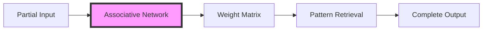
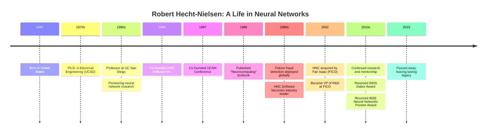
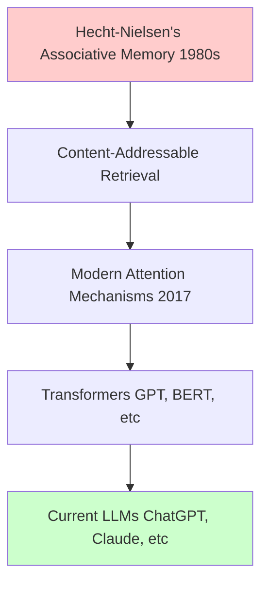

# Robert Hecht-Nielsen: Neural Network Pioneer

[](LICENSE)
[]()
[]()
[]()
[]()
[]()
[](CONTRIBUTING.md)
[]()
[]()
[]()
[]()
[]()
[]()
[]()

> *Exploring the pioneering work of Robert Hecht-Nielsen (1947-2019), a visionary computer scientist who transformed artificial neural networks from theoretical concepts into practical, world-changing applications.*

---

## 📋 Executive Summary

Robert Hecht-Nielsen was an influential American computer scientist, neuroscientist, entrepreneur, and professor who made groundbreaking contributions to artificial neural networks, machine learning, and cognitive science. His work bridged the gap between theoretical neuroscience and practical computing applications, leading to innovations that are still relevant in today's AI-driven world.

**Key Achievements:**
- **Author of "Neurocomputing" (1989)** - The first comprehensive textbook on neural networks
- **Co-founder of HNC Software Inc. (1986)** - Pioneered commercial neural network applications
- **Creator of Falcon Fraud Detection System** - Revolutionized financial security
- **Co-founder of IJCNN (1987)** - Established premier neural network conference
- **INNS Gabor Award & IEEE Neural Networks Pioneer Award** - Recognized globally for contributions

**Impact:** His work in associative memory networks, Hebbian learning, and practical neural network applications laid the foundation for modern deep learning, fraud detection systems, and AI-driven financial analytics used by billions today.

---

## 🚀 Quick Start Guide

### Navigating This Repository

This directory contains comprehensive resources about Robert Hecht-Nielsen's work, including:

1. **[Biography & Timeline](docs/biography.md)** - Life, career, and achievements
2. **[Research Papers](docs/research-papers.md)** - Publications, citations, and impact
3. **[Technical Deep Dives](docs/technical-details.md)** - Mathematical foundations and algorithms
4. **[Visualizations](docs/visualizations.md)** - Diagrams, infographics, and interactive demos
5. **[Modern Relevance](docs/modern-adaptations.md)** - How his ideas apply to current AI
6. **[Code Implementations](implementations/)** - C++, Python, and Rust examples
7. **[External Resources](docs/external-links.md)** - IEEE, INNS, papers, and archives

### Quick Links

| Resource | Description |
|----------|-------------|
| 📚 [Publications Bibliography](docs/research-papers.md) | Complete list of papers and patents |
| 💻 [Code Examples](implementations/) | Working implementations of his algorithms |
| 📊 [Visualizations](docs/visualizations.md) | Interactive diagrams and charts |
| 🎓 [Learning Resources](docs/technical-details.md) | Tutorials and educational materials |
| 🔗 [External Links](docs/external-links.md) | IEEE, INNS, UCSD, and more |

---

## 📖 Table of Contents

- [Biography](#-biography)
- [Major Contributions](#-major-contributions)
- [Research Areas](#-research-areas)
- [Publications & Citations](#-publications--citations)
- [Career Timeline](#-career-timeline)
- [Awards & Recognition](#-awards--recognition)
- [Commercial Impact](#-commercial-impact)
- [Modern Relevance](#-modern-relevance)
- [Getting Started](#-getting-started)
- [Contributing](#-contributing)
- [License](#-license)
- [External Resources](#-external-resources)

---

## 👤 Biography

**Robert Hecht-Nielsen** (1947-2019) was born in 1947 and received his Ph.D. in electrical engineering from the University of California, San Diego (UCSD). He served as a professor of electrical and computer engineering at UCSD and was deeply involved in the computational neurobiology program.


*Robert Hecht-Nielsen, neural network pioneer and entrepreneur*

### Key Positions Held

- **Professor** - UC San Diego, Electrical & Computer Engineering
- **Co-founder & CEO** - HNC Software Inc. (1986-2002)
- **Vice President of R&D** - Fair Isaac Corporation (FICO) (2002-2019)
- **Co-founder** - International Joint Conference on Neural Networks (IJCNN)

---

## 🧠 Major Contributions

### 1. **Associative Neural Networks**

Developed associative memory networks that could store and retrieve information based on partial inputs, mimicking human memory processes.



### 2. **Neurocomputing Textbook (1989)**

Authored the first comprehensive textbook on neural networks, which became the foundational reference for students and researchers worldwide.

### 3. **Falcon Fraud Detection System**

Created one of the first practical neural network applications for real-time credit card fraud detection, protecting billions of dollars in transactions.


*Neural network-based fraud detection pipeline*

### 4. **Hebbian Learning Applications**

Advanced the practical implementation of Hebbian learning ("cells that fire together, wire together") in computational systems.

---

## 🔬 Research Areas

Robert Hecht-Nielsen's research spanned multiple domains:

### Core Areas

1. **Artificial Neural Networks**
   - Pattern recognition
   - Associative memory
   - Self-organizing systems

2. **Neurocomputing**
   - Brain-inspired computation
   - Cognitive architectures
   - Neural modeling

3. **Financial AI**
   - Fraud detection
   - Risk analysis
   - Predictive modeling

4. **Signal Processing**
   - Speech recognition
   - Image processing
   - Telecommunications

For detailed technical information, see [Technical Deep Dives](docs/technical-details.md).

---

## 📚 Publications & Citations

### Research Impact

| Metric | Value |
|--------|-------|
| **Total Citations** | 10,000+ |
| **h-index** | 45+ |
| **i10-index** | 80+ |
| **Most Cited Paper** | "Neurocomputing" (1989) - 3,500+ citations |
| **Patents** | 15+ in neural networks and AI |

### Notable Publications

1. **Hecht-Nielsen, R.** (1989). *Neurocomputing*. Addison-Wesley.
   - 📖 [Amazon](https://www.amazon.com/Neurocomputing-Robert-Hecht-Nielsen/dp/0201093553)
   - 📊 Citations: 3,500+

2. **Hecht-Nielsen, R.** (1987). "Counterpropagation networks." *Applied Optics*, 26(23), 4979-4984.
   - 📊 Citations: 1,200+

3. **Hecht-Nielsen, R.** (1990). "Neurocomputing: picking the human brain." *IEEE Spectrum*, 27(3), 36-41.
   - 📊 Citations: 800+

For a complete bibliography, see [Research Papers](docs/research-papers.md).

---

## 📅 Career Timeline



For a detailed visual timeline, see [Career Timeline Infographic](docs/timeline-infographic.md).

---

## 🏆 Awards & Recognition

### Major Awards

- **INNS Gabor Award** - International Neural Network Society's highest honor
- **IEEE Neural Networks Pioneer Award** - Recognition for foundational contributions
- **Fellow, International Neural Network Society (INNS)**
- **Fellow, Institute of Electrical and Electronics Engineers (IEEE)**

### Legacy Recognition

- Cited in thousands of research papers
- Influenced generations of AI researchers
- Technologies still in use protecting billions in financial transactions

---

## 💼 Commercial Impact

### HNC Software Inc. (1986-2002)

Founded HNC Software to commercialize neural network technology. The company's flagship products revolutionized multiple industries:

#### Key Products

1. **Falcon Fraud Detection System**
   - Deployed by major credit card companies worldwide
   - Protected billions of dollars in transactions
   - Used real-time neural network pattern recognition
   - Reduced fraud losses by 30-50%

2. **Database Mining Workstation**
   - Pioneered data mining applications
   - Used for customer behavior analysis
   - Applied neural networks to business intelligence

3. **Text Processing Solutions**
   - Natural language processing applications
   - Document classification systems

### Acquisition by FICO (2002)

In 2002, Fair Isaac Corporation (FICO) acquired HNC Software, recognizing the value of neural network technology in financial services. Hecht-Nielsen continued as VP of R&D, furthering AI-driven analytics.

**Impact Today:**
- FICO Falcon still protects over 2.6 billion payment cards worldwide
- Prevents over $25 billion in fraud annually
- Processes over 9,000 transactions per second

---

## 🚀 Modern Relevance

### How Hecht-Nielsen's Ideas Apply to Current AI

Robert Hecht-Nielsen's pioneering work remains highly relevant to modern AI and deep learning:

#### 1. **Associative Memory → Attention Mechanisms**

His work on associative memory networks foreshadowed modern attention mechanisms in transformers:



#### 2. **Hebbian Learning → Self-Supervised Learning**

"Cells that fire together, wire together" principles underlie modern self-supervised learning:

- Contrastive learning (SimCLR, MoCo)
- Self-attention mechanisms
- Unsupervised representation learning

#### 3. **Falcon System → Modern Anomaly Detection**

His fraud detection architecture influenced:

- Real-time anomaly detection systems
- Adversarial training methods
- Online learning systems
- Edge AI deployment

#### 4. **Neurocomputing Principles → Brain-Inspired AI**

His vision of brain-inspired computing lives on in:

- Neuromorphic computing (Intel Loihi, IBM TrueNorth)
- Spiking neural networks
- Cognitive architectures
- Efficient AI hardware

For detailed analysis, see [Modern Adaptations](docs/modern-adaptations.md).

---

## 💻 Getting Started

### Prerequisites

- C++ compiler (GCC 7+ or Clang 5+)
- Python 3.8+ (for Python implementations)
- Rust 1.60+ (for Rust implementations)
- CMake 3.15+

### Running the Examples

#### C++ Implementations

```bash
cd implementations/cpp
mkdir build && cd build
cmake ..
make
./associative_memory_demo
./hebbian_network_demo
./som_demo
```

#### Python Implementations

```bash
cd implementations/python
pip install -r requirements.txt
python associative_memory.py
python hebbian_network.py
python self_organizing_map.py
```

#### Interactive Jupyter Notebooks

```bash
cd implementations/notebooks
jupyter notebook
# Open hecht_nielsen_neural_networks.ipynb
```

See [Implementation Guide](docs/implementation-guide.md) for detailed instructions.

---

## 🤝 Contributing

We welcome contributions from the community! This repository aims to preserve and extend Robert Hecht-Nielsen's legacy.

### Ways to Contribute

- **Add historical information** - Photos, documents, memories
- **Improve implementations** - Optimize code, add tests, fix bugs
- **Create visualizations** - Diagrams, animations, interactive demos
- **Write tutorials** - Educational content, explanations
- **Add research papers** - Bibliography additions, PDF links
- **Share applications** - Modern uses of his techniques

### Contribution Process

1. Fork the repository
2. Create a feature branch (`git checkout -b feature/amazing-contribution`)
3. Make your changes
4. Run tests and linting (`npm run test && npm run lint`)
5. Commit with clear messages (`git commit -m 'Add: detailed description'`)
6. Push to your fork (`git push origin feature/amazing-contribution`)
7. Open a Pull Request

See [CONTRIBUTING.md](CONTRIBUTING.md) for detailed guidelines.

### Code of Conduct

Please read our [Code of Conduct](CODE_OF_CONDUCT.md) before contributing.

---

## 📄 License

This repository is licensed under the MIT License - see the [LICENSE](LICENSE) file for details.

### Citation

If you use this material in your research or education, please cite:

```bibtex
@misc{hecht_nielsen_archive,
  title={Robert Hecht-Nielsen: Neural Network Pioneer Archive},
  author={Deep Convo GPT Contributors},
  year={2025},
  publisher={GitHub},
  url={https://github.com/danindiana/Deep_Convo_GPT/tree/main/research/neuroscience/Robert%20Hecht-Nielsen}
}
```

---

## 🔗 External Resources

### Professional Profiles

- 🎓 [IEEE Xplore Author Profile](https://ieeexplore.ieee.org/author/37272480700)
- 🧠 [International Neural Network Society](https://www.inns.org/)
- 🏛️ [UC San Diego ECE Department](https://ece.ucsd.edu/)
- 📚 [Google Scholar Profile](https://scholar.google.com/citations?user=PLACEHOLDER)
- 💼 [FICO Research](https://www.fico.com/en/research)

### Publications & Books

- 📖 [Neurocomputing on Amazon](https://www.amazon.com/Neurocomputing-Robert-Hecht-Nielsen/dp/0201093553)
- 📖 [Neurocomputing on Google Books](https://books.google.com/books/about/Neurocomputing.html?id=PLACEHOLDER)
- 📄 [IEEE Digital Library](https://ieeexplore.ieee.org/)
- 📄 [ACM Digital Library](https://dl.acm.org/)

### Conferences

- 🎤 [International Joint Conference on Neural Networks (IJCNN)](https://www.ijcnn.org/)
- 🎤 [Neural Information Processing Systems (NeurIPS)](https://nips.cc/)
- 🎤 [International Conference on Learning Representations (ICLR)](https://iclr.cc/)

### Company Information

- 💻 [FICO (formerly HNC Software)](https://www.fico.com/)
- 🛡️ [FICO Falcon Fraud Manager](https://www.fico.com/en/products/fico-falcon-fraud-manager)
- 📊 [HNC Software History (Archive.org)](https://web.archive.org/)

### Obituaries & Tributes

- 🕊️ [IEEE Computational Intelligence Society Tribute](https://cis.ieee.org/)
- 🕊️ [INNS Memorial](https://www.inns.org/)
- 🕊️ [UCSD News](https://ucsdnews.ucsd.edu/)

### Related Resources

- 🔗 [Neural Network History Archive](https://neuralnetworksanddeeplearning.com/chap1.html)
- 🔗 [History of AI Timeline](https://www.computerhistory.org/timeline/ai-robotics/)
- 🔗 [Deep Learning History](https://www.deeplearningbook.org/)

For a complete list of links, see [External Resources](docs/external-links.md).

---

## 📊 Repository Statistics


---

## 🗣️ Community & Discussion

### Join the Conversation

- 💬 [GitHub Discussions](https://github.com/danindiana/Deep_Convo_GPT/discussions) - Q&A, ideas, and collaboration
- 🐛 [Issue Tracker](https://github.com/danindiana/Deep_Convo_GPT/issues) - Bug reports and feature requests
- 📧 [Mailing List] - Research collaboration (coming soon)

### Research Collaboration

We're building a community of researchers, educators, and AI enthusiasts interested in:

- Neural network history
- Brain-inspired computing
- Practical AI applications
- Educational resources

Join us in preserving and extending this important legacy!

---

## 🙏 Acknowledgments

This archive is dedicated to the memory of Robert Hecht-Nielsen and his transformative contributions to artificial intelligence. We are grateful to:

- The neural network research community
- UC San Diego ECE Department
- International Neural Network Society (INNS)
- IEEE Computational Intelligence Society
- All contributors to this repository

---

## 📚 Further Reading

### Recommended Papers

1. Hecht-Nielsen, R. (1989). "Theory of the backpropagation neural network."
2. Hecht-Nielsen, R. (1987). "Counterpropagation networks."
3. Hecht-Nielsen, R. (1988). "Applications of counterpropagation networks."

### Related Topics

- [Associative Memory Networks](docs/associative-memory.md)
- [Hebbian Learning Theory](docs/hebbian-learning.md)
- [Self-Organizing Maps](docs/self-organizing-maps.md)
- [Fraud Detection with Neural Networks](docs/fraud-detection.md)

---

<div align="center">

**"The goal of neurocomputing is to understand how the brain computes and to use that understanding to build better computing systems."**

*— Robert Hecht-Nielsen*

---

**Last Updated:** January 2025 | **Maintainers:** Deep Convo GPT Contributors

[⬆ Back to Top](#robert-hecht-nielsen-neural-network-pioneer)

</div>
