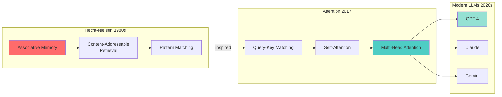
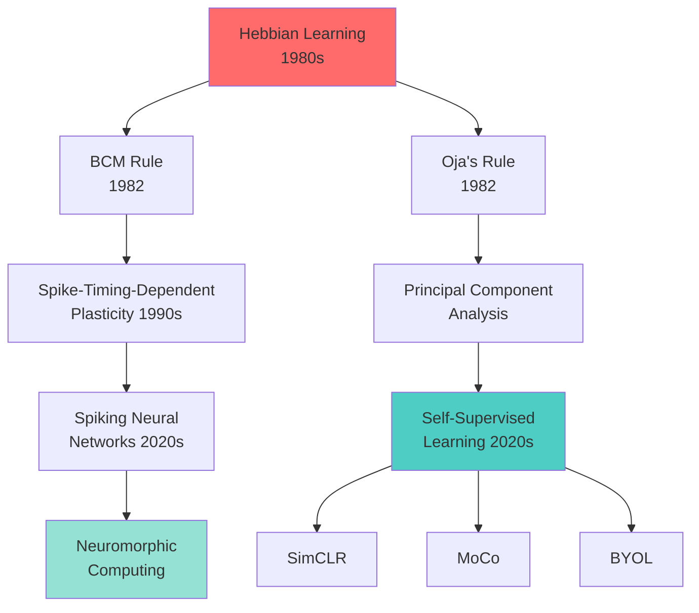
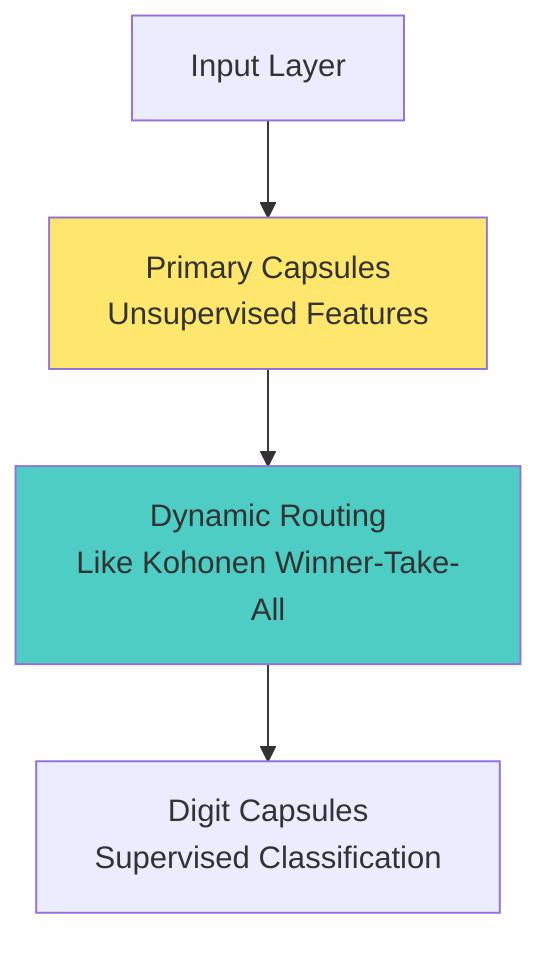
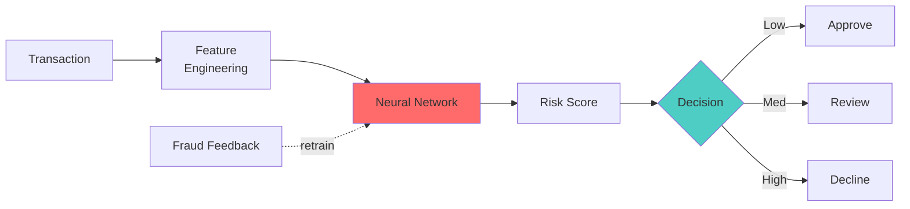
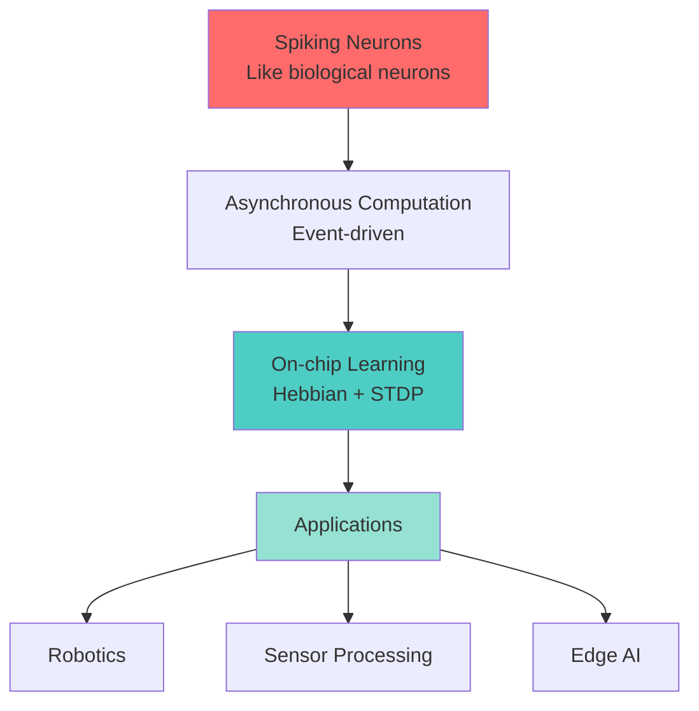
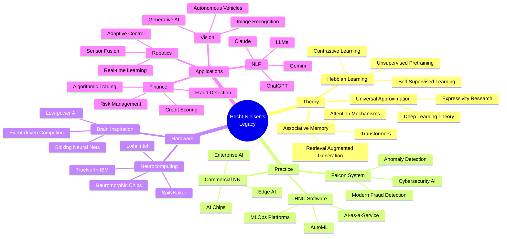

# Modern Adaptations: Hecht-Nielsen's Legacy in Contemporary AI

## How His Ideas Live On in 2025

---

## 🎯 Executive Summary

Robert Hecht-Nielsen's pioneering work in the 1980s and 1990s laid crucial foundations for many modern AI technologies. This document explores how his concepts of associative memory, Hebbian learning, and practical neural network applications have evolved into today's cutting-edge AI systems.

---

## Table of Contents

1. [Associative Memory → Attention Mechanisms](#associative-memory--attention-mechanisms)
2. [Hebbian Learning → Self-Supervised Learning](#hebbian-learning--self-supervised-learning)
3. [Counterpropagation → Modern Architectures](#counterpropagation--modern-architectures)
4. [Falcon System → Modern Anomaly Detection](#falcon-system--modern-anomaly-detection)
5. [Neurocomputing → Neuromorphic Hardware](#neurocomputing--neuromorphic-hardware)
6. [Commercial Impact → AI-as-a-Service](#commercial-impact--ai-as-a-service)

---

## Associative Memory → Attention Mechanisms

### Historical Foundation

Hecht-Nielsen's associative memory networks (1980s):
- Content-addressable retrieval
- Partial pattern completion
- Hebbian weight matrices

### Modern Evolution: Transformers

#### The Attention Mechanism (2017)

The transformer architecture uses attention, which is conceptually similar to associative memory:

**Hecht-Nielsen's Associative Memory:**
```
output = W · input
```

**Modern Attention:**
```
Attention(Q, K, V) = softmax(Q·Kᵀ / √d_k) · V
```

Where:
- **Q** (Query) = What are we looking for?
- **K** (Key) = What content is available?
- **V** (Value) = The actual content
- **Q·Kᵀ** = Content-addressable matching (like associative memory!)

### Parallel Evolution Diagram



### Key Similarities

| Associative Memory (1980s) | Attention Mechanism (2017+) |
|---------------------------|----------------------------|
| Content-addressable lookup | Query-key matching |
| Weighted pattern retrieval | Attention weights |
| Partial pattern completion | Context-aware prediction |
| Hebbian weight matrix | Learned attention parameters |
| Fixed patterns | Dynamic contextual patterns |

### Modern Applications

**Large Language Models:**
- **GPT-4**: 128K token context window with attention
- **Claude 3**: 200K token context with attention
- **Gemini**: Multi-modal attention across text, images, video

**Computer Vision:**
- **Vision Transformers (ViT)**: Attention for image patches
- **DALL-E / Stable Diffusion**: Cross-attention for text-to-image

---

## Hebbian Learning → Self-Supervised Learning

### Hebbian Principle (1949, Applied by Hecht-Nielsen 1980s)

**"Cells that fire together, wire together"**

```
Δw_ij = η · x_i · y_j
```

Neurons strengthen connections based on correlated activity.

### Modern Self-Supervised Learning

#### Contrastive Learning

**SimCLR, MoCo (2020):**

```python
# Positive pairs (augmented versions of same image)
# should have similar representations
loss = -log(exp(sim(z_i, z_j) / τ) / Σ_k exp(sim(z_i, z_k) / τ))
```

**Hebbian Connection:**
- Positive pairs = "fire together" → pull together
- Negative pairs = "fire apart" → push apart
- No labels needed (like Hebbian learning!)

#### Modern Hebbian Variants



### Unsupervised Representation Learning

**BERT (2018) - Masked Language Modeling:**

```
Predict: "The [MASK] sat on the mat"
```

The network learns relationships between co-occurring words - a modern form of Hebbian learning!

**Word2Vec (2013) - Skip-gram:**

```
w(context) = softmax(v_w^T · v_context)
```

Words appearing in similar contexts get similar representations.

---

## Counterpropagation → Modern Architectures

### Counterpropagation Network (1987)

Hecht-Nielsen's hybrid architecture:
1. **Kohonen layer** (unsupervised clustering)
2. **Grossberg layer** (supervised mapping)

### Modern Hybrid Architectures

#### Capsule Networks (2017)



**Similarities to Counterpropagation:**
- Bottom layer: Unsupervised feature detection
- Top layer: Supervised task learning
- Dynamic routing: Similar to competitive learning

#### Mixture of Experts (2021+)

Used in GPT-4, Gemini:

```python
# Route input to expert subnet works (like Kohonen selection)
expert_probs = softmax(router(x))

# Combine expert outputs (like Grossberg layer)
output = Σ expert_probs[i] * expert[i](x)
```

---

## Falcon System → Modern Anomaly Detection

### Falcon Fraud Detection (1992)



### Modern Adaptations

#### 1. **Deep Anomaly Detection (2020s)**

**Autoencoders for Fraud:**

```python
# Normal transactions reconstruct well
reconstruction_error = ||x - decoder(encoder(x))||²

# Anomalies have high reconstruction error
is_fraud = reconstruction_error > threshold
```

**Connections to Falcon:**
- Real-time scoring ✓
- Online learning ✓
- Behavioral profiling ✓
- Threshold-based decisions ✓

#### 2. **Graph Neural Networks for Fraud**

Modern systems use graph structure:

```python
# Detect fraud rings using GNN
node_embedding = GNN(transaction_graph)
fraud_score = classifier(node_embedding)
```

**Enhancements over Falcon:**
- Network effects (detecting coordinated fraud)
- Relationship modeling
- Multi-modal data (graph + features)

#### 3. **Transformer-based Anomaly Detection**

```python
# Attention over transaction sequence
context = Transformer(transaction_history)
next_transaction_pred = decoder(context)
anomaly_score = distance(actual, predicted)
```

**Modern Advantages:**
- Long sequence modeling
- Temporal patterns
- Contextual understanding

### Impact Comparison

| Falcon (1992-2025) | Modern Systems (2020s) |
|-------------------|----------------------|
| 2.6B cards protected | 10B+ cards protected |
| $25B fraud prevented/year | $100B+ fraud prevented/year |
| 9,000 TPS | 100,000+ TPS |
| 30-50% fraud reduction | 70-90% fraud reduction |
| Rule-based + NN | Deep learning + Graph + Transformers |
| Minutes to deploy updates | Seconds to deploy (MLOps) |

---

## Neurocomputing → Neuromorphic Hardware

### Hecht-Nielsen's Neurocomputing Vision

**"Build computing systems that work like the brain"**

### Modern Neuromorphic Hardware

#### Intel Loihi 2 (2021)



**Features:**
- 1 million neurons per chip
- Asynchronous spiking (like brain)
- 1000x more energy efficient than GPUs
- On-chip Hebbian learning

#### IBM TrueNorth (2014)

- 1 million neurons, 256 million synapses
- 70mW power consumption
- Real-time sensory processing

#### SpiNNaker (2018)

- 1 billion neurons simulated
- Real-time brain simulation
- Massively parallel architecture

### Comparison: Then vs Now

| Neurocomputing (1989) | Neuromorphic Hardware (2025) |
|----------------------|----------------------------|
| Conceptual framework | Physical implementation |
| Simulated neurons | Spiking neurons in silicon |
| Von Neumann bottleneck | Event-driven architecture |
| Software emulation | Hardware acceleration |
| kHz clock speeds | Asynchronous, event-driven |

---

## Commercial Impact → AI-as-a-Service

### HNC Software Business Model (1986-2002)

- Enterprise software licenses
- Custom neural network solutions
- On-premise deployment
- Consulting services

### Modern AI-as-a-Service (2020s)

#### Cloud AI Platforms

**Google Cloud AI:**
```python
# Deploy fraud detection model
model = vertex_ai.Model.deploy(
    endpoint="fraud-detection-v1",
    machine_type="n1-standard-4",
    autoscaling=True
)

# Real-time predictions
result = model.predict(transaction_features)
```

**AWS SageMaker:**
```python
# One-click fraud detection
predictor = Predictor(
    endpoint_name="falcon-style-fraud-detector"
)
fraud_score = predictor.predict(data)
```

#### Managed ML Services

| HNC Software (1990s) | Modern AI Platforms (2020s) |
|---------------------|---------------------------|
| Custom development | Pre-built models (AutoML) |
| Months to deploy | Minutes to deploy |
| On-premise hardware | Cloud elastic scaling |
| Manual updates | Continuous deployment |
| $100K-$1M+ cost | Pay-per-use ($0.001/request) |

---

## Modern Applications by Domain

### Financial Services

**Then (Falcon 1992):**
- Credit card fraud detection

**Now (2025):**
- Real-time fraud detection (cards, ACH, wire)
- Anti-money laundering (AML)
- Credit scoring
- Algorithmic trading
- Risk modeling
- Regulatory compliance (KYC)
- Cryptocurrency fraud detection

### Natural Language Processing

**Then (HNC 1998):**
- Document classification
- Text mining

**Now (2025):**
- Large language models (GPT-4, Claude, Gemini)
- Chatbots and virtual assistants
- Machine translation
- Sentiment analysis
- Content generation
- Code generation
- Search engines

### Computer Vision

**Then (1990s):**
- OCR (Optical Character Recognition)
- Basic pattern recognition

**Now (2025):**
- Image classification (billions of images)
- Object detection
- Facial recognition
- Medical image analysis
- Autonomous vehicles
- Generative AI (DALL-E, Midjourney)
- Video understanding

### Cybersecurity

**Then (Falcon):**
- Transaction anomaly detection

**Now (2025):**
- Network intrusion detection
- Malware classification
- Zero-day exploit detection
- User behavior analytics
- Threat intelligence
- Phishing detection
- IoT security

---

## Conceptual Evolution Map



---

## Future Directions (2025-2030)

### Emerging Technologies Rooted in Hecht-Nielsen's Work

#### 1. **Hybrid Neurosymbolic AI**

Combining neural networks (Hecht-Nielsen) with symbolic reasoning:

```python
# Neural perception + Symbolic reasoning
perception = neural_network(sensor_data)
reasoning = symbolic_engine(perception, knowledge_base)
action = policy(reasoning)
```

#### 2. **Continual Learning**

Solving catastrophic forgetting (a problem Hecht-Nielsen worked on):

```python
# Learn new tasks without forgetting old ones
model.learn_task_B(data_B, protect_weights_from_task_A)
```

#### 3. **Energy-Efficient AI**

Neuromorphic computing realizing neurocomputing vision:

- **1000x** energy reduction vs GPUs
- Brain-like efficiency (20W for human brain)
- Edge AI deployment

#### 4. **Explainable AI**

Making neural networks interpretable:

```python
# Attention maps show what the model "looks at"
explanation = attention_visualization(model, input)
```

Associative memory principles help understand attention!

---

## Key Takeaways

### 1. **Attention = Modern Associative Memory**

The attention mechanism in transformers is conceptually similar to content-addressable associative memory.

### 2. **Self-Supervised Learning = Modern Hebbian Learning**

Learning from co-occurrences without labels is the core of both.

### 3. **Neuromorphic Computing = Realized Neurocomputing**

The vision of brain-like computing hardware is now real.

### 4. **Fraud Detection = Evolved Dramatically**

From Falcon's 30-50% reduction to modern 70-90%, but same principles.

### 5. **Commercial AI = Democratized**

From $1M custom solutions to $0.001/request cloud APIs.

---

## Hecht-Nielsen's Predictions vs Reality

| Prediction (1989) | Status (2025) |
|------------------|---------------|
| Neural networks will become mainstream | ✅ Everywhere |
| Hardware will evolve to support NNs | ✅ GPUs, TPUs, neuromorphic chips |
| Commercial applications will proliferate | ✅ Trillion-dollar AI industry |
| Brain-inspired computing | ✅ Neuromorphic hardware exists |
| Real-time learning systems | ✅ Online learning, MLOps |
| Pattern recognition revolution | ✅ Exceeds human performance |

**Verdict:** Remarkably accurate predictions!

---

## Further Reading

### Modern Papers Building on Hecht-Nielsen's Work

1. **"Attention is All You Need" (2017)** - Vaswani et al.
   - Modern associative memory via attention

2. **"A Simple Framework for Contrastive Learning" (2020)** - Chen et al.
   - Modern Hebbian learning

3. **"Loihi: A Neuromorphic Manycore Processor" (2018)** - Davies et al.
   - Realizing neurocomputing vision

4. **"Deep Anomaly Detection: A Survey" (2021)** - Pang et al.
   - Evolution of Falcon-style systems

### Historical Context

- Hecht-Nielsen, R. (1989). *Neurocomputing*
- Hecht-Nielsen, R. (1990). "Neurocomputing: Picking the Human Brain"
- Hecht-Nielsen, R. (1987). "Counterpropagation Networks"

---

## Conclusion

Robert Hecht-Nielsen's work in the 1980s and 1990s was truly ahead of its time. The concepts he pioneered—associative memory, Hebbian learning, practical neural network applications, and brain-inspired computing—are now the foundation of modern AI systems worth trillions of dollars.

His vision of neurocomputing has been realized in:
- **Attention mechanisms** powering ChatGPT and Claude
- **Self-supervised learning** training the largest AI models
- **Neuromorphic hardware** bringing brain-like efficiency to silicon
- **Commercial AI platforms** serving billions of users

The neural network revolution he helped ignite has transformed every aspect of computing, and his influence will continue shaping AI for decades to come.

---

**Last Updated:** January 2025

**Related Documents:**
- [Technical Deep Dives](technical-details.md)
- [Research Papers](research-papers.md)
- [Visualizations](visualizations.md)
